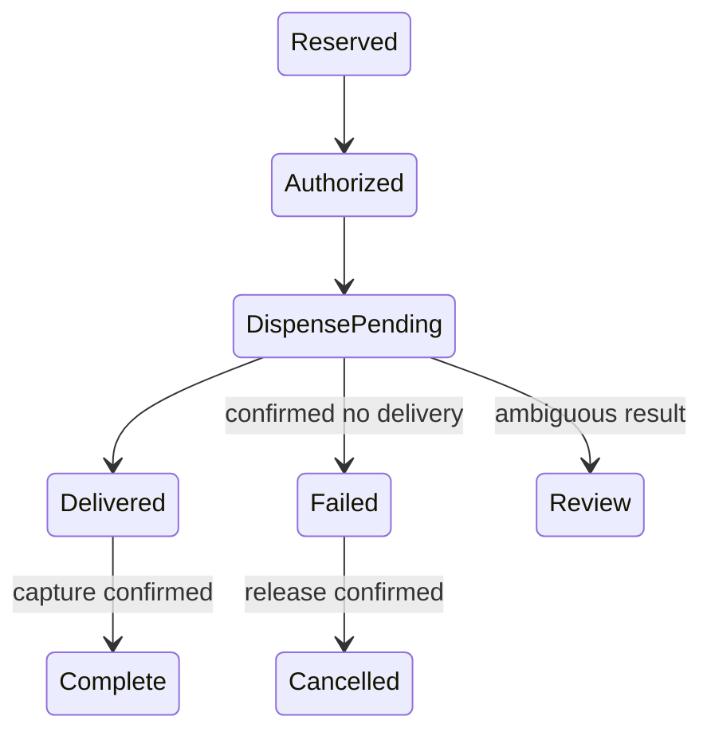

# Design a Vending Machine

Coordinate product reservations, wallet authorization, and confirmed dispensing without repeating uncertain physical effects.

LLD stages: [Requirements](#requirements) → [Core entities](#core-entities) → [API or system interface](#api) → [High-level design](#high-level-design) → [Deep dives](#deep-dives).

## 1. Requirements
{: #requirements }

### Functional requirements

Sell one product per purchase using a stored-value wallet. Amounts are positive integer minor units in one currency. Expose purchase status and allow cancellation before committed dispense intent.

### Non-functional and execution constraints

One process handles concurrent requests; a durable journal stores stock reservations, purchase states, and external-effect IDs. Product lookup is expected O(1), excluding storage and adapter latency. Cap unsettled purchases and reject new work when that limit is reached.

### Out of scope

Exclude coins, change-making, refrigeration, and wallet implementation. The wallet adapter must support idempotent reserve, capture, release, and status lookup. The dispenser must identify each command and report delivered, definitely not delivered, or unknown.

## 2. Core entities
{: #core-entities }

`Machine` owns inventory and purchase transitions. `ProductSlot` stores price, physical stock, and reserved quantity. `Purchase` owns a frozen price, wallet authorization, and dispense command ID. Available stock equals physical stock minus reservations and never becomes negative. One purchase can consume at most one unit; all monetary operations use its frozen amount.

## 3. API or system interface
{: #api }

`buy(requestId, productId, walletId) -> PurchaseStatus` returns a stable purchase ID or `OutOfStock`, `UnknownProduct`, `Busy`, or `InvalidRequest`. The same ID and payload return the existing result; changed payload returns `Conflict`. `status(purchaseId)` returns the current state or `NotFound`.

`cancel(purchaseId) -> Cancelled|Pending|TooLate` succeeds only before dispense intent is committed; unresolved wallet release returns `Pending`. `recordDispense(commandId, result) -> PurchaseStatus` accepts authenticated results and rejects contradictory terminal outcomes as `Conflict`.

## 4. High-level design
{: #high-level-design }

`Machine.buy` uses one transaction to validate the product, reserve one unit in `ProductSlot`, create a `Purchase` with the frozen price, and record the request. Outside the transaction, it asks the wallet adapter to reserve funds with key `purchaseId/reserve`. A definitive refusal cancels the purchase and releases inventory.

Persist authorization and dispense intent before sending the command. On confirmed delivery, atomically reduce physical stock and reservation count by one and record `Delivered`. Then capture funds using `purchaseId/capture`; only confirmed capture produces `Complete`. Capture failures remain visible for collection or reconciliation, not a second dispense.

Confirmed non-delivery releases funds and inventory. An unknown outcome retains both reservations in `Review`; neither a refund nor another dispense is justified without evidence. Recovery resumes from recorded intent and adapter status.

## 5. Deep dives
{: #deep-dives }

### Trade-offs and extensions

Wallet reservation avoids debiting before delivery, but a wallet must guarantee capture of valid reserved funds or expose an unresolved financial liability. Coin support is a separate extension with its own escrow and exact-change inventory; it is not another wallet adapter because physical refund ambiguity changes the state model.

### Concurrency and failure handling

Protect stock reservation and request insertion in one transaction. Serialize purchase transitions; adapter calls run outside locks. Cancellation cannot race past dispense intent; if wallet authorization is in flight, cancellation waits for its reconciliation and release. Never blindly replay an ambiguous actuator command: require durable device deduplication or operator reconciliation. Recovery preserves pending work, not certainty about delivery. Keep completed request IDs in durable storage for the machine's lifetime.

### Test cases

- Stock 1, two concurrent buyers: one reservation, one `OutOfStock`.
- Price 125, wallet balance 124: no dispense; stock reservation released.
- Repeat a successful request ID: same purchase, one debit and one item.
- Delivery confirmed, capture response lost: retry capture with the same key.
- Dispenser times out: `Review`, no automatic refund or second command.
- Unsettled limit 1, one purchase in `Review`: new purchase returns `Busy`; cancellation returns `TooLate`, preserving its reservation.

[Question catalog](../interview-guide.html) · [Article template](interview-template.html)
