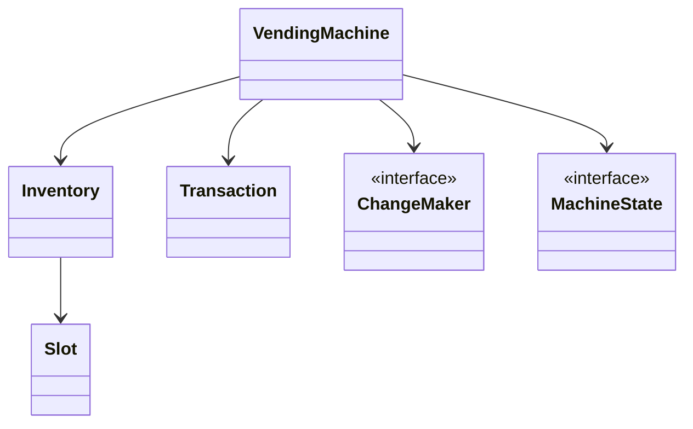
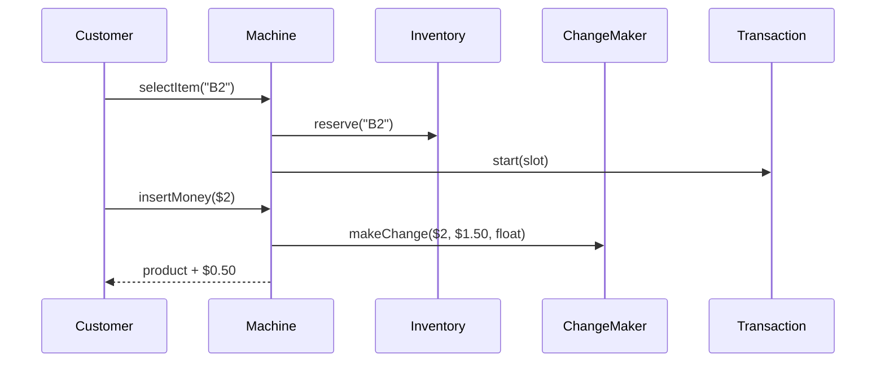
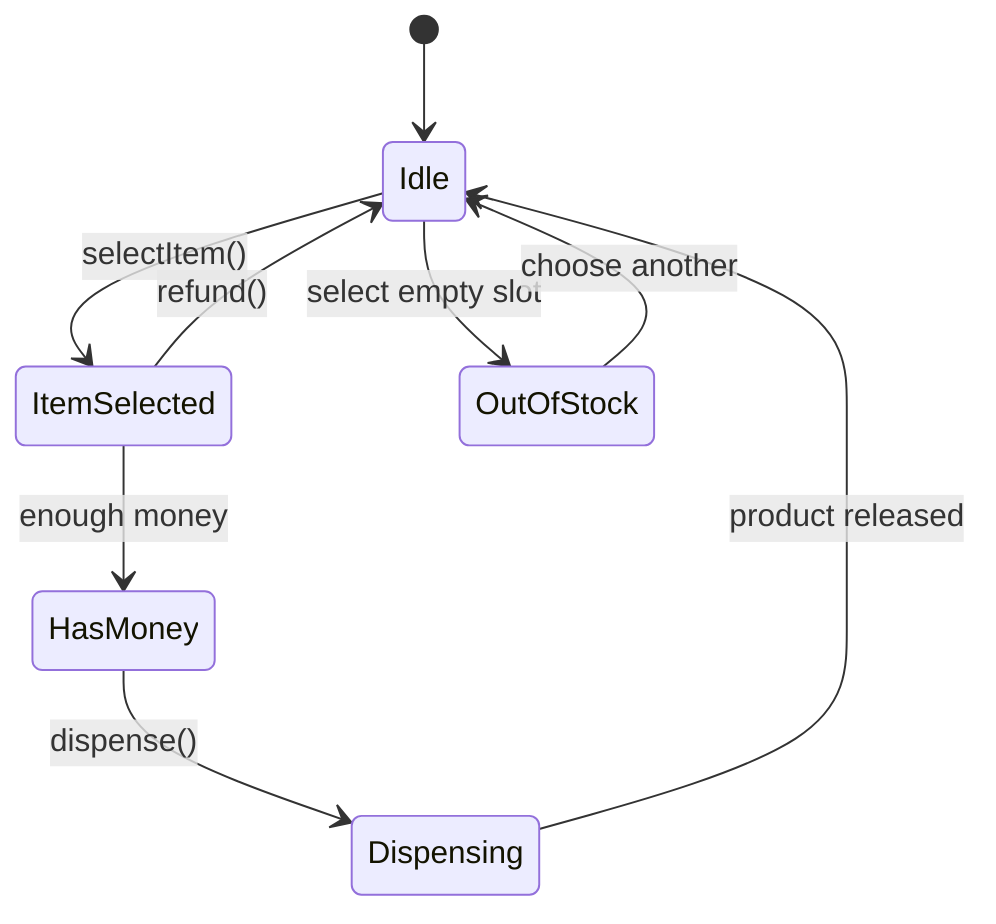

# LLD Walkthrough: Design a Vending Machine

> Self-contained walkthrough. It shows how to design a vending machine as a small stateful domain, not as a maze of product subclasses and coin algorithms.

Vending machine looks simple until candidates overbuild it. They model every coin, every product category, payment gateways, refund policies, and a perfect change-making algorithm. A strong answer is smaller: **select item, accept money, dispense item, return change, and make invalid transitions impossible**.

---

## Minute 0-7: Clarify and fence the scope

Ask the questions that matter:

- **Primary flow?** → Customer selects a product, inserts money, gets product and change.
- **Payment types?** → Cash/coins for the core design. Card is a later `PaymentMethod` seam if requested.
- **Inventory model?** → Slots with product, price, and quantity.
- **Change making?** → Greedy strategy over available denominations. Mention limitations; do not solve coin-change optimization live.
- **Failure behavior?** → Out of stock, insufficient money, unable to make change, dispense failure.

Say the fence out loud:

> "In scope: item selection, cash insertion, inventory decrement, change return, refund, and state transitions. Out of scope: hardware drivers, remote inventory sync, taxation, and real card processing. I'll make change-making a Strategy so we can replace the simple greedy policy later."

This makes the interview finite. The vending machine is a State-pattern problem first, not a math problem.

---

## Minute 7-13: Core entities

Prefer composition. A `Product` does not need subclasses for `Chips`, `Soda`, and `Candy`. Use category enums if needed.

| Object | Responsibility (one line) |
|---|---|
| `VendingMachine` | Public entry point; delegates behavior based on current state. |
| `Inventory` | Owns slots and reserves/decrements quantities. |
| `Slot` | Holds one product type, price, and count. |
| `Product` | Immutable product metadata such as code, name, and category. |
| `Money` | Represents inserted amount and denomination counts. |
| `Transaction` | Tracks selected slot, inserted money, and result. |
| `ChangeMaker` | Computes change from available denominations. |
| `MachineState` | State interface/enum for Idle, ItemSelected, HasMoney, Dispensing, OutOfStock. |

Eight objects. That is plenty.



The key design decision:

> "The machine state owns what actions are legal right now. That keeps `dispense()` from working before a customer has paid."

That sentence tells the interviewer you understand why the State pattern exists.

---

## Minute 13-20: The spine (API + varying interfaces)

Define the methods the UI panel or tests call:

```text
Display selectItem(String slotCode)
Display insertMoney(Denomination d, int count)
DispenseResult dispense()
Money refund()
MachineSnapshot getSnapshot()
```

Now define the variation seams:

```text
interface MachineState {
  Display selectItem(VendingMachine vm, String slotCode)
  Display insertMoney(VendingMachine vm, Denomination d, int count)
  DispenseResult dispense(VendingMachine vm)
  Money refund(VendingMachine vm)
}

interface ChangeMaker {
  Optional<Money> makeChange(Money paid, Money price, Money availableFloat)
}
```

- `MachineState` → **State pattern**. `Idle`, `ItemSelected`, `HasMoney`, `Dispensing`, `OutOfStock` decide legal transitions.
- `ChangeMaker` → **Strategy pattern**. Greedy coin return today; dynamic-programming or denomination-specific rules later.

The API is intentionally boring. That is good. Boring APIs are testable.

Say this out loud:

> "I am not going to put a giant switch statement in every method. The current state handles the command and either transitions or rejects it."

This prevents a common fail: a `VendingMachine` god object with 20 boolean flags.

---

## Minute 20-33: Walk the happy path

Primary flow: customer buys B2 for $1.50, inserts $2.00, receives product and $0.50 change.



Narrate the implementation:

```text
selectItem(slotCode):
  state.selectItem(this, slotCode)

Idle.selectItem(vm, slotCode):
  slot = inventory.get(slotCode)
  if slot.isEmpty(): transition OutOfStock; return "Sold out"
  transaction = Transaction.forSlot(slot)
  transition ItemSelected
  return "Price: 1.50"
```

Then money:

```text
ItemSelected.insertMoney(vm, denom, count):
  transaction.addMoney(denom, count)
  if transaction.inserted >= transaction.price:
    transition HasMoney
  return display remaining amount
```

Then dispense:

```text
HasMoney.dispense(vm):
  change = changeMaker.makeChange(inserted, price, cashFloat)
  if change.empty: return refundWithMessage("Cannot make change")
  inventory.decrement(slot)
  cashFloat.add(inserted).remove(change)
  transition Dispensing
  release product
  clear transaction
  transition Idle
```

The lifecycle is the main artifact:



Say the quiet parts:

- "I reserve logically at selection time only for this transaction; I decrement physically when dispense succeeds."
- "If the machine cannot make change, I refund instead of decrementing inventory."
- "The transaction is cleared only after product release and change calculation are complete."

That ordering matters. It separates a pass from a toy answer.

---

## Minute 33-42: Stretch and edges

Common follow-ups, answered tightly:

- **"What if change cannot be made?"** `ChangeMaker` returns empty. The machine refuses dispense and offers refund. Inventory is not decremented. Do not let the customer pay $2 for a $1.50 item unless the product requirements explicitly allow exact-change mode.

- **"Greedy change is not always optimal."** Correct. For US-like denominations it is fine; for arbitrary denominations, replace `GreedyChangeMaker` with a DP-based implementation. The rest of the machine does not change.

- **"What if the selected item sells out during payment?"** In a single machine, serialize operations with a machine-level lock, or reserve one unit in the transaction and release it on timeout/refund. For live interview scope, use one lock around select/pay/dispense transitions.

- **"Dispense motor fails."** Mark transaction as failed, do not decrement if the failure is detected before release. If failure is detected after decrement, create an operator alert and refund. Hardware certainty is out of scope.

- **"Add card payments."** Add `PaymentMethod` or `PaymentProcessor` Strategy. The state machine still moves from `ItemSelected` to `HasMoney/Paid`.

- **"Restocking."** Operator API: `restock(slotCode, product, count)` guarded by an admin mode. It updates `Inventory`; it does not touch active transaction state.

- **"Timeout."** If a transaction sits in `ItemSelected` or `HasMoney` too long, call `refund()` and transition to `Idle`.

Bounded edge list: invalid slot code, coin jam, duplicate dispense click, exact-change-only mode, product price update during active transaction, and audit logs. Name them; do not implement a warehouse system.

Concurrency answer:

```text
lock machine:
  validate state
  mutate transaction / inventory / cashFloat
  transition state
```

One physical machine is naturally serialized. If you are designing a fleet, that is a different problem.

---

## Minute 42-45: Wrap up

> "Eight core pieces: `VendingMachine` delegates to a `MachineState`, `Inventory` owns slots, `Transaction` tracks the active purchase, and `ChangeMaker` is the Strategy seam. The happy path is select → insert money → make change → decrement inventory → dispense → idle. Edges like out-of-stock and cannot-make-change are state transitions, not scattered if-statements."

---

## What separated a pass from a fail here

- You treated vending as a **state machine**, so illegal operations are naturally rejected.
- You did **not** rabbit-hole into coin-change theory. You put it behind `ChangeMaker`.
- You kept products as data and avoided a useless product inheritance tree.
- You narrated the critical ordering: change first, decrement inventory when dispense is safe, clear transaction last.
- You gave bounded answers for hardware and payment follow-ups.

The winning design is small, stateful, and safe. It is not a catalog system with a vending button attached.
