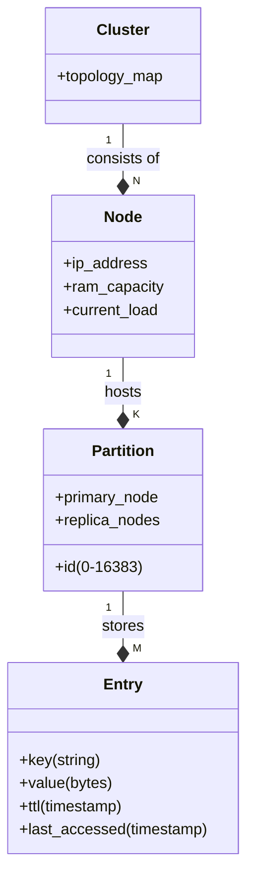

# Article 1: Why Caching Matters

**The hidden infrastructure behind every fast website.**

When Netflix recommendations load in 800ms instead of 10 seconds, or your Twitter feed refreshes instantly even during the Super Bowl—you aren't seeing a fast database: you're seeing a well-designed cache.

> **Reader path — stages 1–3:** [Requirements](../interview-questions/distributed-cache.html#requirements) → [core entities](../interview-questions/distributed-cache.html#core-entities) → [API or system interface](../interview-questions/distributed-cache.html#api) · [HLD template](../interview-template.html). The concise answer is a separate scoped walkthrough; assumptions and contracts may differ.
>
> **Series:** foundations here → [4. Working baseline](02-mvp-architecture.md) → [5. Deep dives](03-scaling-challenges.md). Article numbers identify chapters, not additional delivery stages.

Caching is the art of cheating. It’s the art of giving users the right answer without doing the hard work of calculating it again. This article covers the *why*, the *what*, and the *design*. Because implementing a cache is easy; specificying the right one is hard.

---

<a id="3-what-we-are-building"></a>
<a id="what-we-are-building"></a>
## 1. Requirements

### Scope

We are designing a **Distributed Cache System**. It's not just a `HashMap` on a server; it's a robust, multi-node service that powers your architecture.

### Functional Requirements (What it must do)
1.  **Values**: Get, Set, and Delete data (Text, JSON, Binary).
2.  **Control**: Expire data automatically (TTL).
3.  **Efficiency**: Retrieve multiple keys at once (MGET).

### Non-Functional Requirements (How it must perform)
*   **Latency**: p99 < **5ms**. (Compare to a DB's 20ms+).
*   **Availability**: **99.9%** (Allowing ~43 mins/month downtime).
*   **Hit Ratio**: Target **95%+**.
*   **Consistency**: **AP** (Availability & Partition Tolerance).
    *   *Translation*: We prefer giving a user *slightly stale* data (e.g., a Like count of 99 instead of 100) rather than showing them an error page.

---

<a id="4-the-data-model--entities"></a>
<a id="the-data-model--entities"></a>
## 2. Core entities

Before writing code, we define our entities. A "Cache" isn't a nebulous cloud; it is a hierarchy.



*   **Cluster**: The logical group of all servers.
*   **Node**: A single physical server (e.g., `cache-01.us-east.prod`).
*   **Partition (Shard)**: The unit of data ownership. Key `user:100` hashes to Partition #42.
*   **Entry**: The actual data.

---

<a id="5-api-design-the-contract"></a>
<a id="api-design-the-contract"></a>
## 3. API or system interface

A clean API makes the system usable. Here is the JSON-over-HTTP spec (though in production, we'd use a binary protocol like RESP or Protobuf for speed).

### GET: Retrieve Data
```http
GET /v1/cache/users:1001
Header: Auth-Token: <token>
```
**Response (Hit)**: `200 OK`
```json
{
  "key": "users:1001",
  "data": { "name": "Alice", "role": "admin" },
  "metadata": { "ttl_remaining": 305, "cached_at": "2023-10-25T10:00:00Z" }
}
```
**Response (Miss)**: `404 Not Found`

### SET: Store Data
```http
POST /v1/cache/users:1001
Content-Type: application/json
```
```json
{
  "value": { "name": "Alice", "role": "admin" },
  "ttl_seconds": 3600,
  "policy": "replace_if_exists" 
}
```
**Response**: `201 Created`

### MGET: The Performance Hack
Fetching 100 keys one-by-one requires 100 network round trips. `MGET` does it in one.

```http
GET /v1/cache/batch?keys=users:1001,users:1002,users:1003
```
**Response**:
```json
{
  "results": [
    { "key": "users:1001", "data": {...}, "hit": true },
    { "key": "users:1002", "data": null, "hit": false },
    { "key": "users:1003", "data": {...}, "hit": true }
  ]
}
```

---

## Summary

<a id="1-the-core-problem-databases-cant-scale-like-you-need-them-to"></a>
<a id="the-core-problem-databases-cant-scale-like-you-need-them-to"></a>
<a id="the-physics-of-the-problem"></a>
<a id="real-world-stakes"></a>
<a id="2-a-cautionary-tale-the-pinterest-incident"></a>
<a id="a-cautionary-tale-the-pinterest-incident"></a>
The database-overload estimates and outage example now appear in the [scaling deep dive](03-scaling-challenges.md#database-overload-and-hit-ratio), after the working baseline.

We have defined the **Problem** (Database overload), the **Goal** (95% hit ratio, <5ms latency), and the **Contract** (API).

In real life you can (and often should) buy a cache off the shelf. But for system design—and for building a platform you truly understand—we start from first principles.

In the next article, we build a cache node from scratch: storage layout, TTL expiration, eviction, and (critically) how these internals behave under concurrency.

**[Next: Building Your First Cache (MVP) →](02-mvp-architecture.md)**
