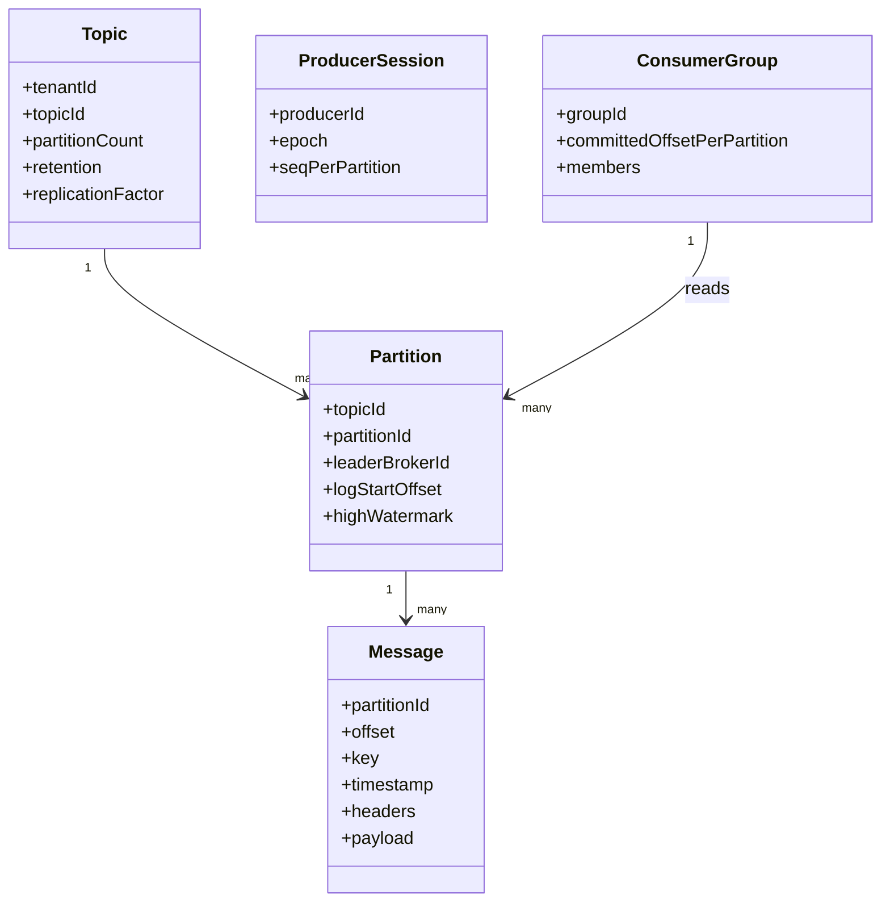
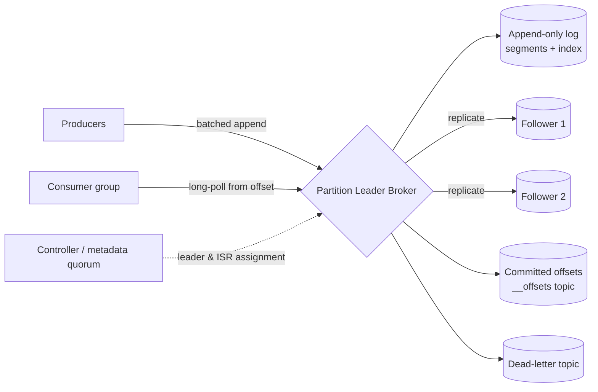

# Designing a Distributed Message Queue: Foundations

A message queue is the shock absorber of a distributed system. Producers and consumers run at different speeds, fail at different times, and scale on different curves; a durable queue in the middle lets each side pretend the other is always available. This series designs a **partitioned, replicated, append-only log** — the architecture behind Kafka, Pulsar, and Kinesis — and then goes deep on the four subsystems that actually decide whether it survives production: the storage engine, partitioning, replication, and delivery semantics.

> **Reader path:** If you want the 45-minute interview version, read the concise answer first — [Requirements](../interview-questions/message-queue.html#requirements), [Core entities](../interview-questions/message-queue.html#core-entities), [API](../interview-questions/message-queue.html#api), [High-level design](../interview-questions/message-queue.html#high-level-design), and [Deep dives](../interview-questions/message-queue.html#deep-dives). This series is the expanded study behind that answer.
>
> **Series:** (1) Foundations · [(2) The log storage engine](02-log-storage-engine.md) · [(3) Partitioning and ordering](03-partitioning-and-ordering.md) · [(4) Replication and durability](04-replication-and-durability.md) · [(5) Delivery semantics](05-delivery-semantics.md) · [(6) Production readiness](06-production-readiness.md). Part numbers are chapters, not the five interview stages. Where the concise answer folds a SQS-style visibility-lease model into the same page, this series commits to the **log + consumer-offset** model and calls out the difference explicitly.

## 1. Requirements

### Functional requirements

- **Publish:** a producer appends a message to a named **topic**; the system returns a durable position.
- **Subscribe and consume:** a **consumer group** reads messages in order within a partition and tracks how far it has progressed.
- **Retain and replay:** messages persist for a retention window (time or size), so a new or lagging group can re-read history from any committed position.
- **Fan-out:** multiple independent groups consume the same topic without interfering with each other.
- **Redrive:** messages that repeatedly fail processing can be routed to a **dead-letter topic** for inspection and controlled replay.

### What "ordering" means here

We preserve **append order within a partition**, not global order across a topic and not completion order across concurrently processed messages. This is the single most important scoping decision in the whole design: total ordering forces a single writer and caps throughput at one machine, while per-partition ordering lets us scale horizontally and still give every keyed stream (e.g., all events for one `user_id`) a stable sequence.

### Nonfunctional requirements

We inherit the concise answer's assumed targets and make them explicit:

| # | Requirement | Target |
|---|-------------|--------|
| N1 | Publish latency | p99 < 20 ms for an acknowledged write, single region |
| N2 | Throughput | 200,000 messages/s peak, ~1 KB average payload |
| N3 | Durability | zero loss of **acknowledged** messages after one broker failure; at-least-once delivery |
| N4 | Retention | 24-hour replayable window (configurable per topic) |
| N5 | Availability | producers and consumers tolerate a single-broker failure with a bounded metadata-refresh + retry |
| N6 | Multi-tenancy | per-tenant quotas and ACLs so one noisy tenant cannot starve others |

### Out of scope

Global (cross-partition) ordering, cross-region synchronous consensus, and atomic transactions spanning the queue and an arbitrary external consumer database. We *will* design exactly-once **within** the pipeline (idempotent producer + transactional commit) in Part 5, which is a different and achievable guarantee.

## 2. Capacity and back-of-the-envelope

Sizing is what separates "an in-memory queue wearing a durability costume" from a real design.

- **Ingress payload:** 200,000 msg/s × 1 KB ≈ **200 MB/s** at peak. At a more typical 50,000 msg/s average that is **50 MB/s**, or ~**4.32 TB/day** of raw payload.
- **Replication factor 3:** every byte is stored three times → **~13 TB/day** and **~600 MB/s** of cross-broker replication traffic at peak, before indexes and metadata.
- **Retention:** 24 hours of replicated payload ≈ **13 TB** resident on disk at any moment. This does not fit in RAM and must not try to; the design is disk-first and relies on the OS page cache for the hot tail.
- **Partitions:** a single partition realistically sustains tens of MB/s. To carry 200 MB/s of writes plus headroom we need **dozens of partitions** spread across brokers — call it 64–128 partitions for the busy topic — so no one disk or NIC is the bottleneck.
- **Network:** 200 MB/s in + 600 MB/s replication out means replication, not ingestion, is the dominant NIC consumer. Rack/AZ placement (Part 4) directly affects cost here.

The takeaway: the workload is **sequential, high-throughput disk I/O with a hot recent tail** — exactly what an append-only log on spinning-or-SSD storage plus page cache is optimized for, and exactly what a row-updating relational queue is bad at.

## 3. Core entities

The concise answer names the entities; here is the model we carry through the series.

- **Topic** — logical stream, owned by a tenant, split into a fixed number of **partitions**; carries retention and replication policy.
- **Partition** — the unit of ordering, storage, parallelism, and replication. A message's identity is `(topic, partition, offset)` where **offset** is a monotonically increasing per-partition sequence number.
- **Message** — immutable record: key (drives partitioning), timestamp, headers, and payload.
- **ProducerSession** — a `producerId` + `epoch`, tracking a per-partition sequence number so the broker can **deduplicate** retries (the basis of the idempotent producer in Part 5).
- **ConsumerGroup** — a set of cooperating consumers that jointly own the partitions of a topic and persist a **committed offset** per partition.

**Core invariant:** a committed consumer offset must never point past the durably replicated log, and a committed offset never refers to a message that isn't in the log. Everything in Parts 4 and 5 exists to protect this invariant across crashes and leader changes.

## 4. API or system interface

A thin, explicit API keeps the hard guarantees visible.

| Operation | Signature | Notes |
|-----------|-----------|-------|
| Produce | `POST /topics/{id}/records` → `{partition, offset}` | Body carries payload, key, producer session, and sequence. A same-session, same-sequence retry returns the **original** offset; changed data or an expired epoch returns `409`. |
| Poll | `POST /groups/{id}/poll` → `{records[], nextOffsets}` | Takes max batch bytes and a max wait (long-poll). Returns records past the group's committed offset. |
| Commit | `POST /groups/{id}/commit` → `{}` | Persists the group's progress. Stale or fenced commits return `409`. |
| Admin | `POST /topics`, `GET /topics/{id}` | Create topics; read partition count, leaders, watermarks. |
| Dead-letter | `GET /topics/{id}/dlq`, `POST /topics/{id}/redrive` | Cursor-based listing; redrive takes an idempotency key. |

Error contract: oversized payloads `413`, quota exceeded `429`, quorum/leader unavailable `503`. Tenant ACLs authorize publish, consume, and redrive **separately**.

Note the deliberate difference from the concise page: it exposes per-message `poll`/`ack` receipt tokens with visibility deadlines (a lease model good for work-queue semantics). This series uses **consumer-group offsets** (a log model good for high-throughput streaming and replay). Part 5 explains when you'd want each, and how a lease layer can sit on top of a log.

## 5. High-level design

The flows, end to end:

1. **Produce.** The producer looks up the leader for the target partition, batches records by size or a short linger timer, and appends. The leader writes to its local log, waits for the required replicas to acknowledge (Part 4), then returns `(partition, offset)`.
2. **Replicate.** Followers continuously fetch from the leader and append to their own copies of the log. The **high-water mark** — the highest offset replicated to enough followers — is the boundary of what consumers are allowed to see.
3. **Consume.** A consumer group is assigned partitions; each member long-polls its partitions from the last committed offset and reads forward. Offsets are committed back to an internal `__offsets` topic, so progress survives consumer restarts and rebalances.
4. **Fail over.** A controller (or metadata quorum) tracks liveness and the in-sync replica set; on leader loss it promotes an in-sync follower and fences the old leader by epoch so a zombie can't corrupt the log.
5. **Redrive.** Messages that exceed a retry budget move to a dead-letter topic through a durable path, so a crash mid-redrive can't lose them.

Everything after this chapter is a zoom-in on one of these boxes. Part 2 opens up `LOG` — how bytes actually land on disk fast enough to hit N1 and N2 while remaining crash-safe for N3.

---

Next: [Part 2 — The log storage engine](02-log-storage-engine.md) explains segments, the sparse offset index, retention, compaction, and the zero-copy read path that makes a disk-backed queue faster than an in-memory one.
