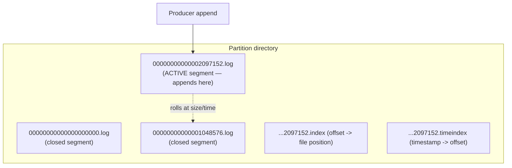
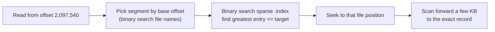
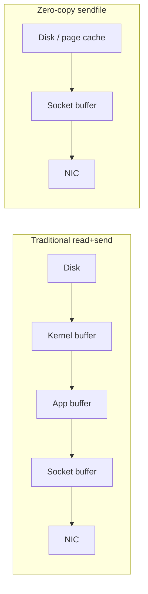
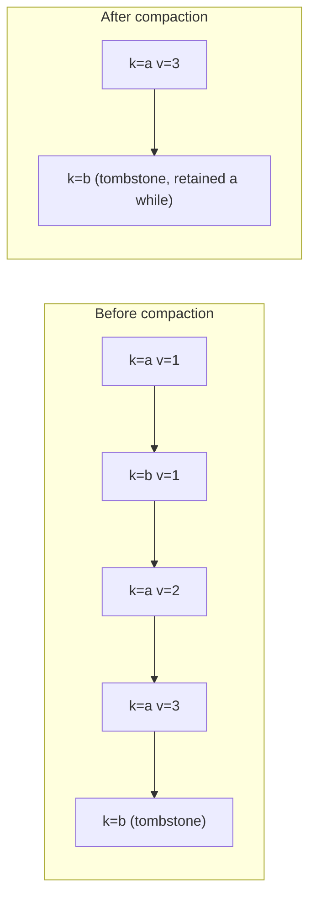

# Message Queue Deep Dive: The Log Storage Engine

Part 1 promised that a disk-backed queue can beat an in-memory one. This chapter is why. The storage engine is the heart of the system: every durability, throughput, and retention guarantee bottoms out in how a partition's bytes are laid out on disk and read back. We design it to do exactly one thing extremely well — **sequential append and sequential scan** — and to make random access the rare, cheap exception.

> **Reader path:** This expands the concise answer's [deep dives](../interview-questions/message-queue.html#deep-dives) on "append-only log vs database-backed queue" and "sequential segment writes." Start there if you want the summary.
>
> **Series:** [(1) Foundations](01-foundations.md) · (2) The log storage engine · [(3) Partitioning and ordering](03-partitioning-and-ordering.md) · [(4) Replication and durability](04-replication-and-durability.md) · [(5) Delivery semantics](05-delivery-semantics.md) · [(6) Production readiness](06-production-readiness.md).

## 1. The problem with the obvious design

The obvious durable queue is a table: `INSERT` on publish, `SELECT ... WHERE status='ready' ORDER BY id LIMIT n` on consume, `UPDATE status='done'` on ack. It works until it doesn't:

- Every consume touches a **hot index range** and every ack **updates a row in place**, generating random writes and B-tree page churn.
- The "ready" index becomes a contention point; vacuum/compaction fights the workload.
- Throughput is capped by random IOPS, not by disk bandwidth — you leave 10× on the table.

A message stream has a special shape: **writes only ever append, reads are mostly sequential from a cursor, and old data is deleted in bulk, never updated.** That shape is a perfect match for an append-only log.

## 2. The commit log, physically

Each partition is an ordered, immutable sequence of records identified by a monotonically increasing **offset**. Physically, a partition is a directory of **segment files**, because a single unbounded file is impossible to expire and slow to recover.

- **Segments.** The partition is chopped into segments of a bounded size (e.g., 1 GB) or age. Exactly one segment is **active** and receives appends; the rest are sealed and read-only. The file name is the **base offset** of its first record, so locating the segment for an offset is an array search over file names, not a scan.
- **Records and batches.** Producers send **batches**; the broker persists a batch header (base offset, length, CRC, compression codec, producer id/epoch/base sequence) followed by the packed records. Batching amortizes per-record overhead and is what makes compression and idempotence (Part 5) efficient.
- **Immutability.** A written record is never modified. "Delete" happens only by dropping whole old segments; "update" (for compacted topics) happens only by writing a newer record for the same key and later garbage-collecting the old one.

## 3. Finding an offset fast: the sparse index

Consumers ask "give me from offset N." We must translate an offset into a byte position without scanning. Storing an index entry for every record would bloat memory, so each segment carries a **sparse index**: one `(relative offset → file position)` entry every few KB of log.

Lookup is therefore **O(log n)** over segments plus **O(log m)** within the sparse index, then a short linear scan. A parallel **time index** maps timestamps to offsets, so retention-by-time and "seek to 9:00 AM" both avoid full scans. The indexes are small enough to stay memory-resident, which is what keeps tail reads cheap.

## 4. Why disk is fast here: page cache, sequential I/O, and zero-copy

Three mechanisms turn "it's on disk" from a liability into an advantage:

1. **Sequential writes.** Appending to the active segment is sequential, so even spinning disks reach hundreds of MB/s and SSDs stay far from their random-write cliff. We never seek to update a record.
2. **Page cache does the caching.** The broker does **not** maintain its own record cache. It writes through the OS page cache, and because consumers read the recent tail that the writer just wrote, those pages are already hot in RAM. Memory is used as cache without GC pressure or a second copy, and a broker restart doesn't cold-start the cache (the kernel keeps it).
3. **Zero-copy fan-out.** To send bytes to a consumer, the broker uses `sendfile`: the kernel copies pages straight from the page cache to the socket, skipping user space entirely.

Fan-out to N consumer groups reads the **same** cached pages N times with no per-consumer copy. This is why one broker can saturate its NIC serving many consumers — the concise answer's claim that the log "amortizes disk writes" in practice also amortizes reads.

## 5. Durability: flush, fsync, and the honest acknowledgment

A write to the page cache is not yet on disk. Two knobs decide the durability/latency trade:

- **OS-flush (default).** Append to page cache and let the kernel flush lazily. Fast (hits N1 easily) but a simultaneous power loss on a machine could lose the not-yet-flushed tail. We **do not** rely on single-node fsync for durability.
- **Replication as durability.** Instead of `fsync` on every write, we make durability a **replication** property: a write is acknowledged only after enough replicas have it (Part 4). Three copies on three machines with independent power domains is a stronger guarantee than one `fsync`, and far cheaper on latency.
- **Optional fsync policy.** Topics that need it can force fsync every _k_ records or _t_ ms; this is a per-topic dial, not a global tax.

This is the crux of N3: "zero loss of **acknowledged** messages after one broker failure" is satisfied by acknowledging only after replication, not by trusting one disk.

## 6. Retention and compaction: bounding the log

A log that only grows is a bug. Two independent reclamation policies:

- **Time/size retention (default).** Drop whole segments older than the retention window (24 h for N4) or beyond a size cap. Because expiry is "unlink an old segment file," it is O(1) metadata work, not a delete storm. A consumer that falls 24 h behind gets an explicit **offset-out-of-range / expired-offset** error rather than silently skipping data.
- **Log compaction (for keyed state).** For "latest value per key" topics (e.g., a changelog of account balances), retain the **most recent record per key** and garbage-collect superseded ones. A record with a null payload is a **tombstone** marking a key deleted; it is kept long enough for all consumers to observe the delete, then removed.

Compaction runs on **closed** segments in the background and never blocks the active segment, so ingest is unaffected. Offsets are preserved (they never shift), which keeps consumer positions valid.

## 7. Crash recovery

On restart a broker must return each partition to a consistent state:

1. **Find the active segment** (highest base offset) and **validate from the last checkpoint** using batch CRCs.
2. **Truncate a torn tail.** If the process died mid-append, the final partial/corrupt batch is truncated so the log ends on a complete, CRC-valid batch.
3. **Rebuild indexes if needed.** Sparse offset and time indexes are derived data; a damaged index is regenerated by scanning the segment.
4. **Reconcile with the leader.** A follower re-joining truncates anything past the leader's high-water mark and re-fetches (the log-divergence handling detailed in Part 4).

Recovery is bounded by **segment size**, not partition size — another reason segments exist. Smaller segments recover faster but cost more file handles and index overhead; ~1 GB is a common balance.

## 8. What this buys us, measured against the NFRs

| NFR | How the storage engine serves it |
|-----|----------------------------------|
| N1 (p99 < 20 ms) | Sequential append to page cache; no random I/O, no in-place update |
| N2 (200k msg/s) | Batching + sequential writes + zero-copy reads saturate disk/NIC bandwidth |
| N3 (no loss) | Durability delegated to replication; CRC-validated recovery truncates torn tails |
| N4 (24 h retention) | Segment-drop retention in O(1); time index for seek-by-time |

The storage engine gives one partition its speed and safety. But one partition is one machine's worth of throughput and ordering. Part 3 is about slicing a topic into many partitions to scale past that — and the ordering guarantees that slicing does and does not preserve.

---

Next: [Part 3 — Partitioning and ordering](03-partitioning-and-ordering.md) covers key hashing, the partitioner, consumer parallelism, hot partitions, and the drain-and-cutover needed to add partitions without breaking ordered producers.
