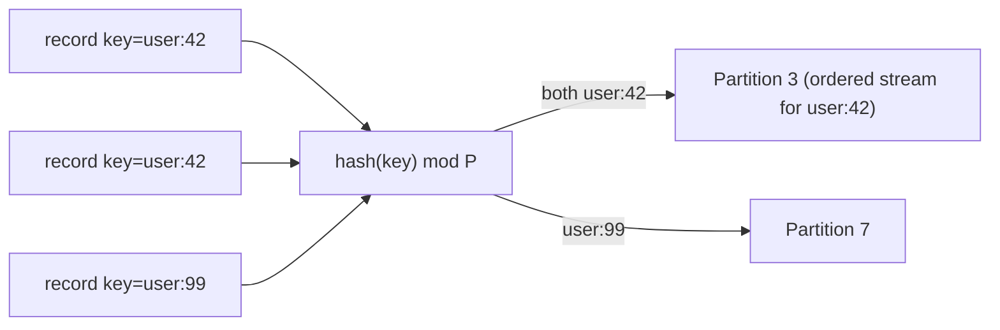

# Message Queue Deep Dive: Partitioning and Ordering

A single partition is a single machine's ceiling: one leader, one append point, tens of MB/s. To reach the 200 MB/s of N2 we split a topic into many partitions and spread their leaders across brokers. Partitioning is the lever that buys throughput — but it is also the lever that defines exactly what ordering the system can promise. This chapter is about spending that lever wisely.

> **Reader path:** This expands the concise answer's [partition throughput](../interview-questions/message-queue.html#deep-dives) discussion — hash routing keys to fixed partitions, hot keys, and the "drain-and-cutover" needed on expansion. The interview version is there; this is the why.
>
> **Series:** [(1) Foundations](01-foundations.md) · [(2) The log storage engine](02-log-storage-engine.md) · (3) Partitioning and ordering · [(4) Replication and durability](04-replication-and-durability.md) · [(5) Delivery semantics](05-delivery-semantics.md) · [(6) Production readiness](06-production-readiness.md).

## 1. The partition is four things at once

A partition is simultaneously the unit of:

1. **Ordering** — records are totally ordered *within* a partition by offset, and not ordered across partitions.
2. **Parallelism** — different partitions are appended and consumed independently, so throughput scales with partition count.
3. **Storage** — each partition is its own segmented log (Part 2), placed on some broker's disk.
4. **Replication** — each partition has its own leader and follower set (Part 4).

Because these four collapse into one concept, every partitioning decision is a simultaneous decision about ordering, throughput, placement, and failure blast radius. That coupling is the whole game.

## 2. Routing a record to a partition

The producer decides a record's partition before it leaves the client:

- **Keyed records** → `partition = hash(key) mod P`. All records sharing a key (e.g., a `user_id`) land on the same partition and are therefore **totally ordered relative to each other**. This is how you get "process every event for one user in order" without global ordering.
- **Keyless records** → spread across partitions for balance. Modern clients use **sticky batching**: fill a batch for one partition, send it, then move to another. Sticky batching keeps batches large (better compression and throughput) without sacrificing balance over time.



The ordering guarantee is precise: **a stable key gets a stable, ordered sub-stream**; unkeyed traffic gets throughput but only per-partition order. Interviewers love the follow-up "how do you order across keys?" — the honest answer is you don't, and if you truly need it you've accepted a single-partition (single-writer) bottleneck.

## 3. Consumer parallelism follows partitions

On the read side, a **consumer group** distributes partitions across its members, and **a partition is owned by at most one member of a group at a time**. That single rule is what preserves per-partition order end to end: only one consumer advances a given partition's offset, so it observes offsets monotonically.

```mermaid
flowchart TB
    subgraph Topic: 6 partitions
      P0 & P1 & P2 & P3 & P4 & P5
    end
    subgraph Group G (3 consumers)
      C0 & C1 & C2
    end
    P0 --> C0
    P1 --> C0
    P2 --> C1
    P3 --> C1
    P4 --> C2
    P5 --> C2
```

Consequences that fall straight out of this:

- **Max useful consumers per group = partition count.** With 6 partitions, a 7th consumer sits idle. Partition count is your **maximum consumer parallelism**, chosen up front.
- **Independent groups scale independently.** Group A and Group B each get their own full copy of the assignment; fan-out is free on the read side because reads are just cursors over the shared log (Part 2's zero-copy path).
- **Rebalancing** reshuffles partitions when members join/leave — covered in Part 5, because it interacts with offset commits and delivery semantics.

## 4. Hot partitions: the failure mode of skew

Hashing assumes keys are uniformly distributed. Real keys are not. One `user_id` that represents a celebrity, one `tenant_id` running a bulk import, or a null-key stampede can make a single partition carry a disproportionate share of traffic — a **hot partition**. Because a partition is a single leader on a single disk, a hot partition throttles at one machine while its siblings idle.

Mitigations, in order of preference:

| Strategy | How | Cost |
|----------|-----|------|
| **Salting the key** | Append a bounded random suffix (`user:42#0..k`) to spread a hot key over _k_ partitions | Loses strict per-key order; needs a merge step downstream |
| **Compound keys** | Partition by `(user, subtype)` so one user's load spreads by subtype | Order preserved only within the compound key |
| **Isolating tenants** | Give a heavy tenant its own topic/partitions | Operational overhead; quota enforcement (Part 6) |
| **Two-tier / random for keyless** | Only key when ordering is actually required | Nothing ordered unless it must be |

The design principle: **only pay for ordering where a real invariant needs it.** Blanket keying by `user_id` "just in case" manufactures hot partitions for a guarantee nobody consumes.

## 5. The hard part: changing the partition count

`hash(key) mod P` has a nasty property — change `P` and almost every key moves to a different partition. For a stateless topic that's merely a rebalance. For an **ordered** topic it's a correctness bug: records for `user:42` that were on partition 3 now hash to partition 5, so new records can be **consumed before** older records still draining on partition 3. Ordering is silently violated at exactly the moment you scale.

```mermaid
flowchart LR
    subgraph Before P=4
      K["user:42"] --> A["partition 3"]
    end
    subgraph After P=8 (naive)
      K2["user:42"] --> B["partition 5 — older records still on 3!"]
    end
```

Two ways to handle growth safely:

- **Explicit drain-and-cutover.** Stop producing to the topic (or to affected keys), let consumers drain partitions to the tail, then switch producers to the new partition count. Bounded downtime for a strong guarantee — appropriate for topics where order is sacred.
- **Over-provision partitions up front.** Since consumer parallelism is capped by partition count, pick a generous count at creation (e.g., 128) so you rarely need to grow. Partitions are cheap relative to a cutover; this is the common production choice.
- **Avoid modulo where possible.** For placement of *partitions to brokers* (not keys to partitions) use consistent hashing / explicit assignment so adding **brokers** moves partition *leadership*, not key *mapping*. Note the distinction: rebalancing partitions across brokers is safe and online; remapping keys across partitions is the dangerous one.

The takeaway mirrors the concise answer: partition expansion changes key placement, so ordered producers need an explicit **drain-and-cutover boundary rather than an invisible rehash**.

## 6. Placement and balance across brokers

Independently of key→partition mapping, the controller must place each partition's **leader** on some broker and balance:

- **Leader spread** — distribute leaders (not just replicas) evenly so write load is balanced; a broker with too many leaders becomes a hotspot.
- **Rack/AZ awareness** — keep a partition's replicas in different failure domains (Part 4) while keeping the leader network-close to its followers to bound replication latency.
- **Rebalancing** — when brokers are added or fail, reassign leadership and, if needed, move replicas. Data movement is throttled so a rebalance doesn't starve live traffic (Part 6).

## 7. Scorecard

| NFR | How partitioning serves it |
|-----|----------------------------|
| N2 (200k msg/s) | Throughput scales with partition count; leaders spread across brokers |
| Ordering | Per-key total order via `hash(key) mod P`; per-partition order end-to-end via single-owner consumption |
| N5 (availability) | Partition is the failure unit; losing one broker affects only its partitions, which fail over independently |
| N6 (multi-tenancy) | Hot-tenant isolation via dedicated partitions/topics + quotas |

Partitioning gives us throughput and per-key ordering, and it makes the partition the unit of failure. The next question is what happens when the machine holding a partition dies — how do we keep an acknowledged record after a broker failure (N3)? That is replication.

---

Next: [Part 4 — Replication and durability](04-replication-and-durability.md) covers leader/follower replication, the in-sync replica set, `acks`, the high-water mark, leader epochs and fencing, and clean failover.
