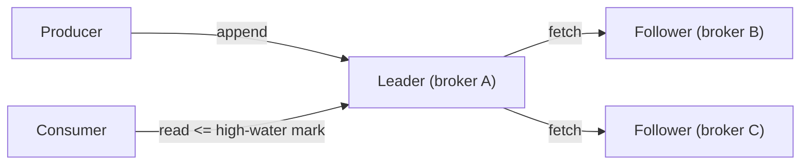
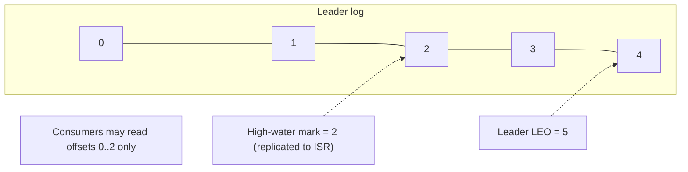
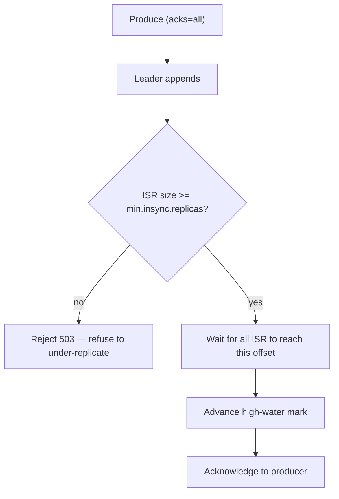
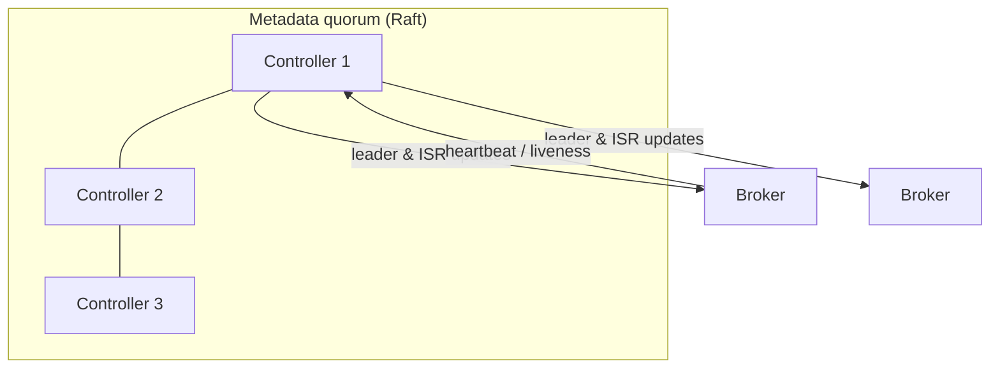

# Message Queue Deep Dive: Replication and Durability

N3 is the promise that makes a message queue trustworthy: **no acknowledged message is lost after one broker failure.** A single disk cannot make that promise — disks and machines die. Replication turns "durable" from a property of one node into a property of a quorum. This chapter is the careful machinery that lets us acknowledge fast (N1) while guaranteeing an acknowledged record survives a broker loss (N3), without ever exposing a record that might vanish.

> **Reader path:** This expands the concise answer's [durable redelivery](../interview-questions/message-queue.html#deep-dives) note — "acknowledge publishes after quorum replication and fence leaders by term." That one sentence is this entire chapter.
>
> **Series:** [(1) Foundations](01-foundations.md) · [(2) The log storage engine](02-log-storage-engine.md) · [(3) Partitioning and ordering](03-partitioning-and-ordering.md) · (4) Replication and durability · [(5) Delivery semantics](05-delivery-semantics.md) · [(6) Production readiness](06-production-readiness.md).

## 1. Leader/follower per partition

Each partition has one **leader** replica and some **followers**, all on different brokers. All reads and writes go through the leader; followers exist to stay current and to be promotable. This is intentionally *not* multi-master: a single writer per partition is what preserves the per-partition total order from Part 3 and avoids write conflicts.



Followers **pull**: each follower issues fetch requests to the leader exactly as a consumer would, appends what it receives to its own copy, and reports back the offset it has reached. Pull-based replication reuses the same efficient read path (Part 2) and lets a slow follower fall behind without blocking the leader's local append.

## 2. Two offsets that run the whole protocol

- **Log End Offset (LEO):** the offset just past the last record a replica has written locally. Each replica has its own LEO.
- **High-Water Mark (HWM):** the highest offset that has been replicated to **enough** replicas. The leader computes it as the minimum LEO across the replicas that count (the ISR, below).

The rule that ties them together and makes the whole system safe:

> **Consumers can only read up to the high-water mark.** Records between the HWM and the leader's LEO exist on the leader but are **not yet acknowledged as durable**, so they are invisible.

This is why a leader crash can't expose a phantom record: anything a consumer ever saw was, by definition, already replicated to a quorum and will survive on a promoted follower.



## 3. The In-Sync Replica set (ISR)

The **ISR** is the set of replicas — including the leader — that are sufficiently caught up (their LEO is within a bounded lag of the leader). A follower that falls too far behind or stops fetching is **removed** from the ISR; when it catches up it rejoins. The ISR is dynamic membership, and it is the quorum the HWM is computed over.

Durability is governed by two dials working together:

- **`acks` (producer side):** how many replicas must confirm before the write is acknowledged.
  - `acks=0` — fire and forget; fastest, no durability. Not for anything that matters.
  - `acks=1` — leader-only; a leader crash before replication loses the record. A common silent data-loss footgun.
  - `acks=all` — the leader waits for the **entire current ISR** to replicate the record before acknowledging. This is what N3 requires.
- **`min.insync.replicas` (topic side):** the minimum ISR size for which `acks=all` writes are allowed. With replication factor 3 and `min.insync.replicas=2`, we tolerate **one** replica down and still accept writes; if the ISR shrinks below 2, the leader **rejects** writes (`503`) rather than accept an under-replicated record it can't guarantee.



The combination is the heart of N3: **acknowledge only after the ISR (≥ min.insync.replicas) has the record.** Fewer replicas than that, and we'd rather refuse the write than lie about durability.

## 4. Failover: promoting a follower without losing or duplicating

When the leader dies, the controller (Section 6) elects a new leader from the **current ISR**. Because every in-sync follower has all records up to the old HWM, the promoted leader has every acknowledged record — no acknowledged data is lost. Two subtleties make this safe rather than merely hopeful:

- **Clean vs unclean election.** Electing from the ISR is a **clean** election: no acknowledged loss. If the ISR is empty (every in-sync replica also died), you face a choice:
  - **Wait** for an ISR member to return (favor consistency, sacrifice availability), or
  - **Unclean leader election:** promote an out-of-sync replica (favor availability, accept losing records it never received).
  
  We default `unclean.leader.election=false`: correctness over uptime. Part 6 discusses when a topic might flip it.
- **Truncation on rejoin.** When the old leader returns as a follower, its log may contain **unacknowledged** records past the HWM that the new leader never had. It must **truncate** those and re-fetch from the new leader so the copies converge. Getting this right requires leader epochs.

## 5. Leader epochs and fencing zombies

A classic distributed-systems hazard: the old leader didn't actually crash — it was network-partitioned, kept accepting writes, and now returns as a **zombie leader**. If clients still talk to it, you get split-brain and log divergence.

The fix is a monotonically increasing **leader epoch** (a term number), bumped on every leadership change and recorded in the log:

- The controller assigns a new epoch to the new leader.
- Brokers and clients **reject** any request stamped with a stale epoch — the zombie is **fenced**.
- The epoch is written into the log so that during truncation a rejoining replica can find the exact divergence point (the offset where epochs differ) and truncate precisely, instead of guessing from the HWM alone.

```mermaid
sequenceDiagram
    participant Old as Old leader (epoch 5)
    participant Ctrl as Controller
    participant New as New leader (epoch 6)
    participant Cl as Client
    Ctrl->>New: You are leader, epoch 6
    Old->>Cl: (zombie) append at epoch 5
    Cl->>New: append (learned epoch 6)
    Old->>New: rejoin request (epoch 5)
    New-->>Old: FENCED — stale epoch; truncate to divergence, refetch
```

This is exactly the concise answer's "fence leaders by term." The producer-side counterpart — fencing a **zombie producer** by epoch so a retried write can't duplicate — lives in Part 5.

## 6. The control plane: who decides leaders and ISR

Someone has to store cluster metadata (topics, partitions, replica assignments, current leaders, ISR) and make leadership decisions consistently. That component must itself be fault-tolerant and strongly consistent, so it is backed by a **consensus quorum** (Raft/Paxos-style; e.g., ZooKeeper historically, or a built-in Raft metadata quorum like KRaft).



- The controller tracks broker liveness via heartbeats, updates the ISR when replicas fall behind or recover, and triggers leader elections on failure.
- Metadata changes are committed through the quorum, so all brokers converge on the same view of who leads each partition — even across controller failures.
- Separating the **data plane** (high-throughput partition replication, tuned for bandwidth) from the **control plane** (low-volume metadata, tuned for consistency) lets each use the right tool: quorum consensus for the small, critical metadata; leader/ISR replication for the large data stream.

## 7. Placement for real fault tolerance

Replication only helps if replicas fail independently. The controller enforces **rack/AZ awareness**: the replicas of a partition are placed in distinct failure domains so a rack switch or an availability-zone outage takes at most one replica. The trade-off is replication latency and cross-AZ network cost (Part 1's 600 MB/s), which is why the leader is usually kept network-close to its followers while still spanning domains.

## 8. Scorecard

| NFR | How replication serves it |
|-----|---------------------------|
| N3 (no acknowledged loss) | `acks=all` + `min.insync.replicas`; consumers read ≤ HWM; clean election from ISR |
| N1 (p99 < 20 ms) | Pull-based replication + acknowledging at ISR quorum (not global fsync) keeps the ack path short |
| N5 (single-broker tolerance) | RF=3, `min.insync.replicas=2`: one broker can die and writes continue |
| Correctness under partition | Leader epochs fence zombies; precise truncation prevents divergence |

We can now store, partition, and durably replicate a stream. What remains is the contract with consumers: how many times is a message delivered, how do groups track progress across rebalances, and can we achieve exactly-once — the questions that decide whether applications can trust the pipeline.

---

Next: [Part 5 — Delivery semantics](05-delivery-semantics.md) covers at-most/at-least/exactly-once, consumer-group offset management, rebalancing protocols, the idempotent producer, and transactions.
