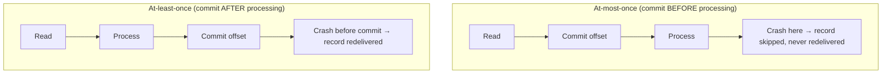
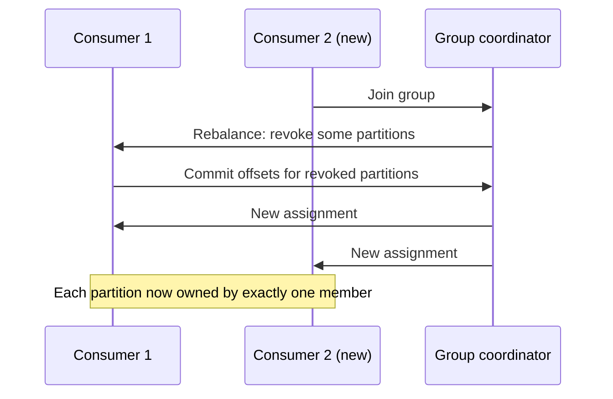
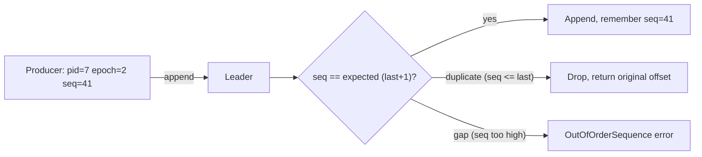
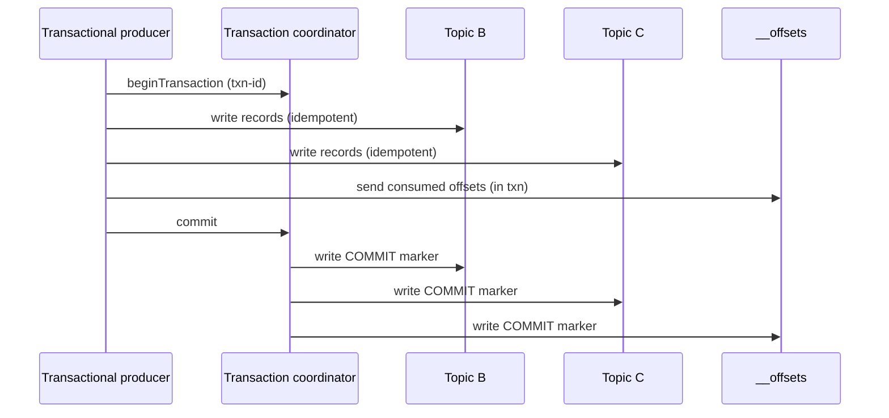

# Message Queue Deep Dive: Delivery Semantics

This is the chapter applications actually feel. Storage, partitioning, and replication decide whether the log is correct; **delivery semantics** decide what a consumer can assume when it reads a record. Getting it right is the difference between "we might double-charge a card" and "we never do." We'll build up from the three classic guarantees to the idempotent producer and transactions that make **exactly-once within the pipeline** real.

> **Reader path:** This expands the concise answer's [durable redelivery](../interview-questions/message-queue.html#deep-dives) and its point that "a crash after processing but before acknowledgment repeats delivery: consumers must deduplicate business effects." Here we show exactly where that gap is and how to close it.
>
> **Series:** [(1) Foundations](01-foundations.md) · [(2) The log storage engine](02-log-storage-engine.md) · [(3) Partitioning and ordering](03-partitioning-and-ordering.md) · [(4) Replication and durability](04-replication-and-durability.md) · (5) Delivery semantics · [(6) Production readiness](06-production-readiness.md).

## 1. The three guarantees, and where they come from

The guarantee a consumer gets is decided by **when it commits its offset relative to when it processes the record.**

- **At-most-once** — commit first, then process. A crash between the two **loses** the record. Acceptable only for lossy telemetry.
- **At-least-once** — process first, then commit. A crash between the two **redelivers** the record. This is the sane default and what N3 promises, but it means **duplicates are possible** and consumers must cope.
- **Exactly-once** — no loss and no duplicate *effect*. It is not magic; it is at-least-once delivery **plus** idempotence or transactions so that a redelivered record produces no additional effect. Sections 4–6 build it.

The crucial mental model from the concise answer: at-least-once + **deduplicate business effects** = effectively-once. There is no way to make the network deliver a message exactly one time; you make the *effect* happen once.

## 2. Consumer-group offset management

A group's progress is a **committed offset per partition**, stored durably in an internal compacted `__offsets` topic (Part 2's compaction keeps only the latest offset per `(group, partition)`). Storing offsets *in the log itself* means offset state inherits the same replication and durability as data — no separate database to keep consistent.

Design choices that matter:

- **Commit granularity.** Commit per batch, not per record, to keep offset traffic small; the cost is that a crash redelivers up to one batch.
- **Auto-commit vs manual.** Auto-commit on a timer is convenient but commits offsets for records you may not have finished processing → silent at-most-once surprises. Real pipelines commit **manually, after** the processing side-effect is durable.
- **The `__offsets` topic is just a log.** Reading the latest committed offset on startup/rebalance is a compacted-topic read; there's no special store.

## 3. Rebalancing: handing partitions between members

When a consumer joins, leaves, or dies, the group must reassign partitions while preserving the "one owner per partition" rule (Part 3). A **group coordinator** (a broker) runs the protocol.

Two protocols, and the reason the newer one exists:

- **Eager (stop-the-world).** Every member revokes **all** partitions, then the coordinator reassigns from scratch. Simple, but the whole group pauses on every membership change — painful with large groups or frequent scaling.
- **Cooperative / incremental.** Only the partitions that actually need to move are revoked; everyone else keeps consuming. Rebalances become cheap and frequent-scaling-friendly. This is the modern default.

Rebalancing interacts with delivery: a member **must commit offsets for revoked partitions before releasing them**, or the new owner re-processes from an older offset (extra duplicates). Long processing loops should also heartbeat independently of `poll`, so a slow-but-alive consumer isn't mistaken for dead and evicted mid-batch.

## 4. The idempotent producer: killing duplicates at the source

At-least-once has a second duplicate source that has nothing to do with consumers: **producer retries.** A producer sends a batch, the leader writes and replicates it, but the ack is lost in the network. The producer retries and — naively — the record is written **twice**.

The fix reuses the `ProducerSession` from Part 1: `(producerId, epoch, sequenceNumber)` per partition.

- The broker remembers the last sequence per `(producerId, partition)`. A retried batch carries the **same** sequence, so the broker recognizes and **drops the duplicate**, returning the original offset — exactly the concise answer's "same-session, same-sequence retry returns the original offset."
- The **epoch** fences a **zombie producer**: if a producer is presumed dead and a new instance takes over its `producerId` with a higher epoch, the old instance's writes are rejected. This is the producer-side mirror of Part 4's leader fencing.
- This makes retries safe **within a producer session and partition** — the foundation, but not yet multi-partition atomicity.

## 5. Transactions: atomic multi-partition writes

Many pipelines are **read-process-write**: consume from topic A, produce results to topics B and C, and commit the input offset — and all of that must be atomic, or a crash leaves partial output plus a duplicate on replay. Transactions provide it.

The machinery:

- A **transactional id** gives the producer a stable identity across restarts; a **transaction coordinator** (a broker, backed by a `__transaction` log) tracks each transaction's state.
- The producer marks a **begin**, writes records to multiple partitions (each idempotently, Section 4), writes its **consumed offsets** to the `__offsets` topic *as part of the same transaction*, then **commits**.
- On commit/abort, the coordinator writes **control markers** into every affected partition. These markers are how readers know a transaction's boundary.

On the read side, **isolation level** decides visibility:

- **`read_uncommitted`** — see everything, including records from in-flight or aborted transactions (fast, no atomicity).
- **`read_committed`** — the consumer buffers past open transactions and only surfaces records once it sees a COMMIT marker; records from ABORTED transactions are skipped. This is what makes the output of a transactional pipeline appear all-or-nothing.

Put together — idempotent producer + transactional read-process-write + `read_committed` — you get **exactly-once *within the queue's boundary***: input offsets and output records commit atomically, so replays neither lose nor duplicate effects.

## 6. The honest boundary of exactly-once

Exactly-once holds **inside the system.** The moment a consumer produces a side-effect in an **external** system that isn't in the transaction — charge a card, send an email, write to an unrelated database — the guarantee stops at the boundary. Two ways to extend it outward:

- **Idempotent sinks.** Make the external effect idempotent with a natural or supplied key (`idempotency-key`), so a duplicate delivery is a no-op. This is the concise answer's "deduplicate business effects" and is the pragmatic default.
- **Transactional outbox / 2-phase patterns.** Write the intent to an outbox in the same DB transaction as the business change, and relay it to the queue; or coordinate a two-phase commit where the sink supports it (rare and expensive).

Design guidance: prefer **at-least-once delivery + idempotent effects** over chasing distributed exactly-once across systems you don't control. Reserve full transactions for pipelines whose input and output both live in the queue.

## 7. Dead-lettering and backpressure

- **Dead-letter topic.** A record that exceeds a retry budget is moved — through a **durable path** (produce-then-commit, ideally transactional) — to a dead-letter topic so a crash mid-redrive can't lose it. Redrive is an admin operation that takes an **idempotency key** so re-injection is itself safe.
- **Backpressure via pull.** Because consumers **pull** at their own pace (Part 4's fetch model), a slow consumer simply fetches less; it can't be overwhelmed by a fast producer. Lag (Part 6) becomes the natural, observable signal for scaling consumers up — bounded by the partition count from Part 3.

## 8. Scorecard

| Concern | Mechanism |
|---------|-----------|
| Default delivery | At-least-once: process, then commit offset |
| Producer-retry duplicates | Idempotent producer: `(pid, epoch, seq)` dedup |
| Zombie producer | Epoch fencing (mirror of leader fencing) |
| Atomic read-process-write | Transactions + control markers + `read_committed` |
| Effects in external systems | Idempotent sinks / outbox — exactly-once *effect*, not delivery |
| Poison messages | Durable dead-letter path + idempotent redrive |

We now have a correct, ordered, durable, at-least-once (optionally exactly-once) pipeline. The last chapter is what it takes to run it at 3 a.m.: quotas, hot-partition defense, the metrics that predict failure, multi-region, security, and the go-live checklist.

---

Next: [Part 6 — Production readiness](06-production-readiness.md) covers quotas and backpressure, hot-partition mitigation, the observability signals that matter, tiered and multi-region storage, security, and a launch checklist.
