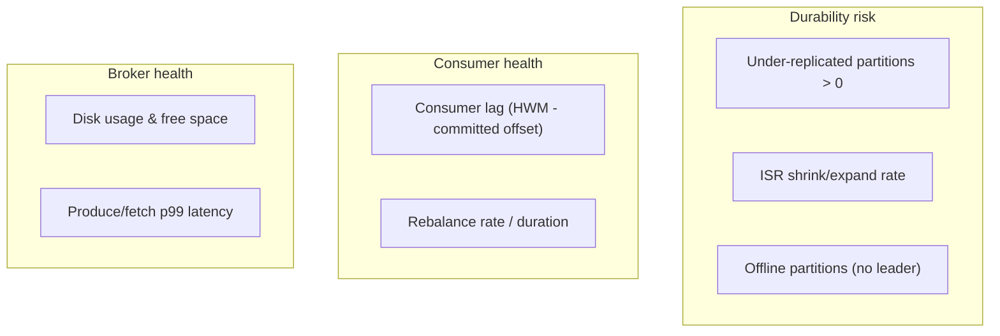
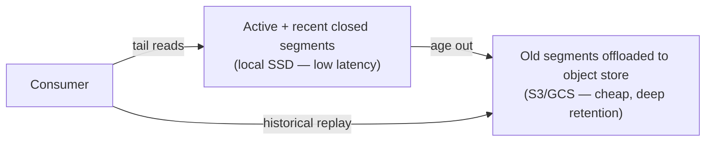

# Message Queue Deep Dive: Production Readiness

A design that works in the diagram and a design that survives Black Friday are different artifacts. This chapter covers the operational surface: keeping one tenant from starving another, defending against skew, seeing failure before it pages you, extending retention cheaply, spanning regions, locking it down, and the checklist that says "ship it."

> **Reader path:** This closes the loop on the concise answer's operational notes — [quotas and queue-depth limits](../interview-questions/message-queue.html#deep-dives), alerting before retention expiry, and the "check the design" failure drills.
>
> **Series:** [(1) Foundations](01-foundations.md) · [(2) The log storage engine](02-log-storage-engine.md) · [(3) Partitioning and ordering](03-partitioning-and-ordering.md) · [(4) Replication and durability](04-replication-and-durability.md) · [(5) Delivery semantics](05-delivery-semantics.md) · (6) Production readiness.

## 1. Quotas and backpressure (N6)

Multi-tenancy means one tenant must never be able to take the cluster down. We enforce **byte-rate and request-rate quotas** per tenant/principal, applied *before* disks or NICs saturate:

- **Producer quotas** cap ingress bytes/s per tenant; over-quota producers are **throttled** (the broker delays responses) rather than hard-failed, so a bulk import slows down instead of erroring out.
- **Consumer quotas** cap egress bytes/s so a replay-from-zero doesn't monopolize a broker's NIC and starve live traffic.
- **Request quotas** cap the broker CPU share a client can consume (connection/metadata storms).

Backpressure is mostly *free* because consumers pull (Part 4): a slow consumer just fetches less and its **lag** grows. The job of quotas is to bound the *producer* side and to keep tenants isolated; the job of monitoring is to notice lag early.

## 2. Hot partitions and skew, operationally

Part 3 covered the design-time defenses (key salting, compound keys, over-provisioning). In production you also need **detection and response**:

- **Detect** with per-partition throughput and byte-rate metrics; a partition consistently at N× the median is hot.
- **Respond** by moving that partition's leader to a less-loaded broker (leadership rebalance — cheap, online) or, if the key space allows, rolling out a salted key with a downstream merge.
- **Never** fix a hot partition by blindly increasing partition count on an ordered topic — that triggers the key-remap ordering hazard from Part 3. Use the drain-and-cutover boundary.

## 3. Observability: the signals that predict failure

Four families of metrics, and specifically what each one warns you about:

- **Consumer lag = high-water mark − committed offset**, per group per partition. The single most important application-level signal: rising lag means consumers can't keep up and, if it approaches the retention window, you are about to **lose unread data**. Alert on lag *time-to-retention*, not just lag size — the concise answer's "alert before retention expiry."
- **Under-replicated partitions (URP > 0)** and **ISR shrink** mean a replica is lagging or down; you are one failure away from breaching `min.insync.replicas` and rejecting writes. This is your N3 early-warning.
- **Offline partitions** (no available leader) means writes/reads for those partitions are down — page immediately.
- **Disk free space** — a full disk on a log-structured system is an outage; alert with enough headroom to act (retention is your relief valve).
- **Produce/fetch p99 latency** guards N1; a rising tail often precedes ISR shrink or disk pressure.

## 4. Tiered storage: retention without hoarding SSDs

24 hours of hot retention (Part 1) fits on local disk, but teams increasingly want **days or weeks** of replay for reprocessing. Storing all of it on broker SSDs is expensive and makes recovery slow. **Tiered storage** splits the log:

- Recent segments stay local for low-latency tail reads; sealed segments are offloaded to a cheap object store and deleted locally.
- Consumers reading history transparently fetch remote segments (higher latency, that's fine for backfills).
- Bonus: brokers hold far less local data, so **failover and rebalancing move less** — recovery gets faster, not just cheaper.

## 5. Multi-region

Cross-region is where "one guarantee fits all" breaks; you choose per topic:

- **Asynchronous mirroring (active-passive).** A replicator copies topics from a primary region to a DR region. Simple and the common default, but the DR copy lags, so a hard region loss can lose the un-mirrored tail — an explicit **RPO > 0**. Offsets differ between regions, so consumers failing over need offset **translation**.
- **Active-active (multi-writer).** Both regions accept writes and mirror to each other. Maximizes availability but reintroduces the cross-region ordering and conflict problems we scoped **out** in Part 1; only worth it for genuinely partitionable, conflict-free workloads.
- **Stretch cluster (synchronous across nearby AZs/regions).** Place the ISR across regions so `acks=all` implies cross-region durability (RPO ≈ 0). Strong, but every write pays cross-region latency — viable only for close regions and latency-tolerant topics.

The honest framing: pick RPO/RTO **per topic**. Most topics take async mirroring (cheap, RPO seconds–minutes); a few critical ones justify the latency of synchronous replication.

## 6. Security

- **Encryption in transit** — TLS on every client↔broker and broker↔broker connection.
- **Authentication** — mutual TLS or SASL (e.g., SCRAM/OAuth) so every principal is identified.
- **Authorization** — ACLs per topic and per operation, authorizing **produce, consume, and admin/redrive separately** (Part 1's contract). A consumer credential can't publish; a redrive right is distinct from a read right.
- **Encryption at rest** — disk/volume encryption for the segment files; sensitive payloads can add application-level (end-to-end) encryption so brokers never see plaintext.
- **Tenant isolation** — ACLs + quotas together ensure a tenant can neither read another's topics nor exhaust shared capacity.

## 7. Operational procedures

- **Rolling upgrades / restarts.** Restart one broker at a time, waiting for URP to return to 0 between steps so you never drop below `min.insync.replicas`.
- **Partition reassignment throttling.** Moving replicas copies whole logs; **throttle** the reassignment traffic so it doesn't starve live produce/fetch (ties back to the quota machinery).
- **Failure drills.** Practice the concise answer's two tests: (1) kill a broker after a quorum append but before the ack and confirm a producer retry resolves to the **original** offset (idempotence, Part 5); (2) kill a consumer before commit and confirm **redelivery**, not silent loss (at-least-once, Part 5). If both hold under chaos testing, N3 is real.
- **Capacity headroom.** Track the Part 1 math continuously; add brokers/partitions before sustained load crosses ~60–70% of disk/NIC so failover has somewhere to go.

## 8. Go-live checklist

| Area | Gate |
|------|------|
| Durability | RF ≥ 3, `min.insync.replicas=2`, `acks=all` on critical topics, unclean election off |
| Ordering | Partition count sized for peak + headroom; keys chosen only where order is required |
| Delivery | Consumers commit **after** processing; idempotent/transactional where effects must not duplicate |
| Retention | Window set per topic; **lag-to-retention** alerting wired |
| Observability | URP, ISR changes, offline partitions, lag, disk, p99 latency dashboards + alerts |
| Multi-tenancy | Producer/consumer/request quotas; ACLs per operation |
| Security | TLS everywhere, authN, per-operation authZ, at-rest encryption |
| DR | RPO/RTO chosen per topic; mirroring + offset translation tested with a failover drill |

## Series recap

Across six chapters we built a distributed message queue from the bytes up:

- **Parts 1–2** established the requirements, capacity math, and the append-only **log storage engine** that makes a disk-backed queue fast (segments, sparse index, page cache, zero-copy) and safe (CRC recovery).
- **Part 3** used **partitioning** to scale throughput and to define exactly the ordering the system can promise — per-key, per-partition — and the drain-and-cutover needed to grow safely.
- **Part 4** made durability a quorum property via **replication**: ISR, `acks=all` + `min.insync.replicas`, the high-water mark, and leader-epoch fencing for clean failover.
- **Part 5** delivered the consumer contract: at-least-once by default, the **idempotent producer** and **transactions** for exactly-once *within* the pipeline, and idempotent sinks beyond it.
- **Part 6** made it operable: quotas, hot-partition defense, the observability signals that predict failure, tiered and multi-region storage, security, and a launch checklist.

The through-line: a message queue earns trust by being **honest about what it acknowledges** — never exposing a record it can't guarantee, never losing one it already did.

---

Back to [Part 1 — Foundations](01-foundations.md) · Concise interview answer: [Design a message queue](../interview-questions/message-queue.html) · [HLD template](../interview-template.html)
