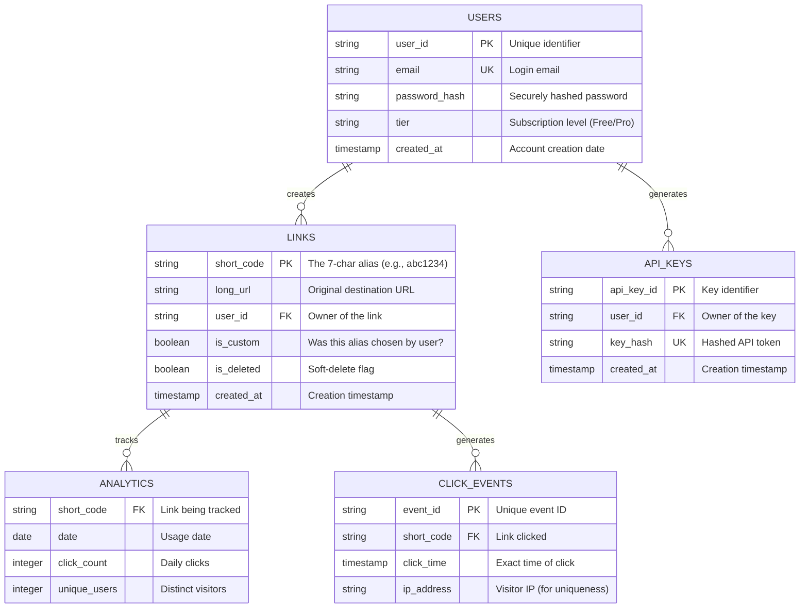

# Article 2: Core Entities & Architecture

## 2. Core entities

### The Data Foundation

A great system design starts with a solid data model. If we get the entities right, the logic tends to follow naturally. If we get them wrong, we'll spend forever fighting our own database schema.

> **Reader path — 2. Core entities:** [Separate scoped walkthrough](../interview-questions/url-shortener.html#core-entities) · [HLD template](../interview-template.html). Its assumptions and contracts may differ.
>
> **Series:** [Requirements](01-introduction-requirements.md) → entities here → [API](03-api-design.md) → [working baseline](04-basic-system-design.md). The scaled architecture and request paths now expand [stage 5](06-proposed-solutions.md#high-level-architecture).

Our URL shortener is relatively simple in terms of relationships, but the scale demands precision. We need to store billions of links while keeping the "hot" path—the redirect—incredibly lightweight.

### Entity Relationships Diagram

This diagram visualizes how our data fits together. Notice that `LINKS` are the central hub, connecting users who create them to the click events they generate.



---

<a id="1-deep-dive-core-entities"></a>
<a id="deep-dive-core-entities"></a>
### Core entity details

Let's break down the three most critical data structures in our system.

#### Entity 1: Links (The Crown Jewels)
This is the heart of our system. The `short_code` is our primary key because it's what we look up 99% of the time.
*   **Design Choice**: We use `is_deleted` (soft delete) instead of actually removing rows. This prevents a deleted short code from being immediately reused by another user (which could cause security confusion) and allows for data recovery.
*   **Scale**: We expect billions of rows here.

```text
Links Table:
  ├─ short_code (PK): "abc1234" (7 chars, Base62)
  ├─ long_url: "https://very-long-site.com/..."
  ├─ user_id (FK): Link owner
  ├─ created_at: Immutable timestamp
  ├─ is_custom: Boolean flag
  └─ is_deleted: Boolean flag
```

#### Entity 2: Users (The Owners)
Users are standard account entities. We separate `API_KEYS` into their own table to allow users to rotate keys without losing their account history or links.
*   **Tier**: Crucial for rate limiting. A "free" user might get 10 links/hour, while "enterprise" gets 10,000.

#### Entity 3: Analytics (The Value Add)
How do we store statistics for 500 million DAILY redirects?
*   **The Trap**: Storing every single click as a row in a relational database will kill it.
*   **The Solution**: We capture raw clicks in an event stream (like Kafka) and aggregate them into daily summaries. The `ANALYTICS` table above represents this *aggregated view* (e.g., "Link A got 50 clicks on Jan 1st"), which is much smaller and faster to query for dashboards.

---

<a id="2-high-level-architecture"></a>
<a id="high-level-architecture"></a>
<a id="component-interactions"></a>
The scaled architecture and component-interaction diagram have moved to [High-level architecture in the scaling deep dive](06-proposed-solutions.md#high-level-architecture), after the API and working baseline.

<a id="3-data-flow-the-life-of-a-request"></a>
<a id="data-flow-the-life-of-a-request"></a>
<a id="path-1-creating-a-link-the-write-path"></a>
<a id="path-2-the-redirect-the-read-path"></a>
The cache-backed creation and redirect flows have moved to [Data flow: the life of a request](06-proposed-solutions.md#data-flow-the-life-of-a-request).

---

## Summary

The series separates concerns:
*   **Entities** focus on correctness and relationships.
*   **Architecture** focuses on speed (Caching) and reliability (Queues).
*   **Data Flows** ensure that "Writes" are safe and "Reads" are fast.

In the next article, we will get into the nitty-gritty of the **API Design**, strictly defining exactly how the outside world talks to these components.
