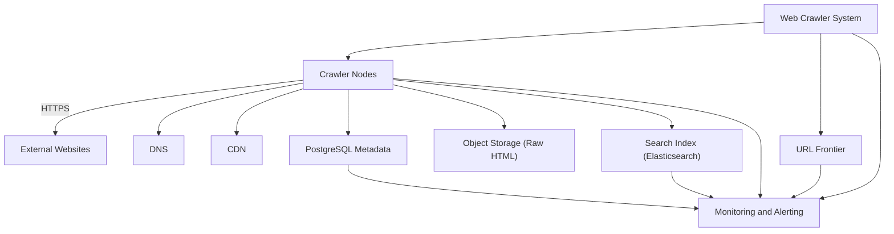
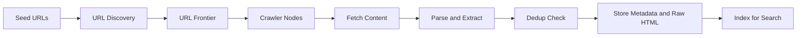
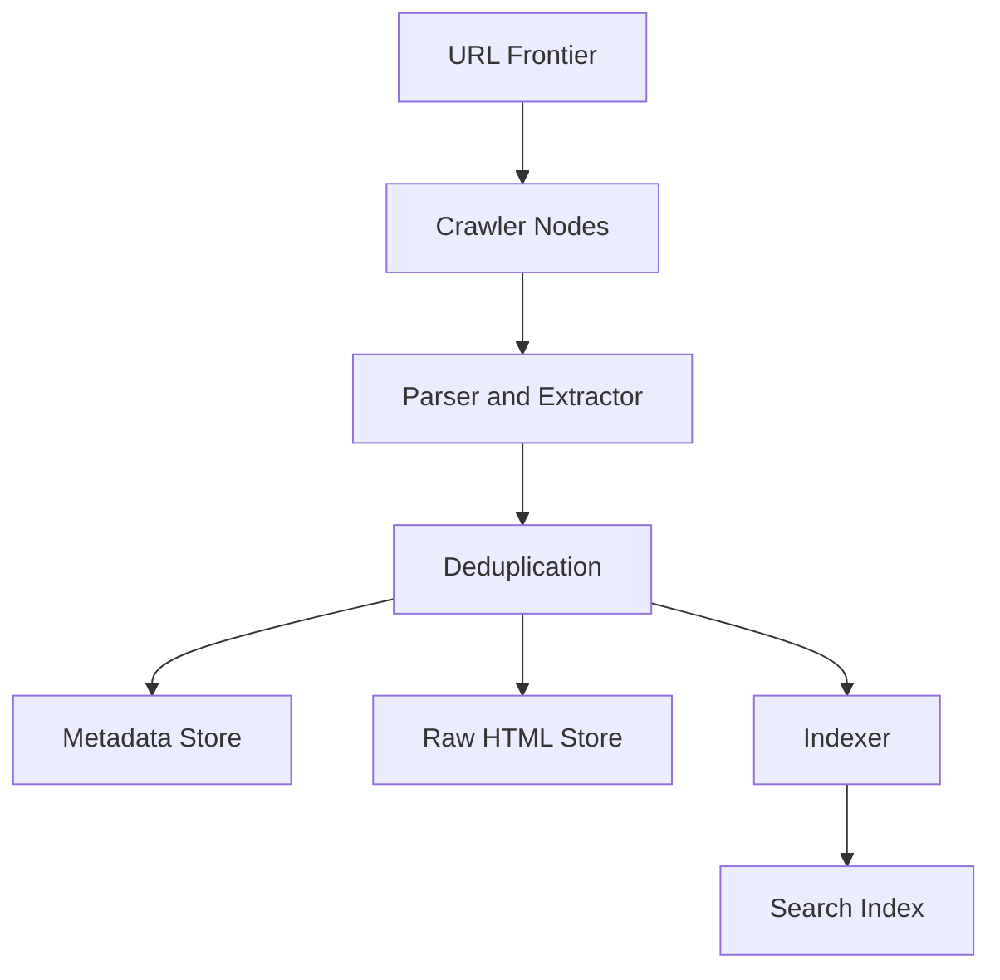
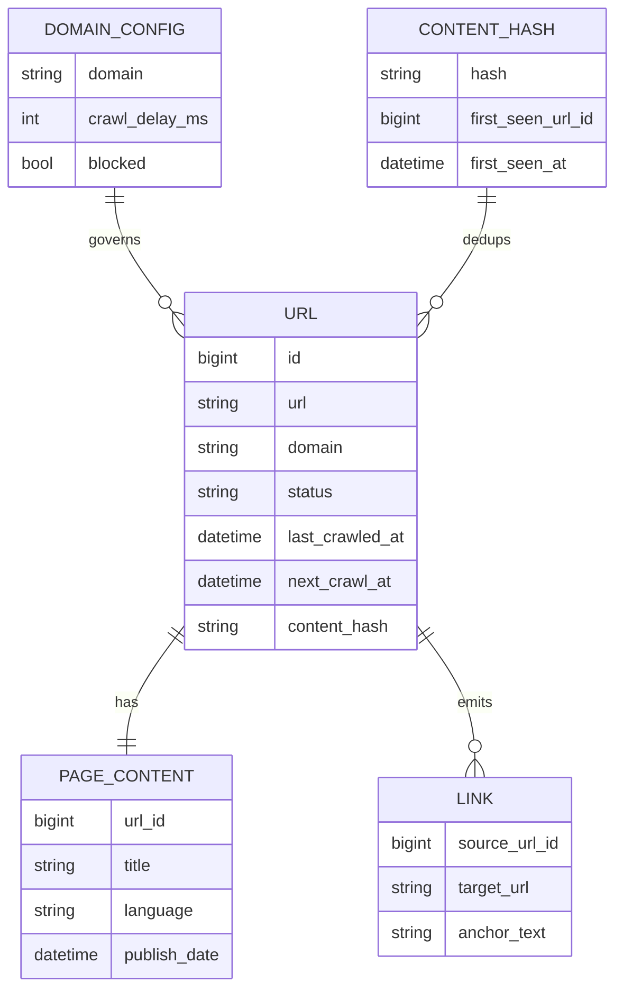
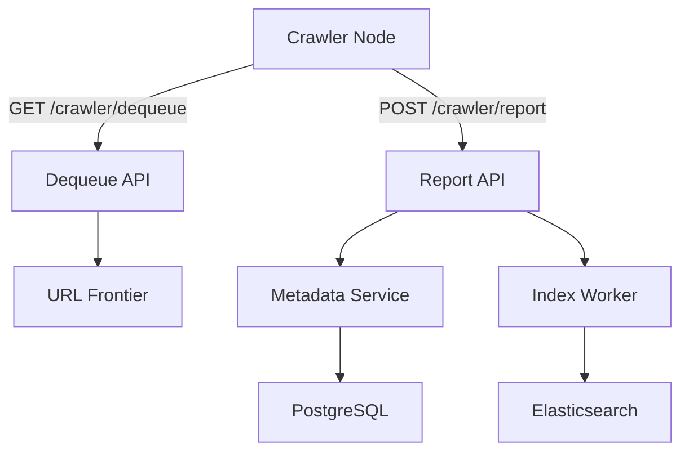
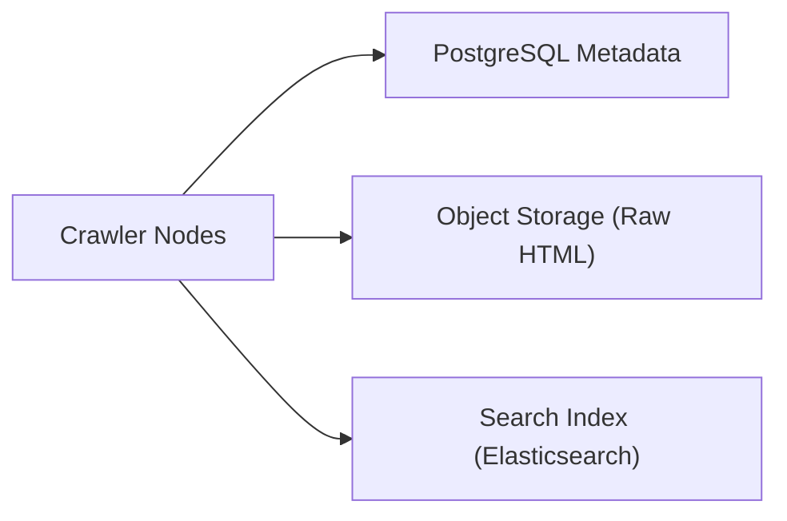

# Designing a Web Crawler: Foundations

## Introduction
A web crawler is a backend system that continuously discovers URLs, fetches content from the public web, extracts useful signals (text, metadata, links), and pushes the processed data into storage and a search index.

This series walks through a realistic, interview-style design grounded in our specs:
- Requirements and capacity targets come from the requirements and scale assumptions.
- Entities and sharding come from the data model and sharding plan.
- API examples come from the API contract.
- Queue/frontier decisions come from the URL frontier and queue/backpressure strategy.

## Requirements (functional + non-goals)
Based on the requirements and scale assumptions, the “must-have” capabilities are:
- URL discovery (follow links) and URL scheduling (recrawl)
- Content fetching (HTTP/1.1 + HTTP/2, compression, redirects)
- Content processing (parsing, metadata extraction, link extraction)
- Duplicate + near-duplicate handling
- Index management (store, update, remove)
- Monitoring/observability (crawl rate, errors, health)

Out of scope / explicitly not implemented (from the non-goals):
- Search ranking (e.g., PageRank)
- User-facing search UI
- Broad end-user authz/authn model (this is primarily internal)
- Crawling private/authenticated content beyond basic cases

## Quality targets (latency, availability, scale)
Based on the quality targets and SLO-style goals:
- Crawl success rate: 95–98%
- Index freshness: 90% of content < 7 days old
- Crawl latency: p95 500ms (URL dequeue → stored/indexed)
- Availability: 99.5% monthly
- Duplicate detection: 98%+
- Index query latency: p99 100ms

From the monitoring and observability plan (more detailed latency/traffic breakdown):
- Crawl spikes: up to 5× (peak 500K URLs/sec)
- Crawl latency budget example: DNS (10–50ms) + TCP/TLS + request + parse + dedup + index

## Capacity estimation (copy + adapt)
Based on the capacity targets:
- Peak throughput target: 100,000 URLs/sec
- 10B URLs indexed (minimum target)

Rough crawl-rate math (based on the throughput target):
- 100K URLs/sec × 86,400 sec/day ≈ 8.64B URL fetch “slots” per day
- Many fetches are recrawls, retries, and filtered URLs; the spec targets ~10B unique URLs indexed/month

Storage sizing (based on average page size and retention assumptions):
- Average compressed page: ~50KB
- 10B pages × 50KB ≈ 500TB/month of compressed raw HTML
- With 3× replication: 18PB/year equivalent durability footprint

## Core entities + data model
From the data model and sharding plan (names shortened for readability):

1) `urls`
- The canonical record for a URL, crawl state, scheduling, HTTP results, and dedup markers.
- Key access patterns: lookup by URL, by domain, by status, and by `next_crawl_at`.

2) `page_content`
- Stores extracted metadata and (optionally) raw HTML (often stored externally and referenced here).

3) `links`
- Stores link graph edges (source → target), plus anchor text.

4) `domain_configs`
- Per-domain policy: crawl delays, blocks, rate limits, robots behavior, etc.

5) `content_hashes`
- Dedup index keyed by hash (SHA-256), mapping to first-seen URL.

6) `crawl_queue`
- Persistent scheduling state (even if the active frontier is Kafka).

7) `crawler_nodes`
- Operational state: heartbeat, capacity, health.

Sharding strategy (from the storage design):
- Metadata shards by domain hash: `hash(domain) % 10`
- Goal: keep a domain’s URL state on the same shard for locality and simpler scheduling

## API surface + 2–3 JSON examples
The crawler is primarily controlled via internal APIs (see the API contract). The most important interactions are:

### Example 1: Dequeue (crawler asks for work)
From the API contract:
- Endpoint: `GET /api/v1/crawler/dequeue`
- The crawler provides `crawler_id`, optional batch size, and priority constraints.

Request example:
```json
{
	"crawler_id": "crawler-42",
	"batch_size": 100,
	"max_priority": 1000
}
```

Response example:
```json
{
	"urls": [
		{
			"id": "12345",
			"url": "https://example.com/page1",
			"domain": "example.com",
			"priority": 850,
			"retry_count": 0,
			"max_retries": 3,
			"crawl_delay_ms": 5000
		}
	],
	"count": 1
}
```

### Example 2: Report (crawler returns results)
From the API contract:
- Endpoint: `POST /api/v1/crawler/report`
- Contains HTTP status, raw content metadata, extracted metadata, and discovered links.

Request example:
```json
{
	"crawler_id": "crawler-42",
	"url_id": "12345",
	"url": "https://example.com/page1",
	"status": "success",
	"http_status": 200,
	"content": {
		"raw_html": "<html>...</html>",
		"size_bytes": 45032,
		"charset": "utf-8",
		"content_type": "text/html"
	},
	"metadata": {
		"title": "Example Article",
		"description": "Article about something",
		"language": "en",
		"publish_date": "2026-01-19T10:30:00Z",
		"author": "John Doe"
	},
	"links": [
		{
			"url": "https://example.com/page2",
			"anchor_text": "Read more",
			"rel": "follow"
		}
	],
	"duration_ms": 234,
	"timestamp": "2026-01-19T10:30:30Z"
}
```

### Example 3: Search (read path)
From the API contract:
- The read path is backed by the search index (Elasticsearch in our storage plan).
- The API returns results with snippets/metadata (not full raw HTML by default).

Response example:
```json
{
	"query": "web crawler",
	"total_results": 1234567,
	"limit": 10,
	"offset": 0,
	"results": [
		{
			"url": "https://example.com/article1",
			"title": "Build a Web Crawler",
			"description": "Complete guide to building scalable web crawlers",
			"content_preview": "A web crawler is a bot that automatically browses the web. It follows links...",
			"score": 0.95,
			"language": "en",
			"crawled_at": "2026-01-19T08:00:00Z"
		}
	],
	"search_time_ms": 45
}
```

(We’ll go deeper on “write path vs read path” in Part 2 when we analyze scale bottlenecks.)

## Basic HLD (default approach)
We’ll use the architecture’s default “distributed frontier + distributed crawlers” approach.

### System context
This diagram orients you to the system boundaries and major dependencies.

*Figure 1: System context and major dependencies.*

### Functional flow (end-to-end)
This is the end-to-end path from discovery to indexing.

*Figure 2: End-to-end crawl and index flow.*

### Core components (HLD)
This view emphasizes the core pipeline components and how they compose.

*Figure 3: Core components in the write pipeline.*

### Minimal data model (ERD)
This ERD is intentionally minimal and highlights the entities that dominate correctness and throughput.

*Figure 4: Minimal entity model for URL state, content, and dedup.*

### API touchpoints
These are the highest-volume control-plane interactions between crawlers and the system.

*Figure 5: Primary API touchpoints for dequeue and report.*

### Storage triangle (write targets)
A single crawl typically produces writes to three independent backends.

*Figure 6: Core write targets (metadata, raw content, index).*

At a high level:
1. URL discovery produces candidate URLs (from sitemaps, seeds, link extraction).
2. The URL frontier selects what to crawl next (priorities + politeness).
3. Crawler nodes fetch content, parse, dedup, and emit results.
4. Metadata is stored in the metadata DB; raw HTML goes to tiered object storage.
5. Extracted text + metadata are indexed for search.

Next: Part 2 covers what breaks at 100K URLs/sec and how we scale each component.

---
