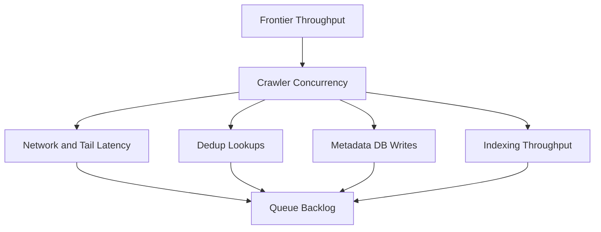
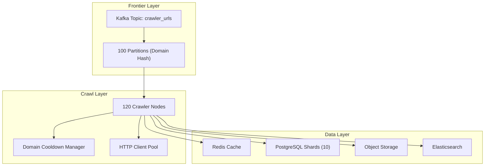
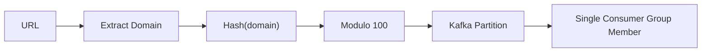
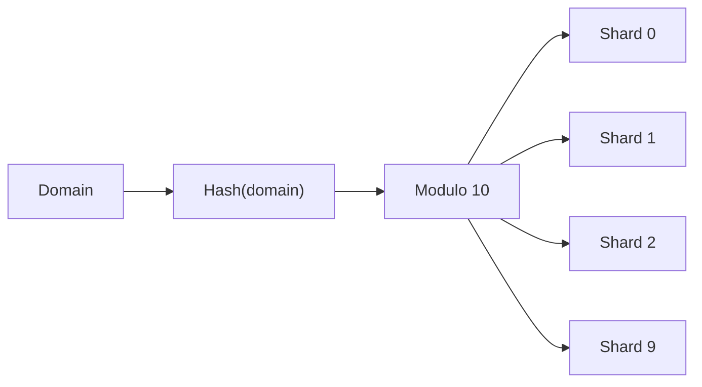
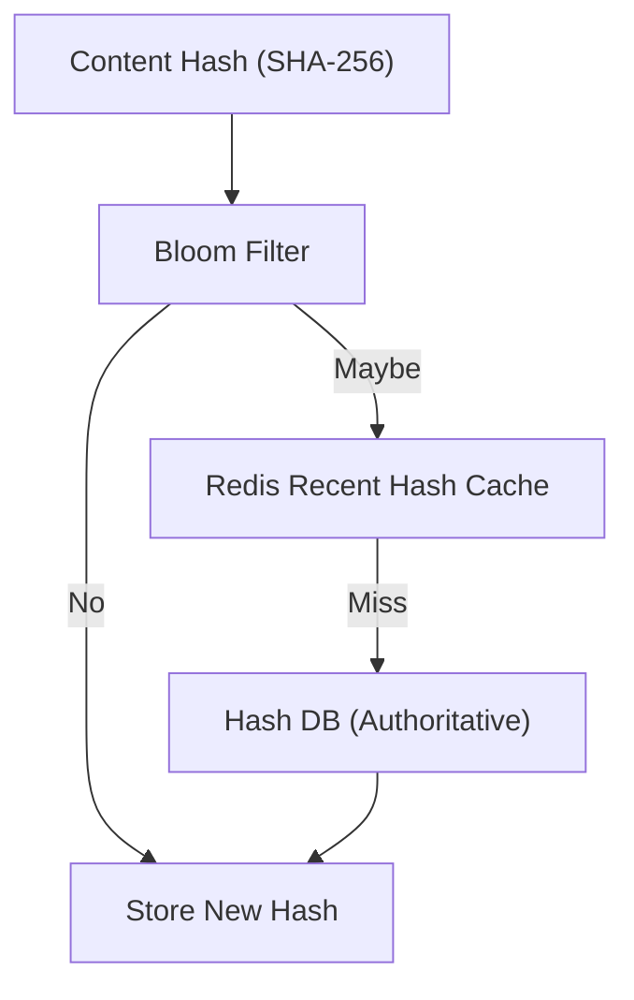
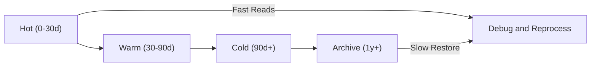
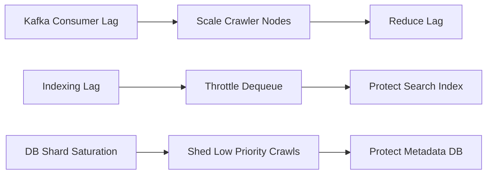

# Designing a Web Crawler: Scale Analysis

## What breaks in the basic design (bottlenecks)
At small scale, a single queue + a few crawlers works fine. At 100K URLs/sec, several things become the “real” system design problem.

From the URL frontier and queue/backpressure strategy, the URL frontier must simultaneously:
- keep millions of pending URLs,
- prioritize them,
- enforce politeness per domain,
- handle retries/backoff,
- and feed 100+ crawler nodes.

From the monitoring and observability plan, we also need to handle 5× spikes (up to ~500K URLs/sec), which amplifies queue/backpressure problems.

Common bottlenecks:
1. Frontier hot-spotting
- If the frontier is centralized (single Redis or single DB), it becomes the throughput ceiling.

2. Politeness enforcement
- Politeness is per-domain, but work is distributed. Without careful partitioning, multiple nodes can accidentally overload the same domain.

3. Network latency and tail behavior
- Even if median fetch latency is low, p95/p99 latency can dominate end-to-end throughput.

4. Storage write amplification
- Each successful fetch can cause multiple writes: URL state updates, content hash inserts, links insertions, content storage, indexing.

5. Dedup performance
- Dedup requires a fast membership test at huge cardinality. If every URL hit the DB for hashing, the DB becomes the bottleneck.

## Capacity & constraints (math, units, peak assumptions)
Based on the requirements and scale assumptions:
- Target peak crawl throughput: 100K URLs/sec

Based on observed/assumed spike behavior from the observability plan:
- Peak spikes: 500K URLs/sec (5×)

Implication: We design steady-state for 100K/sec, but we also need:
- buffering (queue backlog) to absorb spikes,
- elastic scale-up where possible,
- and graceful degradation (reduce crawl rate, pause certain domains, drop low-priority work).

Storage constraints from the storage design:
- Metadata DB: ~6TB total, sharded across 10 shards, with heavy read/write load
- Raw HTML: tiered object storage, huge but low QPS compared to metadata
- Search index: ~90TB, query/read heavy

### Quick sizing sanity-check (crawler nodes)
From the crawler node execution model, the deployment example uses **120 crawler replicas**.

If we want to sustain ~100K URLs/sec at peak (based on the capacity target), then a rough per-node target is:
- $100{,}000 / 120 \approx 833$ URLs/sec/node

This is feasible only if:
- most fetches are I/O-bound (not headless rendering),
- we keep per-domain concurrency bounded (politeness),
- and we aggressively time out slow sites (so tail latency doesn’t pin threads).

(This is intentionally a back-of-the-envelope; actual sizing comes from load testing with the target mix of domains and content types.)

## Scalable HLD (sharding/replication/caching/async)

> **Tip**: Kafka partitions (100) cap frontier consumer parallelism, and Postgres shards (10) cap metadata write parallelism. These become hard ceilings unless you re-partition.

### Bottlenecks and backlog formation

*Figure 1: Where backlogs typically form at scale.*

### Scaled architecture overview

*Figure 2: Scaled architecture across frontier, crawlers, and data stores.*

### Frontier partitioning for politeness

*Figure 3: Domain-hash partitioning makes politeness enforceable.*

### Sharding metadata by domain

*Figure 4: Metadata sharding by domain hash (10 shards).*

### Dedup cache hierarchy

*Figure 5: Dedup membership check from fast-path to authoritative store.*

### Raw HTML storage tiering

*Figure 6: Tiered storage for raw HTML retention.*

### Backpressure controls

*Figure 7: Backpressure signals and the control actions they trigger.*

### Search read path

*Figure 8: Search read path (API → Elasticsearch).*

### 1) Frontier: make it distributed
Based on the URL frontier and queue/backpressure strategy, we choose Kafka for the URL frontier:
- Topic: `crawler_urls`
- Partitions: 100
- Replication factor: 3
- Consumer group: crawlers (one consumer per crawler node)

Key scaling trick:
- Partition by domain hash: `hash(domain) % 100`
- Benefit: all URLs for a domain land in the same partition, making politeness enforcement tractable.

### 2) Crawler nodes: make network IO efficient
From the crawler node design:
- Connection pooling per domain (5–10 connections)
- DNS caching (~1 hour)
- Timeouts: connect 10s, read 30s

These reduce latency and improve throughput per node without increasing aggression against any one domain.

### 3) Dedup: avoid DB round-trips for the common case
From the deduplication strategy, we use a layered design:
- Layer 1: Bloom filter in Redis (fast, ~1% false positives)
- Layer 2: “recent hashes” cache in Redis (7-day TTL)
- Layer 3: authoritative DB table (`content_hashes`)

This keeps the “is this new?” check fast and protects the database.

### 4) Metadata DB: shard by domain
From the storage design:
- Shard by `hash(domain) % 10`
- Each shard handles ~1B URLs, enabling parallel reads/writes
- Keep critical indexes (`status`, `next_crawl_at`, `domain`, etc.) to support scheduling and admin queries

### 5) Raw content: cheap, durable, tiered
From the storage design:
- Store compressed raw HTML in S3 (or HDFS for cost) with hot/warm/cold/archive tiers
- Keep raw content for retention/recrawl analysis without constantly pulling it into hot DB storage

### 6) Indexing: isolate it as an async pipeline
Indexing is CPU + IO heavy and can lag behind crawling.
- Decouple indexing via async workers
- Backpressure: if indexing falls behind, slow down crawl dequeue or reduce low-priority crawling

## Performance characteristics (p95/p99 targets, throughput)
From the monitoring and observability plan:
- Crawl p95 latency target: 500ms
- Crawl p99 latency target: ~1000ms

How we protect latency targets:
- strict timeouts + bounded retries (avoid infinite hangs)
- circuit breakers for failing domains (Part 3)
- queue backlog monitoring (consumer lag, partition lag)

## Cost lens (rough, but useful)
At this scale, the dominant cost drivers are usually:
- **Raw HTML retention** (object storage bytes/month → tiering choices)
- **Index size + indexing throughput** (Elasticsearch hardware and ops)
- **Network egress** (if crawlers run in cloud regions with paid egress)

The biggest lever is being strict about what you store and for how long: keep full raw HTML only as long as you need it for debugging/reprocessing, and rely on extracted text + metadata for most downstream uses.

Next: Part 3 deep dives the primary approach—Kafka frontier + politeness + retries—and how we make it reliable under failure.

---