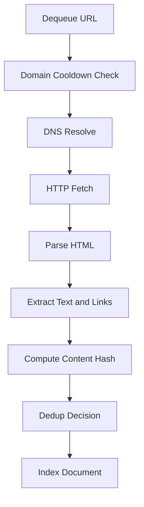
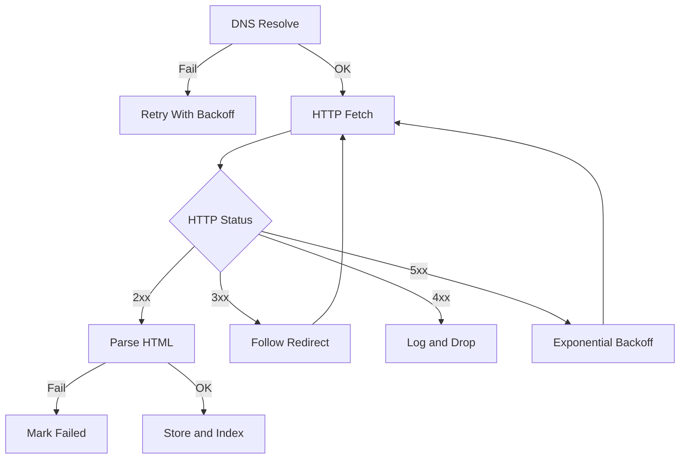
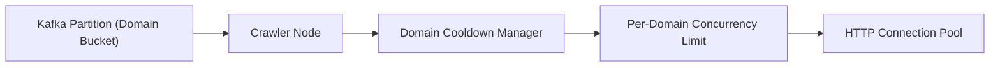
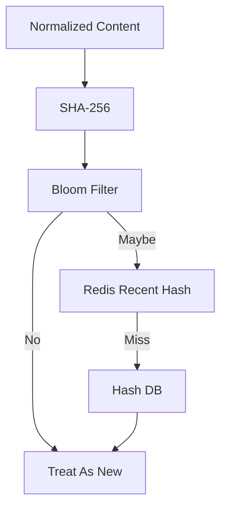
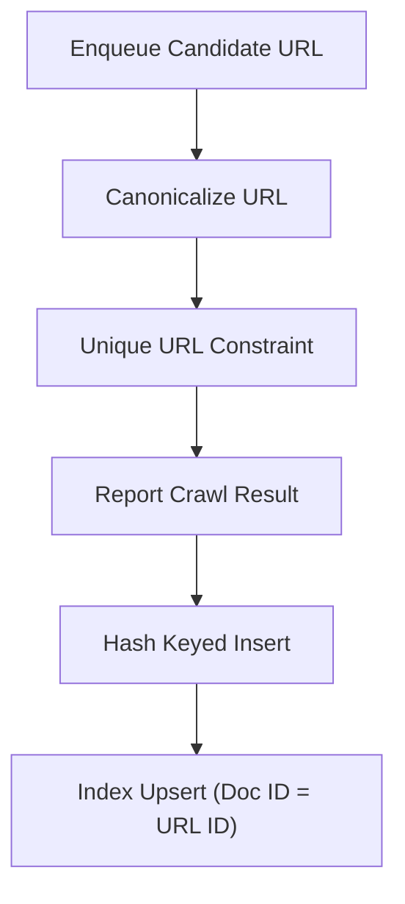
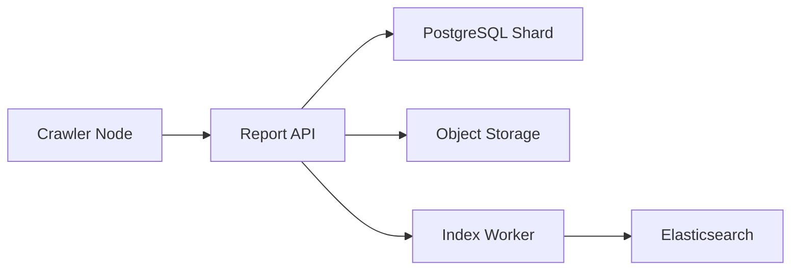

# Designing a Web Crawler: Deep Dive (Approach A - Kafka Frontier)

## Problem statement
The hardest part of a high-throughput crawler is not “fetch a page”. It’s coordinating millions of URLs across 100+ nodes while:
- staying polite per domain,
- prioritizing freshness/importance,
- handling retries and backoff,
- and staying reliable during spikes and failures.

This is the URL frontier problem.

## Proposed solution (protocols, data model, flows)
We implement the frontier using Kafka, with domain-based partitioning to make politeness enforceable.

From the URL frontier and queue/backpressure strategy:
- Topic: `crawler_urls`
- Partitions: 100
- Replication: 3
- Partition key: domain hash (`hash(domain) % 100`)

From the crawler node design, each node has:
- Kafka consumer (URL dequeuer)
- Domain Cooldown Manager
- HTTP client with pooling + DNS cache
- Parser/extractor
- Dedup checker
- Result reporter

From the API contract, crawler nodes use:
- `GET /api/v1/crawler/dequeue`
- `POST /api/v1/crawler/report`

### End-to-end flow
1) URL discovery
- Seeds, sitemaps, and extracted links produce candidate URLs.
- Normalize/canonicalize URLs (scheme, fragments, known tracking params) before enqueue.

2) Enqueue into frontier
- Producer publishes a message keyed by `domain`.
- Partitioning keeps a domain’s URLs in a single partition.

### Priority and freshness scheduling (what makes a frontier a frontier)
Kafka is a distributed log, not a strict priority queue, so the “frontier behavior” comes from the message schema plus consumer-side scheduling.

From the URL frontier and queue/backpressure strategy:
- `priority` is defined on a 0–1000 scale (higher = process first).
- Priority bands (examples): Critical, High, Medium, Low, Batch.
- Retries use exponential backoff and sometimes reduce priority (e.g., 429).
- Recrawls come from a background job that enqueues URLs where `next_crawl_at <= NOW()`.

Practical implementation sketch (per partition):
- Maintain separate in-memory queues per priority band, fed by Kafka messages.
- Dequeue with weighted random (e.g., critical > high > medium) to prevent starvation.
- For recrawls, treat the enqueue “reason” (`scheduled_recrawl`) as metadata so we can measure freshness vs discovery throughput.

This keeps the system honest about what it optimizes for: freshness and importance, while still respecting politeness.

### Frontier persistence and recovery semantics (Kafka replay vs DB state)
Kafka is the durable *work log*, but the metadata DB is the durable *state machine*.

Practical split:
- **Kafka**: “candidate work” events (discover, retry, scheduled recrawl) that can be replayed after failures.
- **Metadata DB (`urls`, `crawl_queue`)**: authoritative URL status and scheduling state (`next_crawl_at`, retry counters, last error, last fetched at).

Recovery pattern:
- If a crawler crashes mid-job, the Kafka message can be reprocessed (at-least-once). Idempotent writes (unique URL constraint, hash-keyed inserts, index upserts) keep this safe.
- A periodic reconciler re-enqueues URLs that are “due” (`next_crawl_at <= now`) and reclaims stuck inflight work (e.g., heartbeat/lease expired).

3) Dequeue and politeness
- A crawler node consumes messages from its assigned partitions.
- Domain Cooldown Manager enforces per-domain delay and backs off on failures.

4) Fetch + parse
- HTTP client uses pooling + timeouts (connect 10s, read 30s per the crawler node design).
- Parser extracts text + metadata + outgoing links.

5) Dedup
From the deduplication strategy:
- Normalize content, compute SHA-256
- Check Bloom filter → Redis cache → DB
- Mark duplicates by linking `duplicate_of_url_id` in `urls`

6) Store + index
From the storage design:
- Metadata state update to PostgreSQL shards (by domain hash % 10)
- Raw HTML stored to tiered object storage
- Index documents written to Elasticsearch

### Core success path

*Figure 1: Core success path from dequeue to indexing.*

### Error handling and retries

*Figure 2: Retry policy sketch (DNS/HTTP/redirects/parse failures).*

### Domain politeness at the worker

*Figure 3: Where politeness is enforced inside the crawler node.*

### Dedup layers (fast path to slow path)

*Figure 4: Layered dedup to protect the DB at scale.*

### Idempotency keys (at-least-once safety)

*Figure 5: Idempotency strategy for at-least-once delivery.*

### Write path targets

*Figure 6: Write targets for metadata, raw content, and indexing.*

## Failure modes + retries/timeouts/idempotency

### 1) The same URL appears many times
Duplicate URLs happen frequently (link graph repeats, parameters, retries). We handle this via idempotency at multiple layers:
- URL canonicalization before enqueue
- `urls.url` unique constraint in the metadata DB (from the data model and sharding plan)
- Content hashing-based dedup (from the deduplication strategy)

### 2) Kafka consumer lag during spikes
From the monitoring and observability plan, peak spikes can be 5×. If crawlers can’t keep up:
- consumer lag grows per partition
- freshness degrades

Mitigations:
- scale crawler nodes horizontally (add consumers)
- reduce low-priority crawling temporarily
- increase queue retention (so backlog isn’t lost)

### 3) Domain distress / politeness failures
If a domain starts returning 429/503 or timing out:
- apply exponential backoff (as part of the retry/backoff policy)
- open a circuit breaker for that domain (as part of crawler node reliability)
- stop consuming more URLs for that domain until cooldown expires

### 4) Timeouts, retries, and retry storms
From the crawler node design:
- connect timeout: 10s
- read timeout: 30s

Rules of thumb:
- bounded retries (e.g., max 3)
- jittered backoff to avoid synchronized retry storms
- treat certain errors as non-retriable (e.g., persistent 404)

### 5) Exactly-once vs at-least-once semantics
In practice, Kafka consumption is at-least-once unless you build a full transactional pipeline.
We embrace at-least-once and make all downstream writes idempotent:
- URL state updates use URL primary keys
- Content hash inserts are keyed by hash
- Index writes can be idempotent by document ID = URL ID

## Performance & scale notes
- Partition count (100) defines parallelism for the frontier.
- Postgres shards (10) define parallelism for metadata.
- The effective system throughput is bounded by the slowest of: network fetch, storage writes, and indexing.

## Trade-offs + why this approach wins
Why Kafka works well here:
- High throughput, horizontal scaling
- Durable log (replay possible)
- Consumer groups align with many crawler nodes

Trade-offs:
- Operational overhead (Kafka cluster management)
- Ordering/priority is approximate (per partition) unless you add extra scheduling logic

Next: Part 4 covers an alternative frontier design (Redis) and when it can be the better choice.
