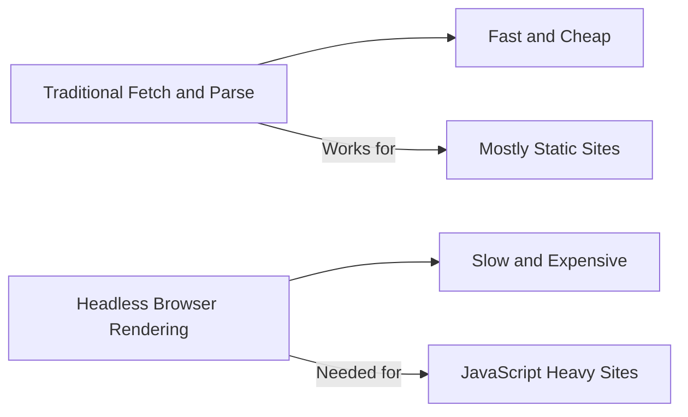
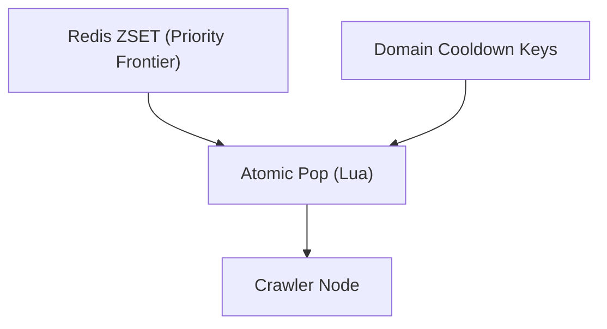
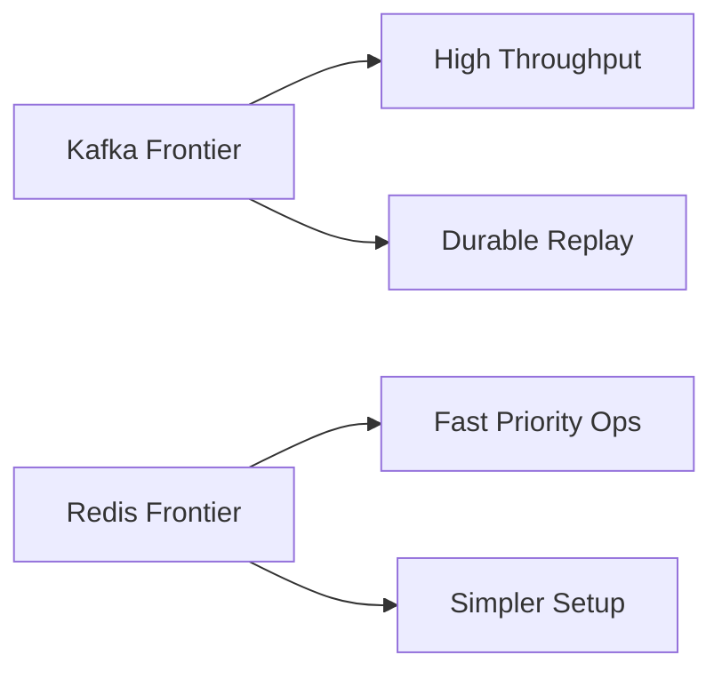

# Designing a Web Crawler: Deep Dive (Approach B - Redis Frontier)

## When this alternative is better
From the URL frontier and queue/backpressure strategy, Redis was considered as a centralized, in-memory option. Redis can be the right choice when:
- you’re not targeting 100K URLs/sec yet,
- you want simpler operations than Kafka,
- you want very fast priority operations (sorted sets) without building more scheduling logic,
- your crawler is small-to-medium and can tolerate a simpler HA story.

If your target is “small crawler for a product feature” rather than “internet-scale indexing”, Redis can be a pragmatic trade.

## A second (independent) alternative: headless browser fetching
The “Approach B” axis doesn’t have to be about the frontier/queue. Based on the requirements, the crawler may need **basic JavaScript support for dynamic content (via headless browser)**.

This is a separate decision from Kafka vs Redis:
- Kafka/Redis decides *how we schedule work across nodes*.
- Traditional fetch vs headless decides *how we render/fetch a page*.

Rule of thumb:
- Prefer traditional fetch-and-parse for most pages (fast and cheap).
- Use headless browsers only when the content is genuinely JS-rendered and required.

*Figure 1: Rendering axis is independent of frontier choice.*

## Architecture + key differences

### Core idea
Use Redis as the “frontier brain”:
- A global priority structure (e.g., sorted set) holds candidate URLs.
- Per-domain gating is enforced by domain cooldown keys.
- Multiple crawler nodes pop work via atomic operations (Lua scripts).

### Data structures (conceptual)
- `frontier:zset` → member = url_id/url, score = priority (and optionally next_allowed_time)
- `domain:cooldown:{domain}` → a key with TTL; if present, domain is “cooling down”
- `inflight:{crawler_id}` → set of URL IDs currently being processed

### Politeness and cooldown
From the frontier strategy and crawler node execution model, politeness is mandatory.
In Redis, you typically implement:
- a per-domain next-allowed timestamp
- jittered delays
- exponential backoff on 429/5xx/timeouts

### Reliability / HA
This is where Redis differs the most from Kafka:
- Kafka provides a durable, partitioned log by design.
- Redis needs careful HA: replication + sentinel/cluster, persistence tuning, and handling failover correctness.

In other words: Redis can be “fast and simple” for moderate scale, but can become the bottleneck or operational risk at very high throughput.

> **Tip**: Be explicit about failover semantics. If you can tolerate duplicates (and have idempotent downstream writes), Redis becomes much easier to operate.

### What happens on Redis failover?
Redis failover is primarily a *correctness* concern: in-flight work can be lost or duplicated depending on your persistence and how you track leases.

Practical approach:
- Treat dequeue as a **lease** (URL moves to an `inflight` set with a TTL/expiry timestamp).
- If a crawler fails, a reaper job moves expired leases back to the frontier.
- After failover, assume **at-least-once** semantics and rely on the same idempotency protections described in Part 3 (unique URL constraints, hash-keyed inserts, index upserts).

## Comparison table (complexity, cost, performance, ops)

### Redis frontier mechanics

*Figure 2: Redis frontier sketch (priority pop + cooldown gating).*

### Kafka vs Redis at a glance

*Figure 3: High-level tradeoff summary for frontier technologies.*

| Dimension | Approach A (Kafka frontier) | Approach B (Redis frontier) |
|---|---|---|
| Throughput | Very high (partitioned log) | High, but central hot spots emerge |
| Ordering/priority | Approximate unless extra logic | Stronger priority semantics with ZSET |
| Politeness enforcement | Easy with domain→partition mapping | Needs careful per-domain gating logic |
| Replay / backfill | Built-in (log replay) | Requires custom persistence and requeue |
| Ops complexity | Kafka clusters + monitoring | Redis cluster/sentinel + persistence tuning |
| Failure behavior | Consumer lag / partition rebalances | Failover edge cases, hot keys, memory pressure |
| Best for | Large-scale distributed crawlers | Smaller crawlers, prototyping, simpler systems |

Next: Part 5 covers security/auth and the trust boundaries that matter for a crawler.
