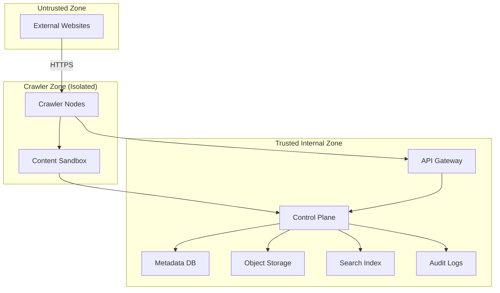
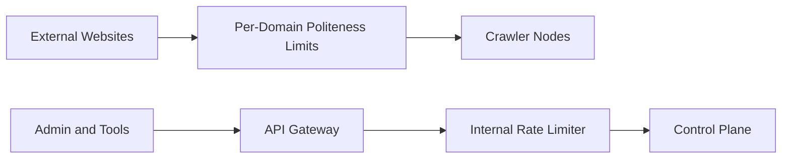
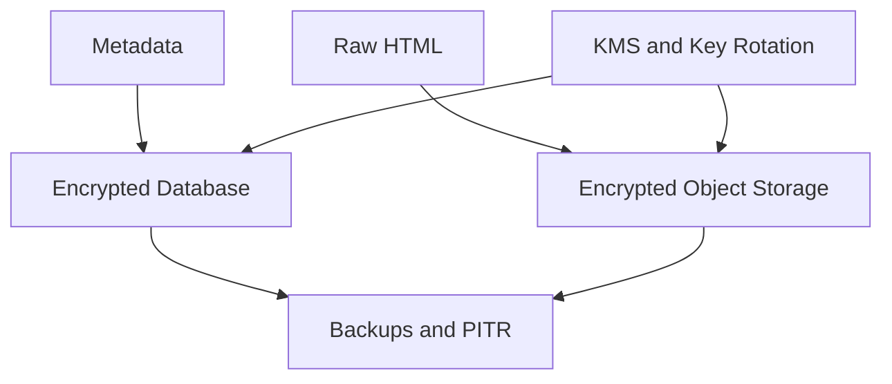

# Designing a Web Crawler: Security & Trust (Auth, Abuse, Compliance)

## Threat model + abuse cases
A crawler has two security “directions”:
1) **Outbound risk** (crawler interacting with untrusted websites)
2) **Inbound risk** (attackers abusing the crawler’s internal APIs and infrastructure)

Based on the security threat-model research, outbound threats include:
- crawling malicious pages (malware, phishing)
- being tricked into downloading dangerous payloads
- indexing sensitive/illegal content

Inbound threats include:
- unauthorized access to admin endpoints (block/allow domains)
- poisoning the system (feeding garbage URLs, forcing crawler storms)
- SSRF-style abuse (tricking the crawler to fetch internal endpoints)
- credential leakage from crawler nodes

### Trap URLs and adversarial URL injection
One of the most common real-world abuse cases is “infinite crawl space”:
- calendar pages that generate endless URLs,
- session IDs and tracking parameters that create near-infinite variants,
- deliberate crawler loops (e.g., `?page=1..N` with no meaningful end).

Mitigations (practical and interview-friendly):
- **URL canonicalization + normalization**: strip fragments, normalize query parameters, and collapse known tracking keys.
- **Per-domain budgets**: cap new URLs accepted per domain per time window.
- **Heuristics**: detect repeating path patterns, very deep paths, or high-entropy query strings and down-rank/drop.
- **Depth + fanout limits**: cap link-follow depth per seed/domain, and cap extracted links processed per page.
- **Blocklists/allowlists**: maintain domain-level and pattern-level blocks for known traps.

## SSRF and network egress protections
SSRF is a very real risk for crawlers because “fetch arbitrary URLs” is the product.

Defenses (standard production practice):
- **Block private and link-local ranges**: RFC1918, loopback, and cloud metadata IPs (e.g., `169.254.169.254`).
- **DNS rebinding defense**: resolve DNS, validate IP, then connect; re-validate on redirects.
- **Redirect safety**: cap redirect hops and re-apply IP/range checks on every hop.
- **Egress policy**: run crawlers in a restricted network with egress allow/deny rules.
- **Scheme allowlist**: allow only `http`/`https` unless there’s an explicit need.

These controls ensure “crawl the public web” doesn’t turn into “scan the internal network.”

## Authentication (user + service-to-service)
From the API contract, most APIs are internal (crawler nodes, admin, monitoring).

Recommended approach:
- **Service-to-service auth**: mTLS between crawler nodes and the control plane (API gateway / internal load balancer).
- **API keys** for automated jobs (short-lived, rotated), especially for ingestion/admin tooling.
- **Human admin auth**: SSO (OIDC) + MFA for admin UI/CLI if present.

Principle: crawler nodes should not have broad permissions—only what they need to dequeue and report.

## Authorization (RBAC/ABAC + enforcement points)
- **RBAC** for admin operations: who can block domains, change crawl delays, or export data.
- **ABAC** where needed: allow edits only for certain domain groups or environments.

Enforcement points:
- API gateway / service mesh policy
- Admin endpoints (`/configure_domain`, `/block_domain`) with strict scopes
- Audit logging for every policy change

## Rate limiting / quotas / anti-abuse
There are two different rate limiting concerns:

### 1) Politeness to external websites
From the URL frontier strategy and the legal/ethical considerations:
- Respect `robots.txt` rules (including crawl-delay)
- Back off on 429 responses
- Identify your crawler via User-Agent and provide an opt-out/contact

### 2) Protecting internal APIs
From the API contract, crawler nodes can request batches. Without limits:
- a compromised node could drain work, overload downstreams, or spam reports

Mitigations:
- per-crawler quotas (dequeue rate, report rate)
- validation (URL IDs must exist, payload sizes capped)
- backpressure responses (429/503) to shed load safely

## Data protection (encryption, secrets, audit logging)

### Encryption
From the storage design and privacy guidance:
- Encrypt data in transit (mTLS inside; TLS to object storage)
- Encrypt at rest (DB, object store, backups)

### Secrets management
- Keep secrets out of crawler node images.
- Use a secret manager (vault / KMS) and rotate keys.

### PII and compliance
From the legal and ethical considerations:
- GDPR/CCPA imply deletion workflows (“right to be forgotten”) and retention policies.
- Avoid indexing PII where not needed; apply redaction for known patterns.
- Keep audit logs for access and policy changes.

### Ethical boundary
From security research, techniques like stealth UA rotation and proxy evasion can cross ethical/legal lines.
Our design should default to:
- honoring robots.txt,
- respecting ToS where applicable,
- crawling responsibly with clear identification.

### Trust boundaries
The crawler should treat fetched content as untrusted and keep it isolated from the control plane.

*Figure 1: Trust boundaries between the public web, crawler isolation, and internal systems.*

### Rate limiting zones

*Figure 2: Two separate rate-limiting problems: external politeness and internal abuse protection.*

### Data protection

*Figure 3: Data protection controls for raw content and metadata.*

Next: Part 6 covers production readiness—SLOs, monitoring, reliability patterns, and safe deployments.