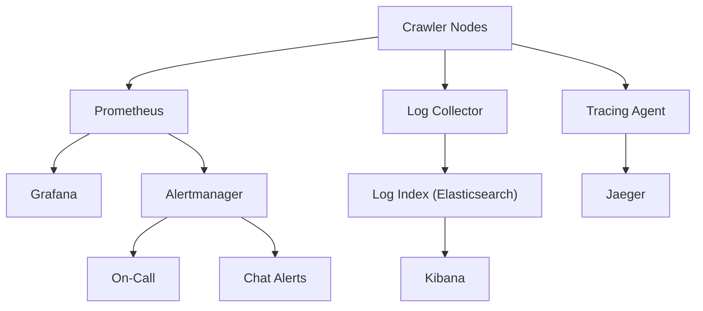
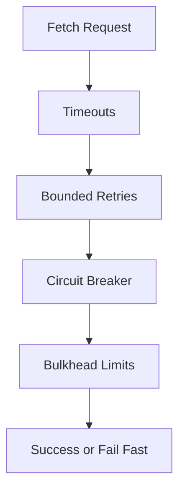
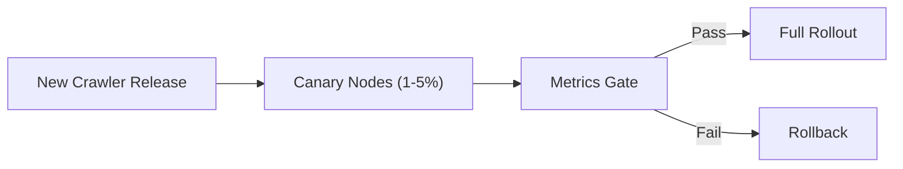
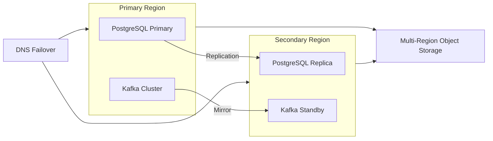

# Designing a Web Crawler: Production Readiness (SLOs, Observability, Reliability)

## SLOs + error budgets
Based on the requirements and SLO targets, key SLO-style targets are:
- Availability: 99.5% monthly
- Crawl latency: p95 500ms
- Freshness: 90% of content < 7 days

From the monitoring and observability plan:
- 99.5% availability implies an error budget of ~3.6 hours/month.

Practical interpretation:
- If we burn the error budget quickly (major outage, persistent backlog), we pause feature work and prioritize reliability fixes.

## Observability (metrics/logs/traces; golden signals)
From the monitoring and observability plan, we track the four golden signals:

1) Latency
- URL processing p50/p95/p99
- Search query p50/p95/p99

2) Traffic
- crawl rate (URLs/sec), by type (new vs recrawl vs retries)
- queue depth / consumer lag (frontier health)

3) Errors
- HTTP 4xx/5xx rates
- timeout rates
- parse failures
- dedup DB error rate

4) Saturation
- CPU/memory for crawler nodes
- DB CPU/IOPS
- Kafka broker disk/network
- Elasticsearch heap/GC

Logging:
- Structured logs for crawl events (url_id, domain, http_status, duration_ms)
- Sampling for high-volume paths

Tracing:
- Trace a “URL job” across: dequeue → fetch → parse → dedup → store → index

## Reliability patterns (timeouts, retries, circuit breakers, bulkheads)
From the crawler node design:
- Timeouts: connect 10s, read 30s
- Retries: bounded (e.g., 3)

Add the standard reliability toolkit:
- **Circuit breakers** per domain (stop hammering failing sites)
- **Bulkheads** (limit concurrency per domain and per crawler)
- **Backpressure** (reduce dequeue when downstreams are saturated)
- **Idempotency** for at-least-once delivery (see Part 3)

## Data safety (backups, DR, RTO/RPO)
From the storage design:
- Metadata is in sharded Postgres; losing it breaks scheduling and dedup references.
- Raw HTML lives in tiered object storage, and can be replicated across regions.

Recommended baseline:
- Postgres PITR + regular snapshots
- Cross-region replication for the most critical metadata
- Clear RTO/RPO targets (interview: pick something realistic like RTO hours, RPO minutes to hours)

## Deployments (canary/blue-green, rollbacks, runbooks)
From the crawler node execution model, crawlers are good candidates for Kubernetes-based rollouts.

Deployment strategy:
- canary new crawler versions (1–5% of nodes)
- monitor error rate and latency before full rollout
- quick rollback path (image rollback)

Runbooks (grounded in the monitoring and observability plan):
- queue backup / consumer lag rising
- crawl error rate spike (DNS failures, timeouts, 429 bursts)
- indexing lag (ES pressure)
- DB shard saturation

First diagnostic step for each (keep it boring and fast):
- **Consumer lag rising**: check lag by partition and identify the top N partitions by lag (often a few hot domains).
- **Error spike**: break down errors by domain + status class (2xx/3xx/4xx/5xx/timeouts) to detect systemic issues vs a single domain distress event.
- **Indexing lag**: check indexer queue depth + Elasticsearch ingestion latency/heap pressure before changing crawl rate.
- **DB shard saturation**: identify the hottest shard and the top write queries (URL state updates, links inserts, hash inserts) before scaling blindly.

### Observability stack

*Figure 1: Observability stack (metrics, logs, traces, alerting).*

### Resilience patterns (fetch path)

*Figure 2: Resilience toolkit on the fetch path.*

### Deployment strategy (canary)

*Figure 3: Canary rollout with a metrics gate and rollback.*

### DR topology (simplified)

*Figure 4: Simplified multi-region DR topology.*

Series recap:
- Parts 1–2 established the foundations and scaling approach.
- Parts 3–4 compared frontier implementations.
- Parts 5–6 focused on security and production operations.

---