# Part 1: Foundations - Top K YouTube Videos System

## Introduction

Imagine you're at YouTube's HQ. A user opens the "Trending" tab on their phone. Within milliseconds, they see the top 100 videos trending RIGHT NOW in their region. No lag, no stale data from "yesterday." 

How does YouTube identify which videos are trending from a catalog of nearly a billion videos? How do they update that list every few seconds without crashing the database?

This is the **Heavy Hitters** or **Top-K** problem—one of the most practically complex systems in large-scale tech. It's the reason TikTok can show you viral dances in real-time, why Twitter identifies trending topics within seconds, and why YouTube's Trending tab feels instantaneous.

In this series, we'll design a system to find the top K (usually 100) videos viewed in the last 24 hours, with real-time updates, multi-regional support, and resilience to millions of concurrent users.

---

## Functional Requirements

### Core Features

1. **Get Top K Videos**: Given a metric (views, engagement, shares), return the top-K videos
   - Input: metric, K (1-100), time window (1h/24h/7d), filters (region, category)
   - Output: Ordered list of videos with metadata

2. **Real-Time Metrics**: Collect view events and engagement metrics as they happen
   - Views (every video watch)
   - Likes, comments, shares
   - Watch duration
   - Freshness: metrics should be < 10 seconds old

3. **Regional & Categorical Trending**: Top videos differ by geography and content type
   - Regions: USA, India, UK, Brazil, Germany, etc. (200+ countries)
   - Categories: Music, Gaming, Comedy, Education, Sports, News (50+ categories)
   - Example: "Top 100 videos in Sports category in USA"

4. **Historical Snapshots**: Persist trending rankings for analytics
   - Store hourly snapshots of top-100 per region/category
   - Enable "what was trending on January 19 at 3 PM?"

---

## Non-Functional Requirements

| Requirement | Target |
|---|---|
| **Latency (P95)** | < 50ms for trending API |
| **Latency (P99)** | < 100ms |
| **Availability** | 99.99% (52 minutes/month max downtime) |
| **Consistency** | Eventually consistent (5-10 second lag acceptable) |
| **Scalability** | 120K+ QPS for trending queries, 25K+ QPS for metric writes |
| **Data Retention** | 90 days for detailed metrics, 1 year for snapshots |

---

## Capacity & Scale Estimation

### Traffic at YouTube Scale

**View Events** (Inbound Writes):
- YouTube has ~1 billion views per day globally
- QPS: 1B ÷ 86,400 seconds ≈ **11.6K QPS baseline**
- Peak (2x): **~23K QPS**

**Trending API Queries** (Outbound Reads):
- Users browsing trending tab: 50K QPS
- Recommendation engine queries: 60K QPS
- Creator analytics: 10K QPS
- **Total: 120K QPS baseline, 160K QPS peak**

### Storage Estimation

**Raw Metrics** (time-series data):
- Per event: 200 bytes (video_id, timestamp, region, deltas)
- Daily: 1B events × 200B = **200 GB/day**
- 90-day retention: **18 TB**

**Aggregated Metrics** (hourly):
- ~10M active videos per hour
- Per record: 100 bytes
- 30-day storage: **720 GB**

**Trending Snapshots**:
- 24 hours × 200 regions × 50 categories = 240K snapshots/day
- Per snapshot: 500 KB (top-100 + metadata)
- Annual: **43.8 TB**

### Bandwidth

**Inbound** (Metrics writes):
- 23K QPS × 200 bytes = **4.6 MB/sec**

**Outbound** (API responses):
- 160K QPS × 50 KB avg = **8 GB/sec** (with caching: 100-200 MB/sec)

---

## Core Entities & Data Model

### Video Metadata
```sql
CREATE TABLE videos (
  video_id UUID PRIMARY KEY,
  title VARCHAR(1000),
  channel_id UUID,
  category VARCHAR(50),
  language VARCHAR(10),
  upload_date TIMESTAMP,
  duration_seconds INT
);
```

### Engagement Metrics (Time-Series)
```sql
CREATE TABLE video_metrics_hourly (
  video_id UUID,
  hour_bucket BIGINT,
  region VARCHAR(50),
  view_count BIGINT,
  engagement_rate FLOAT,
  like_delta INT,
  comment_delta INT,
  share_delta INT,
  PRIMARY KEY ((video_id, region), hour_bucket)
) WITH TTL 7776000;  -- 90 days
```

### Real-Time Leaderboard (Redis Sorted Set)
```
Key: trending:us:music:24h
Type: ZSET (sorted set)
Score: engagement score (0-10000)
TTL: 3600 seconds (1 hour)
Size: ~100 KB (100 videos with metadata)
```

---

## API Endpoints

### 1. Get Top K Videos
```http
POST /api/v1/trending/top-k
Content-Type: application/json

{
  "metric": "view_count",
  "k": 100,
  "time_window": "24h",
  "filters": {
    "region": "US",
    "category": "music"
  }
}
```

**Response** (200 OK):
```json
{
  "timestamp": "2026-01-19T10:30:00Z",
  "videos": [
    {
      "rank": 1,
      "video_id": "dQw4w9WgXcQ",
      "title": "Rick Astley - Never Gonna Give You Up",
      "channel_name": "Rick Astley Official",
      "view_count": 1234567890,
      "engagement_rate": 3.2,
      "thumbnail_url": "https://i.ytimg.com/vi/dQw4w9WgXcQ/default.jpg"
    },
    ...
  ],
  "next_cursor": "page_2_token"
}
```

### 2. Real-Time Trending
```http
GET /api/v1/trending/realtime?region=US&category=music&limit=50
```

Returns top 50 videos with sub-second freshness (5-10 seconds old).

### 3. Historical Snapshot
```http
GET /api/v1/trending/snapshot?date=2026-01-19&region=US&category=music
```

Returns recorded top-100 from that date (for analytics, reporting).

---

## High-Level Architecture

```mermaid
graph LR
    User["👤 User"]
    Browser["🌐 Browser/Mobile"]
    APIGateway["API Gateway<br/>Load Balancer"]
    APIServer1["API Server 1"]
    APIServer2["API Server 2"]
    Redis["💾 Redis Cluster<br/>Leaderboards"]
    
    Cassandra["📊 Cassandra<br/>Time-Series"]
    CDN["🌍 CDN<br/>CloudFlare"]
    
    User -->|"GET /trending"| Browser
    Browser -->|"HTTPS"| APIGateway
    APIGateway -->|"Route"| APIServer1
    APIGateway -->|"Route"| APIServer2
    APIServer1 -->|"ZREVRANGE<br/>< 5ms"| Redis
    APIServer2 -->|"ZREVRANGE"| Redis
    Redis -->|"Cache Hit<br/>99%"| APIServer1
    APIServer1 -->|"Fallback<br/>1%"| Cassandra
    APIServer1 -->|"Response"| CDN
    CDN -->|"Cached<br/>Content"| Browser
    Browser -->|"Trending<br/>List"| User
    
    style User fill:#e1f5ff
    style APIGateway fill:#fff3e0
    style Redis fill:#f3e5f5
    style Cassandra fill:#f3e5f5
    style CDN fill:#c8e6c9
```



**Figure 1**: Basic high-level architecture for YouTube trending videos system. Requests flow through CDN and API servers to Redis (hot data) with fallback to Cassandra.

**Component 1: Metrics Ingestion**
- Video player emits view events → published to Kafka
- Metrics service aggregates: group by (video_id, region, category)
- Stored in Cassandra for historical analysis

**Component 2: Trending Computation**
- Stream processor (Flink) consumes Kafka events
- Computes top-K videos per region/category in real-time
- Updates Redis leaderboard (sorted set) every 5 seconds

**Component 3: Serving**
- API Gateway receives trending requests
- Checks Redis cache (99% hit rate)
- Returns top-100 videos in < 50ms

---

## Key Insights

1. **Decoupling is Critical**: Publishing events to Kafka decouples metric ingestion from database writes. This allows the system to handle 23K QPS write spikes without overwhelming the database.

2. **Streaming Beats Batch**: Instead of recomputing trending once per hour, stream processing updates it continuously (every 5 seconds). This catches viral videos in real-time.

3. **Caching Matters**: 99% of API requests hit Redis cache. Without caching, the system would need 160K database queries/second (impossible).

4. **Eventual Consistency is OK**: Trending can lag 5-10 seconds. Users don't notice; the product still feels real-time.

5. **Regional Sharding is Essential**: Trending is NOT global. Computing separate leaderboards per region reduces data volume and ensures relevance.

---

## Summary

In Part 1, we've defined:
- ✅ Functional requirements (get top-K, real-time metrics, regional trends, historical snapshots)
- ✅ Non-functional requirements (120K QPS, <100ms latency, 99.99% availability)
- ✅ Scale estimates (11.6K writes/sec, 120K reads/sec, 18 TB storage)
- ✅ Data model (videos, metrics, leaderboards)
- ✅ Basic HLD (3-component architecture with Redis cache + Cassandra fallback)

Now that we understand what we're building, Part 2 focuses on HOW to build it at scale.

---

## Next: Part 2 - Scale Analysis

In Part 2, we'll identify and solve three critical bottlenecks:
1. **Write Amplification**: 11.6K QPS view events × 4 tables = 46K writes/sec
2. **Cache Stampede**: All leaderboards expire simultaneously → thundering herd
3. **Query Explosion**: 200K possible region/category combos → which ones to compute?

[→ Continue to Part 2: Scale Analysis](02-scale-analysis.md)

---

**Metrics Summary**:
- Trending Queries: 120K QPS
- View Events: 11.6K QPS  
- Data Freshness: < 10 seconds
- API Latency Target: < 100ms P99
- Availability SLO: 99.99%

