# Deep Dive 2: Transcoding Economics — Why AV1 Costs Less

A creator uploads a 4K video to YouTube. The original file is 30 GB, recorded from a RED camera. YouTube's system receives this file and must convert it into dozens of versions: 480p for mobile on slow networks, 1080p for desktop, 2160p for big screens, 4320p for future TVs. Each quality exists in three codecs: H.264 (universal), VP9 (modern browsers), and AV1 (emerging, extremely efficient).

This is transcoding: the process of converting one video format into many. At 500,000 hours uploaded daily, YouTube runs 2.5-5 million transcode jobs per day. The codec choice in each job determines whether YouTube saves $50 million annually or bleeds $50 million in unnecessary bandwidth costs.

This part reveals the hidden economics: when does the slowest, most computationally expensive codec (AV1) actually become the cheapest?

---

## The Scale of Transcoding

Let's do the math on what "500K hours uploaded daily" actually means:

```
500,000 hours/day uploaded
× 365 days/year
= 182.5 million hours/year
= 658,500 gigabytes per day (assuming 1.3GB/hour source video)
= 240 PB/year of incoming video
```

That's **240 petabytes per year** of raw footage flowing into YouTube's transcoding system.

Now, YouTube doesn't store just the original. It creates quality tiers:

| Quality | Resolution | Bitrate (H.264) | Size per hour |
|---------|-----------|--------|---|
| Mobile (low) | 480p | 800 kbps | 360 MB |
| Mobile (standard) | 720p | 2500 kbps | 1.1 GB |
| Desktop (HD) | 1080p | 5000 kbps | 2.2 GB |
| Desktop (Full) | 1440p | 8000 kbps | 3.6 GB |
| 4K | 2160p | 15000 kbps | 6.75 GB |

**Plus 3 codecs:**
- H.264 (MPEG-4 AVC) — baseline, universal support
- VP9 (open source) — 30-40% better compression
- AV1 (next generation) — 40-50% better compression

**Transcode jobs per day:**
```
500K hours × 5 qualities × 1 codec (minimum H.264) = 2.5 million jobs
500K hours × 5 qualities × 3 codecs (full coverage) = 7.5 million jobs
```

YouTube doesn't do all 3 codecs for all videos. More likely: H.264 for all, VP9 for 70%, AV1 for 10%. Still, the scale is staggering: **millions of encoding jobs, 24/7**.

---

## Codec Comparison: Speed vs Quality vs Cost

Every codec makes a trade-off: encoding speed, file size, device support, patent status.

### H.264 (MPEG-4 AVC) — The Baseline

**Characteristics:**
- **Encoding speed**: 5-10x real-time on a GPU
  - 1-hour video encodes in 6-12 minutes on an NVIDIA T4 GPU
- **Compression ratio**: Lossy; ~1Mbps output for 5Mbps source (80% smaller)
- **Device support**: 99.5% (every device ever made)
- **Quality**: Excellent up to 1080p; acceptable at 1440p; struggles at 4K

**Cost per hour:**
```
T4 GPU: ~$0.35/hour (AWS on-demand pricing)
Encoding time: 10 minutes per hour of video
Cost = $0.35 × (10/60) = $0.058 per hour of video

500K hours/day × $0.058 = $29K/day = $10.6M/year
```

**Why it's the baseline:**
- Universal support (no compatibility issues)
- Fast enough for quality tiers (all jobs complete within hours, not days)
- Mature ecosystem (every tool supports it)
- Cost is reasonable

---

### VP9 (Royalty-Free AV1 Precursor)

**Characteristics:**
- **Encoding speed**: 20-30x real-time (1 hour = 30-50 minutes on T4)
- **Compression ratio**: 30-40% better than H.264
  - H.264 1080p: 5000 kbps
  - VP9 1080p: 3000 kbps (40% reduction)
- **Device support**: ~85% (Chrome, Firefox, Edge on desktop; Android; missing Safari, Smart TVs)
- **Patent status**: Royalty-free (backed by Google; avoiding H.265 patent fees)

**Cost per hour:**
```
Encoding time: 40 minutes per hour of video
Cost = $0.35 × (40/60) = $0.233 per hour of video

500K hours/day × 70% (VP9 adoption) × $0.233 = $81.5K/day = $29.7M/year
```

**Bandwidth savings:**
```
1M concurrent viewers streaming 1080p:
  H.264: 5000 kbps × 1M viewers = 5 Tbps aggregate
  VP9: 3000 kbps × 1M viewers = 3 Tbps aggregate
  Savings: 2 Tbps × $0.01/Gbps/sec (CDN cost) ≈ $20K/sec = $1.73B/year globally
```

Wait—1.73 *billion* in CDN savings? That math seems off. Let me recalculate more carefully.

**More realistic CDN cost model:**

```
CDN pricing: ~$0.08-0.12 per GB egress

1M viewers × 1 hour watch = 1M hours of content delivered
H.264 1080p: 5000 kbps × 1 hour = 5000 Mb = 625 MB per viewer
Cost per viewer: 625 MB × $0.10/GB = $0.0625

CDN per 1M viewers: $0.0625 × 1M = $62,500/hour = $1.5M/day

VP9 saves 40%: $1.5M/day × 40% = $600K/day = $219M/year

Gross: 500K hours/day × 365 days × $0.10/GB × (5Mbps / 8 bits/byte)
= 500K × 365 × 0.1 × 0.625 = $11.4B/year in CDN egress globally

VP9 saves 40% = $4.56B/year
```

(Netflix also reported similar savings with VP9: 40% bandwidth reduction = $100M+/year.)

**The ROI:**
```
Additional encoding cost (VP9 vs H.264): $29.7M - $10.6M = $19.1M/year
Bandwidth savings: $4.56B/year
ROI: 240x
```

VP9 is a **no-brainer**. The encoding cost is paid back in hours.

---

### AV1 (Next Generation, Emerging)

**Characteristics:**
- **Encoding speed**: 100-200x real-time
  - 1 hour of video = 100-200 GPU-hours to encode
  - On a single T4: takes 100-200 hours (4-8 days) to encode 1 hour of video
- **Compression ratio**: 40-50% better than H.264
  - H.264 1080p: 5000 kbps
  - AV1 1080p: 2500 kbps (50% reduction)
- **Device support**: ~60% and growing
  - Chrome, Firefox, Edge: yes
  - Safari, iOS: no (Apple's custom codec support)
  - Android phones: yes (recent models)
  - Smart TVs: limited
- **Patent status**: Royalty-free (Alliance for Open Media: Google, Netflix, Mozilla, Amazon)
- **Quality**: Excellent at all resolutions, especially 4K+

**Cost per hour (1080p):**
```
Encoding time: 150 GPU-hours per hour of video
Cost = $0.35/hour × 150 hours = $52.50 per hour of video

Seems expensive! But wait...
```

**The AV1 Paradox: When Expensive is Cheaper**

AV1 encodes are absurdly expensive in compute. But bandwidth savings are so massive that, for certain content, it's still cheaper overall.

**Scenario: 4K Video**

```
H.264 4K: 15,000 kbps
AV1 4K: 7,500 kbps (50% reduction)

Cost per hour:
  H.264: $0.35 × (15 min / 60) = $0.0875
  AV1: $52.50 per hour

Bandwidth cost per 1M concurrent viewers (1 hour watch):
  H.264 4K: 15,000 kbps × 1M viewers × 1 hour × $0.10/GB ÷ 8 bits/byte
           = (15000 × 1M × 3600) / (8 × 1B) × 0.10 = $8.4M
  AV1 4K: 50% savings = $4.2M saved

Payoff:
  Encoding cost: $52.50 per hour
  Bandwidth savings: $8.4M per 1M viewers per hour
  Break-even: $52.50 ÷ (8.4M / 1M) = $52.50 ÷ 8.4 = 6.25 seconds
  
  Payoff in: 6.25 seconds of 1 viewer watching 4K
```

**Real numbers:**

```
1000 people watch the 4K video:
  Encoding cost: $52.50
  Bandwidth savings: $8.4M × (1000 / 1M) = $8.4K
  
  ROI: $8.4K per view-hour, spent $52.50 on encoding
  Break-even: 6.25 milliseconds of viewing per person (trivial)
```

**Even more extreme: 8K video (50 Mbps H.264)**

```
H.264 8K: 50,000 kbps
AV1 8K: 25,000 kbps (50% reduction)

Bandwidth cost (8K, 1M viewers):
  H.264: 50,000 kbps × 1M × 3600 / (8 × 1B) × 0.10 = $22.5M
  AV1 savings: $11.25M

Encoding cost: $52.50
Break-even: 4.7 microseconds of viewing

Conclusion: AV1 is *required* for 8K
```

---

## Transcoding Strategy: When to Use Which Codec

YouTube (and Netflix, and Google) use a **tiered strategy**:

### Tier 1: H.264 for Everything
All videos get H.264 encoding in all qualities (480p-2160p). H.264 is:
- Fast (6-10 minutes per hour)
- Universal (works on every device)
- Necessary baseline

**Cost**: $10.6M/year (500K hours × 365 × $0.058)

### Tier 2: VP9 for Modern Browsers (70% coverage)
Desktop and modern mobile get VP9 as well. Payload:
- 30-40% smaller file size
- 85% device support (enough for desktop, most Android)
- 4x slower encoding (40 minutes per hour)

**Additional cost**: $19M/year
**Bandwidth savings**: $4.56B/year
**Net savings**: $4.54B/year

### Tier 3: AV1 for 4K+ and Premium (15% of videos)
Only the highest-bitrate content (2160p+, 4K, 8K, or premium creators). Payload:
- 50% smaller file size
- 60% device support (growing)
- 150x slower encoding (100+ hours per hour)

**AV1 encoding for 500K hours × 15% = 75K hours:**
```
Cost = 75K hours × $52.50 = $3.9M/year

But this AV1 saves:
  4K typical upload: 15 Mbps H.264, 7.5 Mbps AV1
  Bandwidth per view-hour: $0.10/GB × (7.5 / 8) Mbps = $0.00093 per Mbps
  
  75K hours × avg 100 views per video × 1 hour average watch:
  = 7.5M view-hours
  
  Savings per view-hour: $0.93 (rough estimate)
  Total savings: 7.5M × $0.93 = $7M
```

**Net savings from AV1**: $7M - $3.9M = $3.1M/year

(Simplified; real calculus is more complex.)

---

## Quality Ladder: Matching Bitrate to Device

YouTube doesn't send a 1080p stream to a phone on 4G. Smart selection requires understanding:
1. Device screen size
2. Network bandwidth
3. User preference (data saver mode?)

**Recommended quality ladder:**

| Device | Network | Target Quality | Bitrate (H.264) | Bitrate (VP9) |
|--------|---------|---|---|---|
| **Mobile** | 4G (10 Mbps) | 480p | 800 kbps | 500 kbps |
| **Mobile** | WiFi (50+ Mbps) | 720p | 2500 kbps | 1500 kbps |
| **Tablet** | WiFi | 1080p | 5000 kbps | 3000 kbps |
| **Desktop** | WiFi (100+ Mbps) | 1080p | 5000 kbps | 3000 kbps |
| **Desktop** | Wired (1Gbps) | 1440p | 8000 kbps | 5000 kbps |
| **4K TV** | Home WiFi | 2160p | 15000 kbps | 10000 kbps |
| **8K Display** | Fiber | 4320p | 50000 kbps | 30000 kbps |

**Streaming selection logic (pseudocode):**

```javascript
function selectQuality(device, networkBandwidth, userPreference) {
  // Measure available bandwidth
  const availableMbps = networkBandwidth;
  
  // Device max quality (can't display higher than screen)
  const deviceMaxQuality = getDeviceMaxQuality(device);
  
  // User preference (data saver? premium?)
  const prefMultiplier = userPreference === 'datasaver' ? 0.5 : 1.0;
  
  // Rule: Use 70% of available bandwidth (save headroom)
  const targetBitrate = availableMbps * 0.7 * prefMultiplier;
  
  // Find quality tier with bitrate ≤ targetBitrate
  const qualities = [480, 720, 1080, 1440, 2160];
  
  for (let q of qualities.reverse()) {
    if (q > deviceMaxQuality) continue;
    
    const requiredBitrate = getBitrate(q);
    if (requiredBitrate <= targetBitrate) {
      return q;
    }
  }
  
  // Fallback: minimum quality
  return 480;
}

// Example
selectQuality('iPhone 15', 25, 'normal')  // Returns 720p
selectQuality('iPhone 15', 25, 'datasaver')  // Returns 480p
selectQuality('iPad', 80, 'normal')  // Returns 1080p
selectQuality('Desktop', 500, 'normal')  // Returns 1440p
```

---

## Transcoding Architecture: The GPU Farm

500K hours/day = 57 hours per second of incoming video. This requires massive compute.

```mermaid
graph TB
    Upload["📤 Video Upload<br/>S3 Raw Video<br/>500K hours/day"]
    
    Upload -->|"Extract metadata"| Queue["Transcode Queue<br/>Priority: H.264 > VP9 > AV1<br/>Real-time queue<br/>+ Background AV1"]
    
    Queue -->|"Batch 1"| GPU_H264_480["H.264 480p<br/>GPU cores: 500<br/>Time: 5 min/hour<br/>Cost: $0.01/hour"]
    Queue -->|"Batch 2"| GPU_H264_720["H.264 720p<br/>GPU cores: 500<br/>Time: 8 min/hour<br/>Cost: $0.013/hour"]
    Queue -->|"Batch 3"| GPU_H264_1080["H.264 1080p<br/>GPU cores: 500<br/>Time: 15 min/hour<br/>Cost: $0.025/hour"]
    Queue -->|"Batch 4"| GPU_VP9_720["VP9 720p<br/>GPU cores: 500<br/>Time: 25 min/hour<br/>Cost: $0.052/hour"]
    Queue -->|"Batch 5"| GPU_VP9_1080["VP9 1080p<br/>GPU cores: 500<br/>Time: 30 min/hour<br/>Cost: $0.063/hour"]
    Queue -->|"Background"| GPU_AV1["AV1 1080p+<br/>Spot GPU cores: 1000<br/>Time: 100+ hours/hour<br/>Cost: $0.525/hour"]
    
    GPU_H264_480 --> Storage["S3 Storage<br/>By codec & quality"]
    GPU_H264_720 --> Storage
    GPU_H264_1080 --> Storage
    GPU_VP9_720 --> Storage
    GPU_VP9_1080 --> Storage
    GPU_AV1 --> Storage
    
    Storage -->|"Cache all qualities"| CDN["CDN<br/>Deliver based on<br/>device & network"]
    
    CDN -->|"H.264 for all devices<br/>VP9 for Chrome/Firefox<br/>AV1 for modern browsers"| Playback["▶️ Video Playback<br/>Adaptive bitrate<br/>Quality negotiation<br/>2s startup"]
    
    style Upload fill:#ffe0b2
    style Queue fill:#81c784
    style GPU_H264_480 fill:#ef5350
    style GPU_H264_720 fill:#ef5350
    style GPU_H264_1080 fill:#ef5350
    style GPU_VP9_720 fill:#ff7043
    style GPU_VP9_1080 fill:#ff7043
    style GPU_AV1 fill:#ff9800
    style Storage fill:#66bb6a
    style CDN fill:#ba68c8
    style Playback fill:#29b6f6
```



### Single Video Transcoding

**Sequential approach (cheapest infra, slowest):**
```
Input video
  → Encode H.264 480p (5 min)
  → Encode H.264 720p (8 min)
  → Encode H.264 1080p (15 min)
  → Total: 28 minutes per video on 1 GPU core
  
Need: 500K videos/day ÷ (1440 min/day ÷ 28 min) = 500K ÷ 51 = 9,800 GPU cores
```

**Parallel approach (expensive infra, fast):**
```
Input video
  ├─ Encode H.264 480p (5 min) ┐
  ├─ Encode H.264 720p (8 min) ├─ Parallel: 15 min max
  ├─ Encode H.264 1080p (15 min) ┘
  ├─ Encode VP9 720p (20 min) ┐
  ├─ Encode VP9 1080p (25 min) ├─ Parallel: 25 min max
  └─ [Encode AV1 1080p (200 hours) - async, separate queue]
  
Total per video: ~25 minutes (max of all parallel)

Need: 500K videos/day ÷ (1440 min/day ÷ 25 min) = 500K ÷ 57.6 = 8,680 GPU cores

Plus AV1 queue (async): 500K × 15% × 150 GPU-hours = 11.25M GPU-hours/day
  = 11.25M / 24 = 468,750 GPU-hours per hour
  = 468,750 GPU cores needed just for AV1
```

Actually, YouTube probably uses a **hybrid approach**:

```
Real-time queue (< 1 day):
  H.264 + VP9 in parallel: ~10,000 GPU cores

Background AV1 queue (< 7 days):
  AV1 at lower priority: ~500,000 GPU cores (or spot instances)
```

### GPU Hardware

**NVIDIA T4 GPU:**
- Cost: $100/month on AWS (on-demand); $30/month (reserved)
- Encoding speed: 1 hour video in 6-10 minutes (1:6 to 1:10 ratio)
- Power: 70W (efficient)
- Memory: 16GB GDDR6

**Cost per hour of video encoded (H.264 real-time queue):**

```
10,000 T4 cores × $30/month (reserved) = $300K/month
Daily encoding: 500K hours/day in parallel mode (25 min per video)
Capacity: 10,000 cores × (1440 min/day ÷ 25 min per video) × 1 video/core
        = 10,000 × 57.6 = 576K videos/day
        
Actual: 500K videos/day < 576K capacity ✓

Cost per hour: $300K/month ÷ (500K videos × 1.5 hours = 750K video-hours) = $0.4/hour

AV1 spot instances (500K cores at $0.10/core/hour spot pricing):
Cost: 500K × $0.10 = $50K/hour
Annual: $50K × 24 × 365 = $438M/year

Wait, that's insanely expensive. Let me recalculate.
```

**More realistic cost model:**

```
Reserved instances (H.264 + VP9):
  10,000 cores × $30/month = $300K/month = $3.6M/year
  Encodes: 500K hours/day

Spot instances (AV1 background):
  1,000 cores × $0.10/hour = $0.1M/day = $36.5M/year
  Can encode 75K hours/day (15% of 500K) in background

Total compute: ~$40M/year
```

Seems high, but consider bandwidth savings of $4.56B/year from VP9 alone. Encoding cost is a rounding error.

---

## Self-Managed vs Managed Encoding

### Option 1: Self-Managed (YouTube's actual approach)

Build your own GPU cluster, manage NVIDIA driver updates, handle kernel panics, optimize CUDA code.

**Pros:**
- Cost control ($0.4/hour per core reserved)
- Customization (use AV1-optimized ffmpeg)
- No vendor lock-in

**Cons:**
- Operations burden
- Upfront CapEx (GPUs are expensive)
- Scaling complexity

### Option 2: AWS MediaConvert (Managed Service)

AWS handles GPU management, encoding, output.

**Cost:** $0.05-0.15 per minute of input video

```
500K hours/day = 30M minutes/day
Cost: 30M minutes × $0.10 = $3M/day = $1.1B/year
```

**Ouch.** Managed services are 30x more expensive at scale.

**Pros:**
- No operations
- Scales automatically
- Integrates with AWS ecosystem

**Cons:**
- Cost is prohibitive at YouTube scale
- No AV1 support (as of 2024)
- Vendor lock-in

**Verdict:** YouTube self-manages. At $1B/year difference, you hire an entire team of GPU experts.

---

## Failure Modes & Resilience

### Failure 1: GPU Crashes During Encoding

```
Symptom: One T4 core dies (5% chance per core per year)

Consequences:
  In-progress video stops encoding
  Upload appears stuck to creator

Recovery:
  1. Timeout detected (5 min)
  2. Job requeued to different GPU
  3. Resume from checkpoint (if available) or restart
  4. Creator sees slow progress, video ready in 30-40 min instead of 25 min
  
SLA: 99.9% of videos complete successfully
Latency impact: 10-20% slower for affected videos
```

### Failure 2: Codec Incompatibility

```
Symptom: AV1 encoder produces output that Safari can't play

Root cause: Safari doesn't support AV1

Resolution:
  1. Detect client device (Safari)
  2. Skip AV1 tier, serve H.264 + VP9
  3. Fallback is automatic in player

This is why tiers exist: ensure fallback options.
```

### Failure 3: Transcode Queue Backlog

```
Scenario: Video goes viral, 10M viewers immediately
  → Player requests all quality tiers
  → Origin fetch for all tiers
  → But video is still processing in transcode queue
  
Result: 404s or stale data

Solution:
  1. Prioritize queue: newly uploaded videos first
  2. Redundant transcoding: when queue > 1 hour, spawn extra GPU jobs
  3. Return "processing" status to client; retry in 10 seconds
```

---

## Real-World Adoption: Why AV1 Lags

AV1 is technically superior but slowly adopted. Why?

**Device support timeline:**
```
2020: 40% support (Chrome, Firefox, some Android)
2022: 50% support (Apple still refusing)
2024: 65% support (Apple's proprietary codec VVC/H.266)
2026: 75% support (legacy devices phased out)

YouTube's strategy:
  2024: AV1 for 4K+ content only (15% of uploads)
  2025: AV1 for 1080p+ content (50% of uploads)
  2026: AV1 for all content (100%)
```

**The Apple problem:**
- iOS/Safari don't support AV1
- Apple prefers H.265 (HEVC), which they control
- Codec wars: patent licensing, market control
- Result: YouTube can't mandate AV1 yet

**The compute cost:**
- AV1 encodes 100x slower
- Requires massive GPU clusters
- Smaller services (Vimeo, Dailymotion) can't afford it yet
- YouTube has unique scale to justify the investment

---

## Cost Analysis Summary

**Annual transcoding & storage costs:**

| Component | Annual Cost |
|-----------|---|
| H.264 encoding (all videos) | $10.6M |
| VP9 encoding (70% of videos) | $19M |
| AV1 encoding (15% of videos, expensive) | $40M |
| S3 storage (240 PB/year input + 5x output) | $250M |
| **Total Encoding** | **$70M** |
| **Total Storage** | **$250M** |
| **CDN Egress** | **$11.4B** |

**Codec Comparison with ROI Analysis:**

```mermaid
graph TB
    subgraph H264["H.264 (MPEG-4 AVC) - The Baseline"]
        H264_Speed["⏱️ Speed: 6-10 min/hour"]
        H264_Compress["📦 Compression: 80%"]
        H264_Support["📱 Support: 99.5%"]
        H264_Cost["💰 Cost: $0.058/hour"]
    end
    
    subgraph VP9["VP9 - Modern Standard"]
        VP9_Speed["⏱️ Speed: 30-50 min/hour"]
        VP9_Compress["📦 Compression: 40% better"]
        VP9_Support["📱 Support: 85%"]
        VP9_Cost["💰 Encoding Cost: $0.233/hour"]
        VP9_Savings["💰 Bandwidth Saved: $4.56B/year"]
        VP9_ROI["✅ ROI: 240x"]
    end
    
    subgraph AV1["AV1 - Next Generation"]
        AV1_Speed["⏱️ Speed: 100-200 GPU-hours/hour"]
        AV1_Compress["📦 Compression: 50% better"]
        AV1_Support["📱 Support: 60% growing"]
        AV1_Cost["💰 Encoding Cost: $52.50/hour"]
        AV1_ROI_4K["✅ 4K ROI: Payback in 6s"]
        AV1_ROI_8K["✅ 8K ROI: Payback in 4.7µs"]
    end
    
    H264 -->|"Baseline<br/>all videos"| Strategy["🎯 Tiered Strategy"]
    VP9 -->|"70% coverage<br/>Modern browsers"| Strategy
    AV1 -->|"15% coverage<br/>4K+ premium"| Strategy
    
    Strategy --> TotalCost["Annual Cost: $76M encoding<br/>Savings: $4.56B CDN bandwidth"]
    
    style H264 fill:#bbdefb
    style VP9 fill:#c8e6c9
    style AV1 fill:#ffe0b2
    style Strategy fill:#f8bbd0
    style TotalCost fill:#d1c4e9
```



**With optimization (VP9 + selective AV1):**

| Component | Annual Cost | Savings |
|-----------|---|---|
| H.264 encoding | $10.6M | — |
| VP9 encoding | $19M | — |
| AV1 encoding | $40M | — |
| S3 storage | $250M | -$250M/year (same as H.264) |
| CDN Egress (40% reduction) | $6.8B | **-$4.56B/year** |
| **Total** | **$76M encoding** | **-$4.56B/year** |

**Savings: $4.56 Billion per year.** That's why codec strategy matters.

---

## Conclusion: Codec Economics Drives Architecture

Transcoding is not a technical problem. It's an economics problem. The numbers:

- H.264: Fast, universal, cheap encoding, expensive bandwidth
- VP9: Slower encoding, 40% bandwidth savings, massive ROI
- AV1: Extremely slow encoding, 50% bandwidth savings, essential for 4K+

YouTube's architecture literally exists to amortize transcoding cost. Every tier, every fallback, every redundancy is justified by the $4.56B/year in CDN savings.

In the next part, we leave the data plane and return to the control plane. **Metadata consistency**: How do you keep PostgreSQL (your database) and Elasticsearch (your search index) in sync? Update one and the other fails? Search becomes wrong. We'll explore Change Data Capture (CDC), Kafka, and the Outbox pattern—the unsexy-but-critical systems that keep data synchronized across services.

---

**Key Takeaways:**
- 500K hours/day = 2.5M-7.5M transcode jobs depending on codec coverage
- H.264: baseline, 6-10 min per hour, $0.058/hour encoding
- VP9: 30% more expensive to encode, saves $4.56B/year in bandwidth
- AV1: 100x slower than H.264, but ROI in 6 seconds of 4K viewing
- Tiered strategy: H.264 for all, VP9 for modern browsers, AV1 for 4K+
- Total cost: $70M/year encoding + $250M storage + $11.4B CDN egress
- Savings with optimization: $4.56B/year
