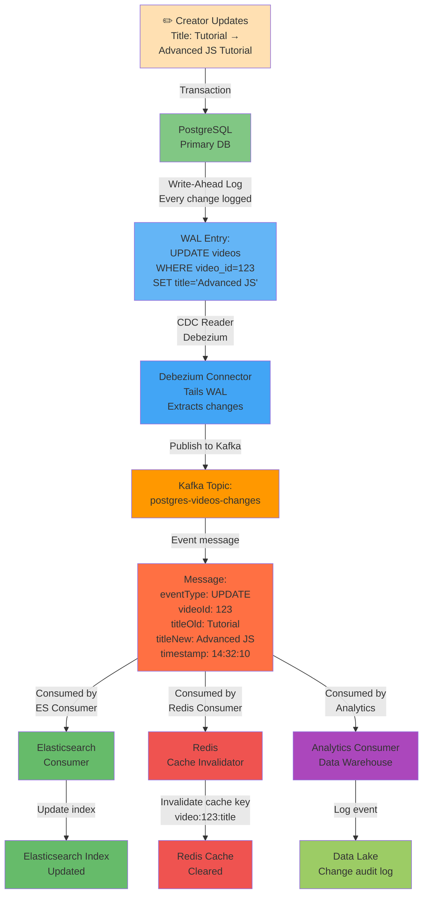
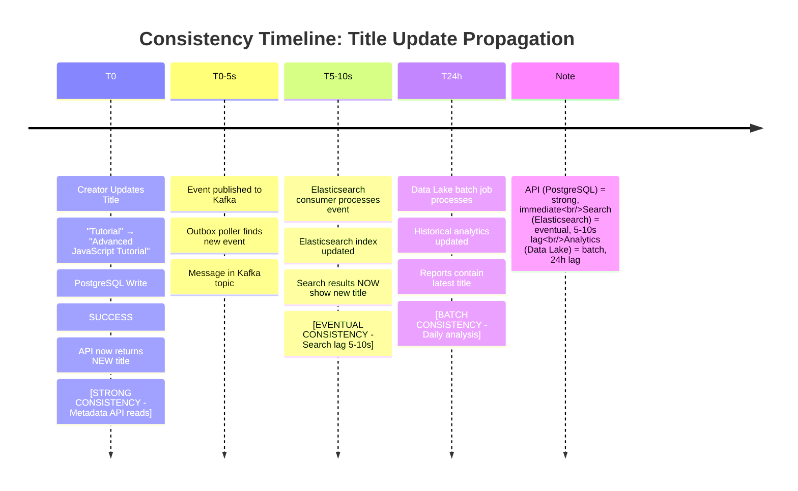

# Deep Dive 3: Metadata Consistency — Keeping Search in Sync

A creator updates their video title from "Tutorial" to "Advanced JavaScript Tutorial for Beginners (2024)". They hit save. One millisecond later, the API responds: "Title updated." But when they search for "Advanced JavaScript Tutorial", nothing appears. A friend searching finds the old title. The video info page shows the new title.

Welcome to the distributed systems version of hell: **data consistency across multiple databases.**

At YouTube's scale, video metadata lives in multiple places:
- **PostgreSQL**: The source of truth (strong consistency, slow writes)
- **Elasticsearch**: The search index (full-text search, eventually consistent)
- **Redis**: The cache layer (fast, but can become stale)
- **Message brokers**: Event logs (for audit trails, analytics)

Update PostgreSQL? Elasticsearch doesn't know. Elasticsearch is out of sync. Users search and find stale results. The system is broken, but subtly—not a hard crash, just gradually accumulating wrongness.

This part explores how YouTube keeps these systems in sync reliably.

---

## The Dual-Write Trap

The naive approach: "Just update both."

```javascript
async function updateVideoTitle(videoId, newTitle) {
  // Update database
  await postgres.query(
    'UPDATE videos SET title = $1 WHERE video_id = $2',
    [newTitle, videoId]
  );
  
  // Update search index
  await elasticsearch.update({
    index: 'videos',
    id: videoId,
    body: { doc: { title: newTitle } }
  });
  
  return { success: true };
}
```

**What goes wrong?**

### Scenario 1: Elasticsearch Write Fails

```
1. PostgreSQL update: SUCCESS (title changed)
2. Elasticsearch update: TIMEOUT (ES node is restarting)
3. Function throws error
4. Client sees error
5. User clicks retry
6. PostgreSQL is already updated
7. Second retry succeeds
8. Result: Title is in PostgreSQL but not in Elasticsearch

Search is now BROKEN. Users search and don't find the video under the new title.
```

### Scenario 2: Network Partition

```
1. PostgreSQL update: SUCCESS
2. Network partition occurs (client can't reach Elasticsearch)
3. Elasticsearch update: FAIL (unreachable)
4. System returns error to user
5. User manually retries
6. But PostgreSQL doesn't re-execute (already updated)
7. Elasticsearch still has old data

Result: DATA INCONSISTENCY. Different services report different state.
```

### Scenario 3: Race Condition

```
Multiple clients update title simultaneously:
Client A: "Tutorial" → "Advanced JS"
Client B: "Tutorial" → "JS Advanced"

Timeline:
  T0: Client A writes PostgreSQL (value: "Advanced JS")
  T1: Client B writes PostgreSQL (value: "JS Advanced")
  T2: Client A writes Elasticsearch ("Advanced JS")
  T3: Client B writes Elasticsearch ("JS Advanced")

PostgreSQL: "JS Advanced" (correct, last write)
Elasticsearch: "JS Advanced" (happens to match)
But what if Client A's Elasticsearch write is delayed?

T0: Client A writes PostgreSQL (value: "Advanced JS")
T1: Client B writes PostgreSQL (value: "JS Advanced")
T2: Client B writes Elasticsearch ("JS Advanced")
T3: Client A writes Elasticsearch ("Advanced JS") [DELAYED]

PostgreSQL: "JS Advanced" (correct)
Elasticsearch: "Advanced JS" (WRONG!)

Result: Inconsistency. Search shows wrong title.
```

**The core problem:** Dual writes have no atomicity. You can't atomically update two independent systems. If one fails, you're stuck in a broken state.

---

## Change Data Capture (CDC): The Solution

Instead of application code updating multiple systems, use **CDC**: a streaming log of every change to the database.

### How CDC Works



**Key property:** Changes flow from a single source (PostgreSQL WAL) to multiple destinations. Ordering is preserved. Nothing is missed.

### CDC Implementation: Debezium

**Debezium** is an open-source CDC platform. It connects to PostgreSQL's logical replication slot and streams changes.

**Setup:**

```bash
# 1. Enable logical replication in PostgreSQL
psql -U postgres -c "ALTER SYSTEM SET wal_level = logical;"
sudo systemctl restart postgresql

# 2. Create replication slot
psql -U postgres -c "SELECT * FROM pg_create_logical_replication_slot('youtube_slot', 'pgoutput');"

# 3. Deploy Debezium connector
# Configuration (in Kafka Connect)
{
  "name": "postgres-videos-connector",
  "config": {
    "connector.class": "io.debezium.connector.postgresql.PostgresConnector",
    "database.hostname": "postgres-primary.example.com",
    "database.port": "5432",
    "database.user": "replication_user",
    "database.password": "***",
    "database.dbname": "youtube",
    "database.server.name": "postgres",
    "table.include.list": "public.videos,public.comments",
    "topic.prefix": "cdc",
    "publication.name": "dbz_publication",
    "slot.name": "youtube_slot"
  }
}

# 4. Result: Topics created automatically
kafka --list-topics | grep cdc
  cdc.public.videos
  cdc.public.comments
```

**Message format (Avro):**

```json
{
  "source": {
    "version": "2.1.0",
    "connector": "postgresql",
    "name": "postgres",
    "ts_ms": 1705589530123,
    "snapshot": false,
    "db": "youtube",
    "schema": "public",
    "table": "videos",
    "txId": 1001,
    "lsn": 0,
    "xmin": null
  },
  "op": "u",  // u=update, c=create, d=delete, r=read
  "ts_ms": 1705589530123,
  "transaction": null,
  "before": {
    "video_id": "dQw4w9WgXcQ",
    "title": "Tutorial",
    "description": "Learn JS",
    "updated_at": "2024-01-16T10:00:00Z"
  },
  "after": {
    "video_id": "dQw4w9WgXcQ",
    "title": "Advanced JavaScript Tutorial",
    "description": "Learn JS",
    "updated_at": "2024-01-18T14:32:10Z"
  }
}
```

Every change is captured: before-state, after-state, operation type, timestamp, transaction ID.

---

## The Outbox Pattern: Atomic Dual-Write

But CDC alone has a problem: what if your application crashes between writing to PostgreSQL and publishing to Kafka?

**The Outbox Pattern** solves this:

```
Instead of:
  PostgreSQL update → (then) Kafka publish
  
Use:
  PostgreSQL transaction:
    1. Update videos table
    2. Insert into outbox table (same transaction)
  
Kafka worker (async):
  1. Read from outbox
  2. Publish to Kafka
  3. Delete from outbox
```

**Implementation:**

```sql
-- Create outbox table
CREATE TABLE outbox (
  id BIGSERIAL PRIMARY KEY,
  aggregate_type VARCHAR(255) NOT NULL,
  aggregate_id VARCHAR(255) NOT NULL,
  event_type VARCHAR(255) NOT NULL,
  payload JSONB NOT NULL,
  created_at TIMESTAMP DEFAULT NOW(),
  published_at TIMESTAMP,
  INDEX(published_at)  -- For finding unpublished events
);

-- Update videos and add to outbox in one transaction
BEGIN;
  UPDATE videos SET title = 'Advanced JS' WHERE video_id = 'abc123';
  
  INSERT INTO outbox (aggregate_type, aggregate_id, event_type, payload)
  VALUES (
    'video',
    'abc123',
    'VideoTitleUpdated',
    jsonb_build_object(
      'videoId', 'abc123',
      'oldTitle', 'Tutorial',
      'newTitle', 'Advanced JS',
      'timestamp', NOW()
    )
  );
COMMIT;
```

**Key insight:** Both writes happen in the same database transaction. If either fails, the entire transaction rolls back. No partial updates.

**Outbox Poller (runs every 1 second):**

```javascript
async function pollAndPublishOutbox() {
  // 1. Find unpublished events
  const events = await postgres.query(
    'SELECT * FROM outbox WHERE published_at IS NULL ORDER BY id LIMIT 1000'
  );
  
  for (const event of events) {
    try {
      // 2. Publish to Kafka
      await kafka.publish('video-events', event.payload);
      
      // 3. Mark as published
      await postgres.query(
        'UPDATE outbox SET published_at = NOW() WHERE id = $1',
        [event.id]
      );
    } catch (err) {
      logger.error(`Failed to publish event ${event.id}:`, err);
      // Don't mark as published; retry in next poll
    }
  }
}

// Run every 1 second
setInterval(pollAndPublishOutbox, 1000);
```

**Why this works:**

1. **Atomic write**: PostgreSQL update + outbox insert are in one transaction (atomic)
2. **At-least-once delivery**: If Kafka publish fails, the outbox entry remains unpublished
3. **Exactly-once eventual consistency**: Poll job retries until Kafka succeeds
4. **No data loss**: If the poller crashes, events are still in the outbox table (durable)
5. **Simple**: No distributed transactions, no XA protocol complexity

**Trade-off:** Eventual consistency. Events appear in Kafka after a small lag (seconds to minutes, depending on poll interval).

---

## Consistency Models: API vs Search

Here's the key insight: **Different consumers need different consistency levels.**

### API Reads: Strong Consistency

When a user views a video info page, they see:
```
Title: Advanced JavaScript Tutorial (from PostgreSQL)
Description: ...
Views: 1.4B (from Redis shards)
```

This is served directly from PostgreSQL. It's **strongly consistent**: the latest data, no stale reads.

```javascript
async function getVideoInfo(videoId) {
  // Read from PostgreSQL (primary, read-after-write consistency)
  const video = await postgres.query(
    'SELECT * FROM videos WHERE video_id = $1',
    [videoId]
  );
  
  // Redis cache miss? Rebuild
  if (!video) {
    return { error: 'Video not found' };
  }
  
  // Aggregate view counts from Redis shards
  const viewCount = await getViewCount(videoId);
  
  return {
    videoId: video.video_id,
    title: video.title,  // Latest from DB
    description: video.description,
    viewCount  // Near real-time from Redis
  };
}
```

**Latency**: 50-200ms (DB query + aggregation)

### Search: Eventual Consistency

When a user searches for "Advanced JavaScript Tutorial", results come from Elasticsearch. There's a lag.

```javascript
async function searchVideos(query) {
  // Read from Elasticsearch (replica, eventual consistency)
  const results = await elasticsearch.search({
    index: 'videos',
    q: query,
    size: 20
  });
  
  return results.hits.map(hit => ({
    videoId: hit._id,
    title: hit._source.title,  // Might be stale (5-10 min lag)
    description: hit._source.description,
    views: hit._source.view_count
  }));
}
```

**Latency**: <200ms (Elasticsearch query)

**Staleness**: 5-10 minutes (time for CDC → Kafka → Elasticsearch update)

**Why this is acceptable:**

- Users don't expect instant search index updates
- Search traffic is not as critical as playback
- 5-10 minute lag is unnoticeable (users type, get results, click video)
- If the title changed 1 minute ago and they search 2 minutes later, maybe they see the old title. They click the video, see the new title on the info page. No confusion.

### The Freshness Timeline



This is the freshness timeline showing how data propagates through the system.
        ├─ Updates search index
        └─ Search now returns new title

Timeline:
  API: 0 seconds lag (immediate)
  Search: ~10 seconds lag (acceptable)
```

---

## Schema Evolution: Adding New Fields

Videos table grows over time. You add a new field: `transcoding_status`.

```sql
ALTER TABLE videos ADD COLUMN transcoding_status VARCHAR(32) DEFAULT 'queued';
```

Now Elasticsearch must know about this field.

**Without CDC:**
```
Option 1: Reindex entire table (8 hours downtime, 100M videos)
Option 2: Dual-write code for new field (complex, error-prone)
Option 3: Hope it works (spoiler: it doesn't)
```

**With CDC:**

```
1. Add column to PostgreSQL
2. Debezium automatically includes new column in CDC messages
3. Elasticsearch consumer reads new field
4. Elasticsearch mapping updated automatically
5. New videos indexed with transcoding_status
6. Old documents backfilled with default value

Zero downtime. Automatic. Reliable.
```

---

## Failure Modes & Recovery

### Scenario 1: Elasticsearch Cluster Down (30 minutes)

```
T=0:00  Elasticsearch goes down
        │
        ├─ CDC still running: PostgreSQL → Kafka
        ├─ Outbox still working: events queuing
        └─ Search requests fail (customer-facing)

T=0:15  Operations team noticed; Elasticsearch cluster recovering
        │
        └─ Kafka buffer is filling with events (30 min worth)

T=0:30  Elasticsearch recovers
        │
        ├─ Elasticsearch consumer catches up
        ├─ Kafka backlog of 30-min events are replayed
        ├─ Index is refreshed within 5 minutes
        └─ Search is restored

Impact: Search unavailable for 30 minutes. Strong consistency maintained (no data loss).
Recovery: Automatic (no manual intervention)
RTO: 30 min (availability)
RPO: 0 minutes (no data loss)
```

### Scenario 2: Kafka Broker Down (1 minute)

```
Kafka replicates across 10 brokers, replication factor 3.
One broker dies.

Impact: Negligible
├─ Partition leadership fails over to replica (30 sec)
└─ Publishing continues with no data loss

RTO: < 1 minute
RPO: 0 (replication)
```

### Scenario 3: Outbox Poller Crashes

```
Outbox poller process dies.
Events pile up in outbox table (not published to Kafka).

Recovery:
1. Alert fires: Outbox entries older than 5 minutes
2. New poller starts (or old one restarts)
3. Reads unpublished entries from outbox
4. Publishes to Kafka
5. Catches up in minutes

Impact: Lag in eventual consistency (5-15 min instead of 10 sec)
Data loss: None (outbox is persistent)
```

---

## Monitoring: Detecting Drift

At what point do you realize search is out of sync with the database?

### Metric 1: Outbox Queue Depth

```
SELECT COUNT(*) FROM outbox WHERE published_at IS NULL;

Healthy: < 1000 events
Warning: 1000-10000 events (poller is slow)
Alert: > 10000 events (poller is broken, lag > 5 min)
```

### Metric 2: Kafka Consumer Lag

```
The Elasticsearch consumer is behind. How far?

kafka-consumer-groups --describe \
  --bootstrap-server localhost:9092 \
  --group elasticsearch-consumer

GROUP: elasticsearch-consumer
TOPIC: video-events
PARTITION: 0, CURRENT-OFFSET: 1500000, LOG-END-OFFSET: 1502000, LAG: 2000

LAG = 2000 events

At 10 events/sec, lag = 200 seconds = 3.3 minutes (acceptable)
At 1 event/sec, lag = 2000 seconds = 33 minutes (alert!)
```

### Metric 3: Consistency Audit

Periodically compare database and search index:

```javascript
async function auditConsistency() {
  // Sample 10,000 videos
  const dbSample = await postgres.query(
    'SELECT video_id, title, updated_at FROM videos ORDER BY RANDOM() LIMIT 10000'
  );
  
  // Look up same videos in Elasticsearch
  const esSample = await elasticsearch.mget({
    docs: dbSample.map(v => ({ _index: 'videos', _id: v.video_id }))
  });
  
  // Compare
  let mismatches = 0;
  for (let i = 0; i < dbSample.length; i++) {
    const db = dbSample[i];
    const es = esSample[i]._source;
    
    if (db.title !== es.title) {
      mismatches++;
      logger.warn(`Mismatch: ${db.video_id} DB="${db.title}" ES="${es.title}"`);
    }
  }
  
  const mismatchRate = mismatches / 10000;
  
  // Alert if > 1% mismatch
  if (mismatchRate > 0.01) {
    alert('High consistency drift: ' + mismatchRate);
  }
}

// Run every 5 minutes
setInterval(auditConsistency, 5 * 60 * 1000);
```

---

## Advanced: Handling Deletes

Deletes are tricky because the CDC message is "DELETE from database" but the Elasticsearch document still exists.

### Soft Deletes

Don't actually delete. Mark as deleted:

```sql
ALTER TABLE videos ADD COLUMN deleted_at TIMESTAMP;

-- Instead of DELETE:
UPDATE videos SET deleted_at = NOW() WHERE video_id = 'xyz';

-- CDC captures this update
-- Elasticsearch consumer reads deleted_at field
-- If deleted_at IS NOT NULL, delete from Elasticsearch
```

**Benefit**: Soft deletes leave an audit trail. You can restore videos if needed.

### Hard Deletes with Tombstones

If you must hard-delete:

```javascript
// CDC messages for deletes look like:
{
  "op": "d",  // delete operation
  "before": {
    "video_id": "xyz",
    "title": "Deleted Video"
  },
  "after": null
}

// Elasticsearch consumer:
if (msg.op === 'd') {
  await elasticsearch.delete({
    index: 'videos',
    id: msg.before.video_id
  });
}
```

---

## Alternative Architectures: When CDC Isn't Enough

CDC + Kafka is the standard, but edge cases exist.

### Cross-Region Replication

PostgreSQL primary in US-East, replica in EU-West.

**Problem**: Replica lag (10-100ms)
**Solution**: CDC streams changes to EU in real-time, EU Elasticsearch stays current

### Handling Out-of-Order Events

```
Event A: Title "Tutorial"
Event B: Title "Advanced Tutorial"

If Event B arrives before Event A:
  Elasticsearch = "Advanced Tutorial"
  Correct state after both = "Advanced Tutorial"
  ✓ OK (eventual consistency)
  
But metadata also has updated_at timestamp:
  Event A: updated_at = T=100
  Event B: updated_at = T=200
  
  If B arrives first:
    Elasticsearch state = B, timestamp = 200
  Then A arrives:
    Check: A.timestamp (100) < Elasticsearch.timestamp (200)
    → Reject A (it's old)
    → Keep B (it's newer)
  ✓ Resolved
```

**Implementation: Version/Timestamp checking**

```javascript
async function handleVideoUpdate(event) {
  // Get current version in Elasticsearch
  const current = await elasticsearch.get({
    index: 'videos',
    id: event.videoId
  });
  
  // Only update if event is newer
  if (event.updatedAt > current._source.updated_at) {
    await elasticsearch.update({
      index: 'videos',
      id: event.videoId,
      body: { doc: event }
    });
  } else {
    logger.info(`Skipping stale event for ${event.videoId}`);
  }
}
```

---

## Conclusion: The Hidden Art of Consistency

Consistency sounds simple: "Keep data in sync." In practice, it's:

1. **CDC** (Change Data Capture): Extract changes from source database
2. **Kafka**: Durable event stream, preserving order
3. **Outbox Pattern**: Atomicity for dual-write (database + outbox)
4. **Eventual Consistency**: Accept lag for high availability
5. **Monitoring**: Detect drift before users notice
6. **Conflict Resolution**: Timestamp-based versioning

The reward: Update PostgreSQL once. Changes flow to Elasticsearch, Redis, analytics, audit logs—automatically, durably, reliably.

In the final part, we zoom out. We've built a bulletproof architecture for:
- **Real-time analytics** (Part 2: 1M QPS view counters)
- **Efficient video storage** (Part 3: AV1 encoding saves $4.56B/year)
- **Consistent metadata** (Part 4: CDC + Outbox + eventual consistency)

Now we ask: **Can this actually run in production?** What about multi-region failover? SLOs and alerting? Incidents at 3 AM? Cost optimization? Security? Compliance? Part 5 is about operating YouTube at planetary scale.

---

**Key Takeaways:**
- Dual-write to PostgreSQL + Elasticsearch is fragile (one fails, inconsistency)
- CDC (Change Data Capture) extracts changes from database WAL
- Outbox Pattern ensures atomicity: update database + insert event in same transaction
- Kafka provides durable, ordered event stream to multiple consumers
- API reads from PostgreSQL (strong consistency, 50-200ms latency)
- Search reads from Elasticsearch (eventual consistency, 5-10min lag, <200ms latency)
- Monitoring detects: outbox depth, Kafka lag, consistency audits
- CDC makes schema evolution automatic and safe (new fields flow automatically)
