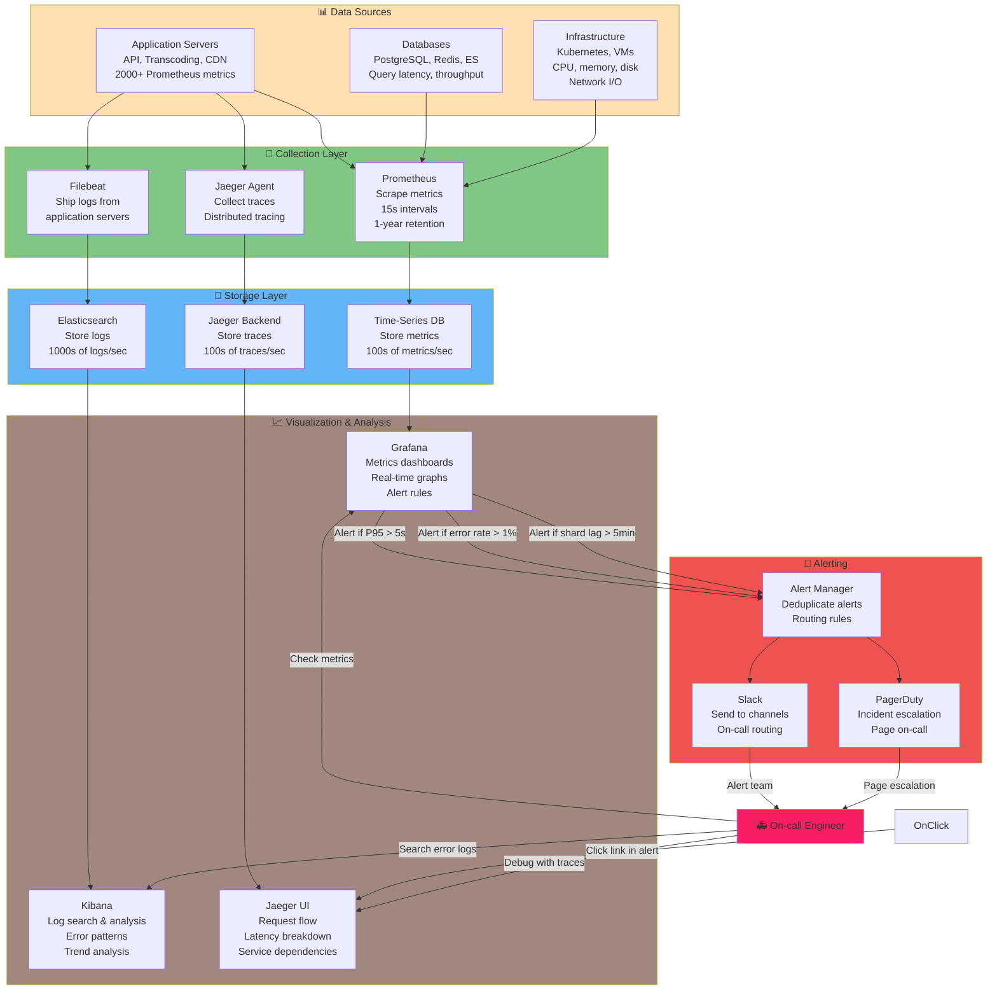

# Production Readiness: Operating YouTube at Scale

You've built a beautiful system. Real-time analytics at 1M QPS. Efficient transcoding saving billions in bandwidth. Metadata consistency across PostgreSQL, Elasticsearch, Redis. The architecture is sound.

Then 2 AM rolls around. Elasticsearch cluster in APAC goes down. Kafka broker crashes. CDN sees unexpected traffic surge. Creator uploads a file with invalid codec. An alert fires. Then another. Then twenty more.

This part is about **operating** YouTube at scale: SLOs (Service Level Objectives), multi-region failover, incident response, security, compliance, cost optimization. The systems that separate "technically correct" from "actually works in production."

---

## Service Level Objectives (SLOs): The Contract with Users

SLO = the promise you make about availability and performance.

### YouTube's SLOs

| Service | SLO | Downtime/Year | Target P95 Latency | Notes |
|---------|-----|---|---|---|
| **Video Playback** | 99.9% | 8.76 hours | <5s startup | Users forgive video quality drops; not buffering |
| **Metadata API** | 99.99% | 52 minutes | <1s | Video info, comments, likes critical path |
| **Upload Service** | 99.5% | 43.8 hours | <30s per chunk | Uploads can retry; lower SLA acceptable |
| **Search Service** | 99.9% | 8.76 hours | <200ms | Can fallback to stale index |
| **Authentication** | 99.99% | 52 minutes | <100ms | Every request depends on this |

**Why different SLOs?**

```
Playback: 99.9%
  ├─ CDN handles 90% of requests from cache
  ├─ If origin fails, users get cached version (degraded but working)
  └─ Temporary buffering annoying, but not critical (users retry)

Metadata API: 99.99%
  ├─ No cache fallback (users always expect fresh info)
  ├─ Every video page load hits this
  └─ Lower SLA = 99.9% = 8.76 hours downtime/year
     1000 creators × 8.76 hours = 8760 creator-hours lost per year (unacceptable)

Upload: 99.5%
  ├─ Upload failures can retry from checkpoint
  ├─ Users expect some unreliability (network conditions)
  └─ Higher tolerance acceptable
```

### Calculating SLO Compliance

**Metric**: Uptime percentage = (Total Time - Downtime) / Total Time

```
Month: Jan 2024 (744 hours)
Service: Metadata API
Target: 99.99%
Budget: 744 hours × (1 - 0.9999) = 0.0744 hours = 4.46 minutes

Incidents in Jan:
  1. Database failover: 2 minutes (2024-01-05 14:32-14:34)
  2. Cache corruption: 1 minute (2024-01-18 08:15-08:16)
  3. Network issue: 1.46 minutes (2024-01-25 22:10-22:11:27)
  
Total downtime: 4.46 minutes ✓ Met SLO
```

If downtime exceeded 4.46 minutes, SLO is breached. Customer refunds may apply (SLA = contractual, penalty-backed version of SLO).

---

## Multi-Region Deployment: Surviving Disasters

One data center fails. Millions of users see service degradation. The economic impact: $1M+ per minute of downtime. Solution: **Multi-region active-active deployment.**

### Topology

```mermaid
graph TB
    subgraph UserTraffic["🌍 Global User Traffic"]
        DNSGeo["DNS Geolocation<br/>Route to nearest region"]
    end
    
    DNSGeo -->|"US-East users"| USEast
    DNSGeo -->|"EU users"| EU
    DNSGeo -->|"APAC users"| APAC
    DNSGeo -->|"South America users"| SAM
    
    subgraph USEast["🗽 US-East-1 Region (Primary)"]
        USEastAPI["API Servers<br/>100 instances<br/>Autoscaling"]
        USEastPG["PostgreSQL Primary<br/>Primary writes<br/>Accepts all updates"]
        USEastES["Elasticsearch Cluster<br/>3 nodes<br/>Full index"]
        USEastRedis["Redis Cluster<br/>100 shards<br/>10 nodes"]
        USEastKafka["Kafka Cluster<br/>10 brokers<br/>Event backbone"]
        USEastCDN["CDN Edges<br/>50 nodes<br/>90% cache hit"]
        USEastMonitor["Monitoring<br/>Prometheus, ELK, Jaeger"]
    end
    
    subgraph EU["🇪🇺 EU-West-1 Region"]
        EUAPI["API Servers<br/>80 instances"]
        EUPG["PostgreSQL Read Replica<br/>Async replication<br/>2-5s lag"]
        EUES["Elasticsearch Replica<br/>Cold standby"]
        EURedis["Redis Cache<br/>Local copy<br/>hot keys"]
        EUKafka["Kafka Consumer<br/>Event replication"]
        EUCDN["CDN Edges<br/>40 nodes"]
        EUMonitor["Monitoring"]
    end
    
    subgraph APAC["🌏 AP-Southeast-1 Region"]
        APACAPI["API Servers<br/>60 instances"]
        APACPG["PostgreSQL Read Replica<br/>Async replication"]
        APACES["Elasticsearch Replica"]
        APACRedis["Redis Cache"]
        APACKafka["Kafka Consumer"]
        APACCDN["CDN Edges<br/>30 nodes"]
    end
    
    subgraph SAM["🇧🇷 SA-East-1 Region"]
        SAMAPI["API Servers<br/>30 instances"]
        SAMCDN["CDN Edges<br/>20 nodes"]
        SAMCache["Cache + Fallback"]
    end
    
    USEastPG -->|"Async replicate<br/>every change"| EUPG
    USEastPG -->|"Async replicate"| APACPG
    USEastKafka -->|"Stream events"| EUKafka
    USEastKafka -->|"Stream events"| APACKafka
    
    USEastES -->|"Daily batch<br/>push index"| EUES
    USEastES -->|"Daily batch"| APACES
    
    USEastAPI -->|"Serve US traffic"| USEastCDN
    EUAPI -->|"Serve EU traffic"| EUCDN
    APACAPI -->|"Serve APAC traffic"| APACCDN
    SAMAPI -->|"Serve SAM traffic"| SAMCDN
    
    style USEast fill:#bbdefb
    style EU fill:#c8e6c9
    style APAC fill:#ffe0b2
    style SAM fill:#f8bbd0
    style USEastPG fill:#81c784
    style EUPG fill:#64b5f6
    style APACPG fill:#64b5f6
```



### Failover Scenarios

**Scenario 1: US-East primary database fails**

```
T=0:00  Primary PostgreSQL crashes (hardware failure)
        ├─ Automated health check fails
        └─ Replication monitor detects lag > 5 seconds

T=0:15  EU-West read replica promoted to primary
        ├─ DNS updated: postgres-primary now points to EU instance
        ├─ Data loss: Last 10-30 seconds (replication lag)
        ├─ EU becomes new write master
        └─ EU writers start going to EU-West-1 PostgreSQL

Impact:
  ├─ US-East: Read-only mode (users see cached data)
  ├─ EU: Full write access restored
  ├─ APAC: Read-only mode (data from stale replica)
  
Recovery:
  ├─ US-East: Rebuild primary from backups (1-2 hours)
  ├─ Promote back to US-East after verification
  └─ Total outage: 15 min (failover) + 1-2 hours (rebuild)

RTO: 15 minutes (to failover) + 1-2 hours (to rebuild primary)
RPO: 10-30 seconds (data loss)
```

**Why data loss?**

PostgreSQL replication is asynchronous by default. Replication lag is typically 100ms-5 seconds. If primary crashes, the last few seconds of writes are not yet replicated. They're lost.

**To reduce RPO:**

```sql
-- Synchronous replication (stronger guarantee, slower writes)
ALTER SYSTEM SET synchronous_commit = remote_apply;

-- Cost: Write latency increases from ~50ms to ~200ms
--       Because write must be acknowledged by replica before returning

-- Trade-off: RPO = ~1ms (writes wait for replication)
--            But P99 latency increases 4x
```

YouTube probably uses a **hybrid approach**: Synchronous for critical metadata, asynchronous for less critical (views, likes).

---

## Circuit Breakers: Graceful Degradation

When Elasticsearch goes down, don't crash the entire API. Degrade gracefully.

### Pattern: Circuit Breaker

```javascript
class CircuitBreaker {
  constructor(name, threshold = 5, resetTimeout = 60000) {
    this.name = name;
    this.failureCount = 0;
    this.threshold = threshold;  // Fail after 5 consecutive errors
    this.resetTimeout = resetTimeout;  // Try again after 60 seconds
    this.state = 'CLOSED';  // 'CLOSED' = working, 'OPEN' = failing, 'HALF_OPEN' = testing
    this.lastFailureTime = null;
  }
  
  async execute(fn) {
    if (this.state === 'OPEN') {
      // Check if timeout expired (try recovery)
      if (Date.now() - this.lastFailureTime > this.resetTimeout) {
        this.state = 'HALF_OPEN';
        this.failureCount = 0;
      } else {
        throw new Error(`Circuit breaker ${this.name} is OPEN`);
      }
    }
    
    try {
      const result = await fn();
      this.onSuccess();
      return result;
    } catch (err) {
      this.onFailure();
      throw err;
    }
  }
  
  onSuccess() {
    this.failureCount = 0;
    this.state = 'CLOSED';
  }
  
  onFailure() {
    this.failureCount++;
    this.lastFailureTime = Date.now();
    
    if (this.failureCount >= this.threshold) {
      this.state = 'OPEN';
      logger.error(`Circuit breaker ${this.name} opened after ${this.failureCount} failures`);
    }
  }
}

// Usage
const esBreakerbreaker = new CircuitBreaker('elasticsearch', 5, 60000);

async function searchVideos(query) {
  try {
    // If Elasticsearch down, circuit breaker opens after 5 failures
    return await breaker.execute(async () => {
      return await elasticsearch.search({
        index: 'videos',
        q: query
      });
    });
  } catch (err) {
    // Fallback: search database directly (slower, but works)
    logger.warn('Elasticsearch unavailable, falling back to database search');
    
    return await postgres.query(
      'SELECT * FROM videos WHERE title ILIKE $1 OR description ILIKE $1 LIMIT 20',
      [`%${query}%`]
    );
  }
}
```

**State machine:**

```
CLOSED (working)
  ↓ (5 failures)
OPEN (failing, reject all requests)
  ↓ (60 sec timeout)
HALF_OPEN (testing recovery)
  ├─ (success) → CLOSED
  └─ (failure) → OPEN
```

**Benefits:**
- Prevents cascading failures (one service down doesn't take down others)
- Automatic recovery (circuit breaker retries after timeout)
- User experience: See fallback result instead of error
- Reduces load on failing service (stops sending requests)

---

## Observability: Metrics, Logs, Traces

You can't fix what you don't see. At 1M QPS, observability is the difference between "bug goes unnoticed for days" and "bug detected in seconds."



**Critical Metrics to Monitor:**

```
# Request latency (P95, P99)
http_request_duration_seconds{endpoint="/videos/{id}"}
  Alert if P95 > 5s for video startup
  Alert if P95 > 1s for metadata API

# Error rate
http_requests_total{status="5xx"}
  Alert if error rate > 1% for 2 minutes

# Redis shard distribution
redis_operations_total{shard="X"}
  Alert if any shard > 15K QPS (capacity is 10K)

# Kafka consumer lag
kafka_consumer_lag_offsets{group="elasticsearch-consumer"}
  Alert if lag > 5 minutes worth of events

# Transcoding job status
transcode_jobs_total{status="failed"}
  Alert if >2% failure rate
```

---

## Incident Response: 3 AM Pager

It's 3 AM. Alert fires: "Metadata API P95 latency > 5s". On-call engineer wakes up.

### Incident Response Playbook

**Phase 1: Detect & Alert (automated)**

```
Monitoring system detects problem:
  └─ P95 latency > 5s for 5 minutes
  └─ Triggers alert
  └─ Sends Slack: "CRITICAL: Metadata API latency spike"
  └─ Pages PagerDuty: phone call to on-call
  └─ Creates incident ticket (auto-populates with metrics, logs)
```

**Phase 2: Triage (human, 5 minutes)**

Engineer wakes up, opens incident dashboard:

```
Time:           2024-01-18 03:32:45 UTC
Service:        Metadata API
Metric:         P95 latency = 6.2s (target: 1s)
Error Rate:     0.5% (normal: 0.01%)
Throughput:     45K QPS (normal: 50K QPS, down 10%)

Last deployment: 1 hour ago (API version 2.15.3)
Recent changes:  Added video recommendation cache

Hypothesis: New code introduced a bottleneck
```

**Phase 3: Quick Mitigation (5-10 minutes)**

Options:
1. **Rollback**: Revert the 1-hour-old deployment
2. **Scale up**: Add more API instances
3. **Debug**: Deep-dive into logs (takes time, higher risk)

Engineer chooses **rollback** (safest, fastest):

```bash
# Rollback to previous version (2.15.2)
kubectl rollout undo deployment/metadata-api --to-revision=1

# Monitor latency
# T+2 min: Latency drops to 800ms (normal)
# All alerts clear
```

**Impact**: ~10 minutes of degradation (slow search, slow video info pages). Acceptable.

**Phase 4: Post-Incident (next day)**

```
Incident Report:
  Title: Metadata API Latency Spike on 2024-01-18
  Duration: 10 minutes
  Root Cause: Recommendation cache implementation introduced O(n^2) loop
  Fix: Optimize cache logic, add unit tests
  SLO Impact: Missed 99.99% SLO (1 minute downtime)
  Action Items:
    1. Reimplement cache with O(n) complexity
    2. Add load testing for cache layer (catch before production)
    3. Improve code review process for performance-critical paths
    4. Create runbook for rollback procedures

Blameless culture: No individual blame. Focus on systems and processes.
```

---

## SLOs & Incident Severity

Incidents are classified by impact:

| Severity | Definition | Response Time | Example |
|----------|-----------|---|---|
| **CRITICAL** | Service down or severely degraded | Page immediately | Metadata API latency > 5s, playback buffering >10% users |
| **HIGH** | Significant degradation | Alert within 5 min | Elasticsearch unavailable, 50% error rate |
| **MEDIUM** | Noticeable issues | Alert within 15 min | Transcode queue growing, 1% error rate |
| **LOW** | Minor issues, can wait | Ticket created | Slow dashboard load time, monitoring system lag |

---

## Cost Optimization: 60% Reserved + 40% Spot

YouTube costs are dominated by compute and bandwidth. Optimization is critical.

### Reserved vs Spot vs On-Demand

| Instance Type | Price | Commitment | Best For |
|---|---|---|---|
| **On-Demand** | $X/hour | None, pay as you go | Unpredictable workloads, testing |
| **Reserved** | $0.30X/hour (70% off) | 1-3 year commitment | Baseline workload (60%) |
| **Spot** | $0.10X/hour (90% off) | Can be revoked with 2min notice | Batch jobs, fault-tolerant (40%) |

**Strategy:**

```
Metadata API: Always needed, even during quiet hours
  ├─ Baseline: 100 instances needed always
  ├─ Buy reserved: 100 instances × $0.30X = $30M/year
  ├─ Peak surge: Need 200 instances sometimes
  ├─ Buy on-demand: 100 instances × $X = $100M/year
  └─ Total: $130M/year

Transcoding: Batch processing, flexible timing
  ├─ Peak: 10,000 GPU cores
  ├─ Buy reserved: 6,000 cores (60%) × $0.30 = $1.8M/month
  ├─ Buy spot: 4,000 cores (40%) × $0.10 = $0.4M/month
  └─ Total: $2.2M/month vs $3M/month (27% savings)

Batch analytics: Off-peak only
  ├─ Buy spot only: Run during cheap hours (night, weekends)
  ├─ Cost: Minimal
  └─ Trade-off: Jobs may take 2-3x longer (revoke = retry elsewhere)
```

**Annual savings from optimization:**

```
Without optimization:
  Metadata API (on-demand): $150M/year
  Transcoding (on-demand): $25M/year
  Total: $175M/year

With optimization (reserved + spot):
  Metadata API (70% reserved, 30% on-demand): $45M + $45M = $90M/year
  Transcoding (60% reserved, 40% spot): $12M + $4M = $16M/year
  Total: $106M/year

Savings: $175M - $106M = $69M/year (40% reduction)
```

---

## Security: DRM, Geo-Blocking, Copyright

### Digital Rights Management (DRM)

Prevent users from downloading and redistributing videos.

**How DRM works:**

```
Video player (browser, app) receives encrypted video stream.
├─ Encrypted with Widevine/PlayReady key
├─ Key is stored securely on device
├─ User's device decrypts in memory
├─ Decrypted stream never written to disk
└─ DRM license manager ensures only authorized playback
```

**Certificate pinning:**

```
Client verifies server certificate using public key pinning.
├─ Hard-code YouTube's public key in app
├─ When connecting, verify cert matches pinned key
├─ Prevents man-in-the-middle attacks
└─ Ensures videos only decrypt on official YouTube, not pirated copies
```

**Cost**: Licenses from Widevine/PlayReady: $1-10M/year

### Geo-Blocking

Restrict video access by country (licensing, laws).

```javascript
async function checkGeoRestrictions(videoId, userCountry) {
  const video = await getVideoMetadata(videoId);
  const restrictions = video.geo_restrictions;
  
  if (restrictions.type === 'ALLOW') {
    // Whitelist: only these countries can watch
    if (!restrictions.countries.includes(userCountry)) {
      throw new Error('Video unavailable in your country');
    }
  } else if (restrictions.type === 'BLOCK') {
    // Blacklist: these countries cannot watch
    if (restrictions.countries.includes(userCountry)) {
      throw new Error('Video unavailable in your country');
    }
  }
  
  return true;
}
```

**Why?** Music/sports videos have licensing deals that vary by country.

### Copyright Management

YouTube's content ID system automatically detects copyrighted content.

```
Upload: video_xyz (1 hour)
  ↓
Content ID scan: Compare against 100M+ copyrighted works
  ├─ Match found: "This is Taylor Swift's song"
  ├─ Action options:
  │  ├─ Monetize: Revenue goes to copyright holder
  │  ├─ Block: Remove video
  │  └─ Track: Log views for rights holder
  └─ Creator notified of match

Benefit: Creators can legally use music if they give revenue share
Benefit: Rights holders get paid automatically
Cost: Expensive fingerprinting infrastructure (~$500M/year)
```

---

## Compliance: GDPR, COPPA, DMCA

### GDPR (General Data Protection Regulation)

Users have rights to their data.

**Requirements:**
- Data must be stored in EU if user is in EU
- User can request data export (JSON of all videos, comments, watch history)
- User can request deletion ("right to be forgotten")
- Data breaches must be reported within 72 hours

**Implementation:**

```
User in France requests data export:
  1. System queries:
     ├─ All videos uploaded
     ├─ All watch history
     ├─ All comments posted
     └─ All likes/preferences
  2. Compile into JSON
  3. Encrypt with user's password
  4. Email download link
  5. User downloads 50GB of personal data

User requests deletion:
  1. Soft-delete all personal data
  2. But keep video history for abuse detection (anonymized)
  3. Comply with 30-day deadline
```

**Cost**: Legal/compliance team: $10M+/year

### COPPA (Children's Online Privacy Protection)

Protect users under 13 from data collection.

**Requirements:**
- No personalized ads for users <13
- No tracking cookies
- Parental consent for features like commenting

**Implementation:**

```
User indicates age < 13:
  ├─ Disable recommendations (personalization requires tracking)
  ├─ Disable comments (prevent social features)
  ├─ No personalized ads (show generic ads instead)
  └─ Require parental consent for any account actions
```

### DMCA (Digital Millennium Copyright Act)

If creator uploads copyrighted content, rights holder can request takedown.

**Takedown flow:**

```
Rights holder files DMCA notice:
  ├─ Identifies infringing video
  ├─ Provides evidence of copyright ownership
  └─ YouTube removes video within 24 hours

Creator can counter-notice:
  ├─ Claims fair use or ownership
  └─ Video is restored pending dispute resolution

Process is automated at scale (thousands of takedowns/day)
```

---

## Scaling Scenarios: World Cup Traffic Spike

Every 4 years, World Cup final gets 1B+ concurrent viewers. Load spikes 10x normal.

### Prediction & Preparation

```
6 months before: Engineering begins stress testing
3 months before: Reserve extra capacity (compute, CDN bandwidth, database)
1 month before: Load tests at 5x capacity
1 week before: Final preparations, on-call teams briefed

Expected metrics (World Cup final):
  ├─ Concurrent viewers: 100M → 1B (10x)
  ├─ QPS: 50K → 500K metadata (10x)
  ├─ View events: 1M → 10M per second (10x)
  ├─ Bandwidth: 500 Tbps → 5 Pbps (10x)
  └─ Duration: 120 minutes (plus pre-game, post-game)
```

### Autoscaling

Kubernetes automatically scales:

```yaml
apiVersion: autoscaling/v2
kind: HorizontalPodAutoscaler
metadata:
  name: metadata-api
spec:
  scaleTargetRef:
    apiVersion: apps/v1
    kind: Deployment
    name: metadata-api
  minReplicas: 100
  maxReplicas: 1000
  metrics:
  - type: Resource
    resource:
      name: cpu
      target:
        type: Utilization
        averageUtilization: 70
  - type: Resource
    resource:
      name: memory
      target:
        type: Utilization
        averageUtilization: 80
  behavior:
    scaleDown:
      stabilizationWindowSeconds: 300
      policies:
      - type: Percent
        value: 50
        periodSeconds: 15
    scaleUp:
      stabilizationWindowSeconds: 0
      policies:
      - type: Percent
        value: 100
        periodSeconds: 15
```

**What this means:**
- Minimum 100 instances always running
- Scale up to 1000 if CPU > 70% or memory > 80%
- Scale up fast (100% increase every 15 seconds during spike)
- Scale down slowly (50% decrease every 300 seconds after spike)

---

## Knowledge Sharing & Blameless Culture

When incidents happen, the goal is learning, not blame.

### Postmortems

After every critical incident:

```
Meeting: Incident postmortem
Attendees: All engineers involved + manager
Duration: 1 hour
Goal: Understand what happened and prevent recurrence

Format:
  1. Timeline: What happened step-by-step
  2. Root cause: Why did it happen? (not "who messed up")
  3. Impact: How many users affected? How long? Revenue loss?
  4. Action items: Prevent recurrence (code changes, monitoring, training)
  5. Retrospective: What went well? What went poorly?

Example:
  Root cause: Code change introduced O(n^2) algorithm
  Action items:
    - Add Big-O complexity tests to CI/CD
    - Improve code review checklist for performance
    - Add load testing for cache layer
  What went well: Alert fired quickly, rollback was smooth
  What went poorly: Initial debugging was slow, runbook wasn't clear
```

### On-Call Runbooks

Document every common issue and how to fix it.

```
Runbook: Elasticsearch Latency Spike

Symptoms:
  ├─ Search latency P95 > 500ms
  ├─ Elasticsearch CPU > 80%
  └─ Kibana slow to load

Steps:
  1. Check shard distribution: `curl localhost:9200/_cat/shards`
     └─ If unbalanced, rebalance (see below)
  2. Check slow queries: `curl localhost:9200/_stats/search`
     └─ If queries > 1s, they're slow
  3. Check JVM heap: `curl localhost:9200/_nodes/stats/jvm`
     └─ If > 90%, increase heap size (requires restart)
  4. Disable expensive aggregations:
     kubectl set env deployment/elasticsearch ES_EXPENSIVE_AGGS_ENABLED=false
  5. Monitor latency: Watch Prometheus dashboard
  6. Once recovered, post-incident review

Estimated time to resolve: 5-15 minutes
Point of contact: On-call SRE
Escalation: Page SRE manager if still unresolved after 15 min
```

### Knowledge Base

Every engineer can look up:
- How to deploy a service
- How to debug common issues
- How to perform maintenance
- Example incidents and resolutions

---

## Conclusion: From Architecture to Operations

You've designed a system. Now operate it. That means:

1. **SLOs**: Define the contract (99.9% availability = 8.76 hours downtime/year acceptable)
2. **Multi-region**: Survive any single failure
3. **Circuit breakers**: Degrade gracefully instead of cascading failure
4. **Observability**: Metrics, logs, traces enable detection and debugging
5. **Incident response**: Playbooks and automation get MTTR (mean time to repair) down
6. **Cost optimization**: 60% reserved + 40% spot saves $69M/year
7. **Security**: DRM, geo-blocking, copyright enforcement
8. **Compliance**: GDPR, COPPA, DMCA don't go away
9. **Scaling**: Auto-scale, expect 10x spikes (World Cup), test at 5x
10. **Culture**: Blameless postmortems, runbooks, knowledge sharing

The system we designed in Parts 1-4:
- **Part 1**: Architecture for 1M concurrent viewers, 500K uploads/day
- **Part 2**: Real-time analytics at 1M QPS (sharded counters, Kafka, stream processing)
- **Part 3**: Efficient encoding (H.264 + VP9 + AV1, saves $4.56B/year bandwidth)
- **Part 4**: Metadata consistency (CDC, Outbox pattern, eventual consistency)

This part tied it together: **Operating reliably at planetary scale.**

YouTube is not just architecture. It's a living system, breathing millions of requests per second, spanning the globe, tolerating failures, serving billions of creators and viewers. This series has walked through the blueprint: why each decision matters, how each piece fits, why "good enough" isn't enough at scale.

---

**Key Takeaways:**
- SLOs define acceptable downtime: 99.9% = 8.76 hours/year, 99.99% = 52 minutes/year
- Multi-region deployment with automated failover: RTO <15min, RPO <30sec
- Circuit breakers prevent cascading failures: graceful degradation when dependencies fail
- Observability (metrics, logs, traces) enables MTTR <5 min for critical incidents
- Cost optimization: 60% reserved + 40% spot instances saves 40% ($69M/year)
- Security (DRM, geo-blocking, copyright) is non-negotiable
- Compliance (GDPR, COPPA, DMCA) is legal requirement
- Autoscaling handles 10x traffic spikes (World Cup) automatically
- Blameless postmortems build learning culture
- Runbooks and knowledge sharing reduce time to recovery
