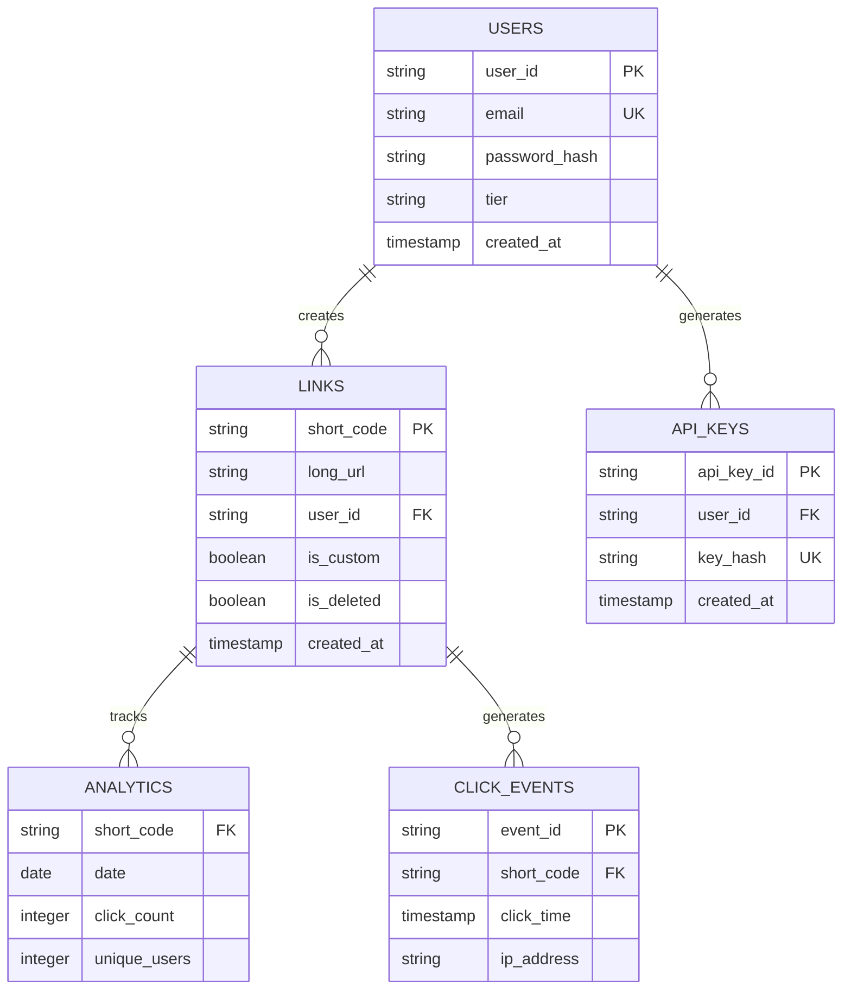

# Article 2: Core Entities & Components

## Entity Relationships Diagram



---

## Core Entities

A URL shortener needs just a few core entities:

### Entity 1: Links (URLs)

The primary entity - maps short codes to long URLs.

```
Links Table:
  ├─ short_code (String, Primary Key, immutable)
  │  └─ e.g., "abc123"
  ├─ long_url (String, up to 2048 chars)
  │  └─ e.g., "https://blog.example.com/..."
  ├─ user_id (String, Foreign Key to Users)
  │  └─ Who created this link
  ├─ created_at (Timestamp, immutable)
  │  └─ When was link created
  ├─ is_custom (Boolean)
  │  └─ true if user chose code, false if random
  ├─ is_deleted (Boolean, soft delete)
  │  └─ true if user deleted
  ├─ expires_at (Timestamp, optional)
  │  └─ When link auto-deletes
  └─ title (String, optional)
     └─ User's description of link
```

**Uniqueness**: 
- `short_code` is globally unique (only one long URL per code)
- `long_url` is NOT unique (same URL can have multiple codes via hashing)

### Entity 2: Users

Accounts that own links.

```
Users Table:
  ├─ user_id (String, Primary Key)
  │  └─ e.g., "user@example.com" or UUID
  ├─ username (String, unique)
  │  └─ Display name
  ├─ email (String, unique)
  │  └─ Contact + login
  ├─ password_hash (String, hashed)
  │  └─ Never store plain passwords
  ├─ tier (String, enum)
  │  └─ "free", "premium", "enterprise"
  ├─ subscription_expires_at (Timestamp)
  │  └─ When does premium expire?
  ├─ api_key (String, unique, hashed)
  │  └─ For programmatic access
  ├─ created_at (Timestamp)
  │  └─ Account creation time
  └─ last_login (Timestamp)
     └─ Last activity
```

### Entity 3: Analytics (Optional but Recommended)

Track redirect statistics for insights and billing.

```
Analytics (Daily Aggregate):
  ├─ short_code (String, Foreign Key)
  │  └─ Which link was clicked
  ├─ date (Date)
  │  └─ YYYY-MM-DD
  ├─ click_count (Integer)
  │  └─ How many times clicked that day
  ├─ unique_users (Integer)
  │  └─ How many different IPs/users
  ├─ referrer_stats (Map/JSON)
  │  └─ Where clicks came from
  └─ device_stats (Map/JSON)
     └─ Desktop vs mobile breakdown
```

**Why daily aggregate?**
- Raw events (500M per day) would be expensive to store
- Aggregated daily summaries (1B URLs × 365 days = 365M rows) is manageable
- Trade-off: Can't get granular minute-level stats, but don't need them for MVP

---

## Entity Relationships

```
┌─────────────────┐
│     Users       │
├─────────────────┤
│ user_id (PK)    │
│ username        │
│ email           │
│ tier            │
└────────┬────────┘
         │
         │ 1:N (User creates many links)
         │
┌────────▼────────┐         ┌──────────────────┐
│     Links       │◄────────┤   Analytics      │
├─────────────────┤         ├──────────────────┤
│ short_code (PK) │         │ short_code (FK)  │
│ long_url        │         │ date (PK)        │
│ user_id (FK)    │         │ click_count      │
│ created_at      │         │ unique_users     │
│ is_custom       │         └──────────────────┘
│ is_deleted      │
│ expires_at      │
└─────────────────┘
```

**Relationships Explained**:

1. **Users → Links** (1:N)
   - One user can create many links
   - One link belongs to exactly one user

2. **Links → Analytics** (1:N)
   - One link can have many daily analytics records
   - One analytics record is for exactly one link

---

## Core Components (System-Level)

These are the building blocks we'll need:

### Component 1: API Server
```
Responsibility:
  ├─ Handle HTTP requests
  ├─ Validate input
  ├─ Coordinate with cache + database
  └─ Return responses

Technology: Node.js, Go, or Python
Deployed: Containerized, load balanced
```

### Component 2: Database
```
Responsibility:
  ├─ Persist link mappings
  ├─ Store user accounts
  ├─ Maintain relationships
  └─ Ensure ACID properties

Technology: PostgreSQL (SQL) or DynamoDB (NoSQL)
Deployed: Single region (MVP), multi-region (scale)
```

### Component 3: Cache Layer
```
Responsibility:
  ├─ Cache hot URLs (most-clicked)
  ├─ Reduce database load
  ├─ Improve latency
  └─ Handle traffic spikes

Technology: Redis, Memcached
Deployed: In-process or distributed
```

### Component 4: Load Balancer
```
Responsibility:
  ├─ Distribute traffic to API servers
  ├─ Health check servers
  ├─ Route to closest region
  └─ Retry on failure

Technology: HAProxy, Nginx, AWS ELB
Deployed: At entry point
```

### Component 5: Message Queue (Optional)
```
Responsibility:
  ├─ Queue analytics events
  ├─ Decouple redirect from analytics
  ├─ Buffer traffic spikes
  └─ Enable batch processing

Technology: Kafka, RabbitMQ, SQS
Deployed: Between API and analytics
```

---

## Data Flow: Core Paths

### Path 1: Create Link (Write)

```
User Request
    │
    ├─ Validate URL (format, length, safety)
    │
    ├─ Check for duplicate (idempotency)
    │   └─ Query database: "Does this URL already have a code?"
    │   └─ If yes: Return existing code (don't create duplicate)
    │
    ├─ Generate short code (or use custom)
    │   └─ Random: generate random base62 code
    │   └─ Custom: validate not taken
    │
    ├─ Insert into database
    │   └─ DynamoDB: one write operation
    │   └─ Latency: 10-50ms
    │
    ├─ Cache result
    │   └─ Redis: one set operation
    │   └─ Latency: 1-5ms
    │
    └─ Return short_url to user
       └─ Total latency: 50-200ms
```

### Path 2: Redirect (Read)

```
User Clicks Link (short.app/abc123)
    │
    ├─ Check local cache (in-process)
    │   └─ Latency: <1ms
    │   └─ If found: go to "Return Redirect"
    │
    ├─ Check distributed cache (Redis)
    │   └─ Latency: 1-5ms
    │   └─ If found: cache locally + return
    │
    ├─ Query database (fallback)
    │   └─ Latency: 50-100ms
    │   └─ If found: cache + return
    │
    ├─ Log analytics (async, don't wait)
    │   └─ Queue event to message queue
    │   └─ Fire-and-forget (user doesn't wait)
    │
    └─ Return Redirect
       └─ HTTP 301 response + Location header
       └─ Total latency: 1-100ms (depending on cache hit)
```

### Path 3: Delete Link (Write)

```
User Requests DELETE /links/abc123
    │
    ├─ Verify ownership
    │   └─ Check: is user_id owner of abc123?
    │   └─ If no: return 403 Forbidden
    │
    ├─ Soft delete from database
    │   └─ Set is_deleted = true
    │   └─ Keep data for audits
    │
    ├─ Invalidate caches
    │   └─ Delete from local cache
    │   └─ Delete from Redis
    │
    └─ Return 204 No Content
       └─ Total latency: 50-200ms
```

---

## Component Interactions Diagram

```
┌──────────────────┐
│  Users/Browser   │
└────────┬─────────┘
         │
         │ HTTP request
         │
    ┌────▼──────────┐
    │ Load Balancer │ ◄────── Health checks
    │ (Route 53)    │
    └────┬──────────┘
         │
    ┌────┴───────────────────────┐
    │   API Servers (N instances) │
    │   ├─ Server 1               │
    │   ├─ Server 2               │
    │   └─ Server N               │
    └────┬──────────┬──────────┬──┘
         │          │          │
    ┌────▼──┐  ┌───▼────┐  ┌──▼────────┐
    │ Cache │  │Database│  │Msg Queue  │
    │ Redis │  │ Postgres   │ (Kafka)   │
    └───────┘  └────────┘  └────┬──────┘
                                 │
                            ┌────▼────────┐
                            │ Analytics   │
                            │ (TimescaleDB)
                            └─────────────┘
```

---

## Summary: Entities & Components

**3 Core Entities**:
1. **Links**: short_code → long_url mapping (immutable, global)
2. **Users**: Account data (tier, API key, subscription)
3. **Analytics**: Daily aggregates (clicks, referrers, devices)

**5 Core Components**:
1. **API Server**: Handle HTTP, coordinate logic
2. **Database**: Persistent storage (PostgreSQL for MVP)
3. **Cache**: Hot data (Redis for latency)
4. **Load Balancer**: Route traffic
5. **Message Queue**: Async analytics (optional for MVP)

**Data Flows**:
- **Create**: Validate → Deduplicate → Generate code → Store → Cache
- **Redirect**: Local cache → Redis → DB → Async log → Return
- **Delete**: Verify ownership → Soft delete → Invalidate caches

**Next Article**: API design (endpoints, request/response schemas, error handling).
