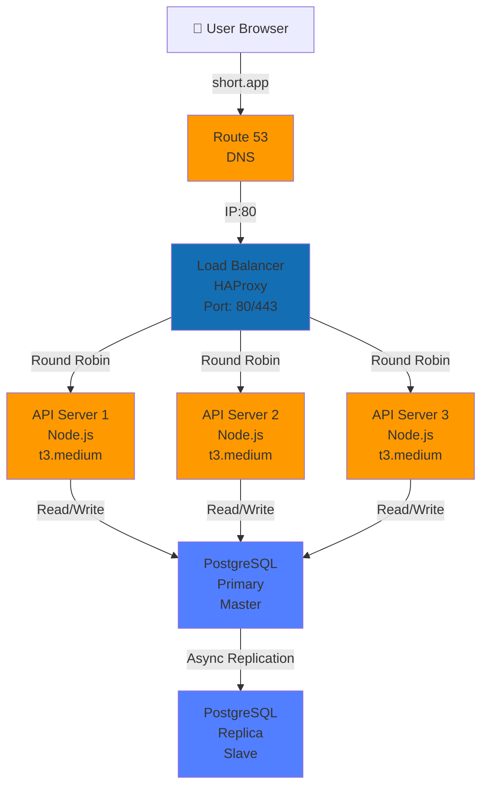

# Article 4: Basic System Design (MVP)

## Minimal Viable Product (MVP)

The MVP satisfies all functional requirements without worrying about scale.

**MVP Constraints**:
- Single data center (us-east-1)
- Synchronous processing (everything waits)
- No caching
- Small database (< 10M URLs)
- Modest traffic (< 100 RPS)

---

## MVP Architecture

### ASCII Diagram
```
┌────────────────┐
│ Load Balancer  │
│  (HAProxy)     │
└────────┬───────┘
         │
    ┌────┴─────────────┐
    │  API Servers     │
    │  ├─ Instance 1   │
    │  ├─ Instance 2   │
    │  └─ Instance 3   │
    └────┬─────────────┘
         │
    ┌────▼───────────┐
    │  PostgreSQL    │
    │  Single Region │
    │  Replicated    │
    └────────────────┘
```

### Mermaid Architecture Diagram


**Technology Stack**:
- **Compute**: Node.js/Python API servers
- **Database**: PostgreSQL with master-slave replication
- **Load Balancer**: HAProxy or Nginx
- **DNS**: Route 53 (simple failover)

---

## MVP Database Schema

```sql
-- Users table
CREATE TABLE users (
  user_id UUID PRIMARY KEY,
  username VARCHAR(100) UNIQUE NOT NULL,
  email VARCHAR(100) UNIQUE NOT NULL,
  password_hash VARCHAR(255) NOT NULL,
  tier VARCHAR(20) DEFAULT 'free',
  created_at TIMESTAMP DEFAULT NOW(),
  updated_at TIMESTAMP DEFAULT NOW()
);

-- Links table (main entity)
CREATE TABLE links (
  short_code VARCHAR(10) PRIMARY KEY,
  long_url TEXT NOT NULL,
  user_id UUID NOT NULL REFERENCES users(user_id),
  created_at TIMESTAMP DEFAULT NOW(),
  is_custom BOOLEAN DEFAULT FALSE,
  is_deleted BOOLEAN DEFAULT FALSE,
  expires_at TIMESTAMP,
  title VARCHAR(255)
);

-- Indexes for common queries
CREATE INDEX idx_links_user_id ON links(user_id);
CREATE INDEX idx_links_created_at ON links(created_at);
CREATE INDEX idx_links_long_url_hash ON links(MD5(long_url));
  -- For duplicate detection

-- Analytics table (daily summary)
CREATE TABLE daily_analytics (
  short_code VARCHAR(10) NOT NULL REFERENCES links(short_code),
  date DATE NOT NULL,
  clicks INTEGER DEFAULT 0,
  unique_users INTEGER DEFAULT 0,
  PRIMARY KEY (short_code, date)
);

CREATE INDEX idx_analytics_date ON daily_analytics(date);
```

---

## MVP Request Flows

### Create Link Flow

```
User submits long URL
    ↓
1. Validate URL
   ├─ Check format (http/https)
   ├─ Check length (< 2048 chars)
   ├─ Check not malware (Safe Browsing API)
   └─ If invalid: return 400 Bad Request

2. Check for duplicate
   ├─ SELECT short_code FROM links 
      WHERE MD5(long_url) = MD5($long_url)
   └─ If found: return existing short_code (idempotent!)

3. Generate short code
   ├─ If custom: check if available
   │  └─ If taken: return 409 Conflict
   │  └─ If available: use it
   ├─ If random: generate random 6-char base62
   │  └─ Loop: SELECT COUNT(*) FROM links 
   │          WHERE short_code = $code
   │  └─ Retry if collision (very rare)

4. Insert into database
   ├─ INSERT INTO links (short_code, long_url, user_id, ...)
   │  VALUES ($code, $url, $user_id, ...)
   └─ Latency: 10-50ms (network + write)

5. Return response
   └─ 201 Created with short_url
```

**Total latency**: 50-200ms (mostly database write)

### Redirect Flow

```
User clicks short.app/{code}
    ↓
1. Query database
   ├─ SELECT long_url FROM links 
      WHERE short_code = $code AND is_deleted = FALSE
   └─ Latency: 10-30ms (network + read)

2. Return redirect
   ├─ HTTP 301 Location: $long_url
   └─ Cache-Control: public, max-age=31536000

3. Log analytics (synchronous in MVP)
   ├─ UPDATE daily_analytics 
      SET clicks = clicks + 1 
      WHERE short_code = $code AND date = TODAY()
   └─ Latency: 10-50ms
```

**Problem in MVP**: Logging blocks user! Total latency: 30-100ms, but 2 database round trips.

---

## MVP Data Flows Diagram

```
Create Link Request
    ↓
API Server
  ├─ Validate URL (Safe Browsing API)
  ├─ Check duplicate (DB query)
  ├─ Generate code (algorithm)
  ├─ Insert into DB (write)
  └─ Return 201 Created

Redirect Request
    ↓
API Server
  ├─ Query database (read)
  ├─ Check is_deleted flag
  ├─ Synchronously update analytics (write)
  └─ Return 301 Redirect
```

---

## MVP Trade-offs / Limitations

### Problem 1: Database as Bottleneck

```
PostgreSQL single master capacity: ~1,000 read-heavy RPS
Our need: 100 RPS (with room to grow)

Satisfied? Yes ✓
But: What happens at 600 RPS?
  └─ Queries start timing out
  └─ Users get 500 errors
  └─ Cascading failure
```

### Problem 2: Synchronous Analytics Kills Latency

```
Redirect flow without analytics:
  Query DB: 20ms
  Return: 5ms
  Total: 25ms ✓

Redirect flow with analytics:
  Query DB: 20ms
  Update analytics: 50ms
  Return: 5ms
  Total: 75ms ⚠️
```

**Why?**
- Analytics writes add latency to critical path
- User doesn't care about analytics, only about redirect speed

### Problem 3: No Resilience to Failures

```
If PostgreSQL goes down:
  ├─ All requests fail immediately
  ├─ No fallback mechanism
  ├─ All users see "Service Unavailable"
  └─ Total downtime: minutes to hours
```

### Problem 4: Single Region Vulnerability

```
If AWS us-east-1 region fails:
  ├─ All data inaccessible
  ├─ No replicas in other regions
  ├─ Manual failover required
  └─ RTO: hours (not acceptable for 99.9% SLA)
```

### Problem 5: Collision on Custom Codes

```
Race condition:
  Thread 1: SELECT count FROM links WHERE code='abc123'
            → 0 (code available)
            [100ms delay...]
  Thread 2: SELECT count FROM links WHERE code='abc123'
            → 0 (code available)
            Thread 2 inserts first!
  Thread 1: INSERT → UNIQUE constraint violation!

Solution: Database transaction or atomic insert
  But adds latency + complexity
```

---

## Scaling MVP (When to Evolve)

```
Traffic Growth: What breaks when?

At 50 RPS: MVP works fine
At 100 RPS: Database reads are slow (50% CPU)
At 200 RPS: Database at capacity, timeouts
At 300+ RPS: Persistent failures, users abandon

Action: Need caching layer!
```

---

## Summary: MVP Design

**Architecture**:
- 3 API servers (load balanced)
- PostgreSQL single master with replica
- Synchronous all operations
- No caching

**Database**:
- 3 tables: users, links, daily_analytics
- Indexes on user_id, created_at, long_url hash
- ACID transactions for consistency

**Flows**:
- Create: Validate → Deduplicate → Generate → Insert
- Redirect: Query → Update analytics → Return

**Limitations** (Why MVP isn't production):
1. Database is bottleneck at 200+ RPS
2. Synchronous analytics kills redirect latency
3. No resilience (single point of failure)
4. No geographic redundancy (can't survive regional outages)
5. No caching (wastes database resources)

**When to scale**:
- When traffic hits 100+ RPS consistently
- When redirect latency exceeds 50ms p95
- When database CPU > 70%

**Next Article**: Basic design details and where it breaks.
