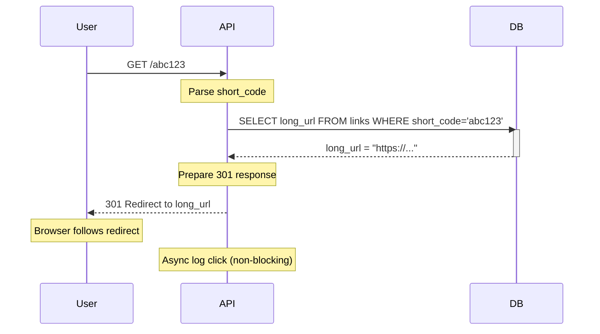
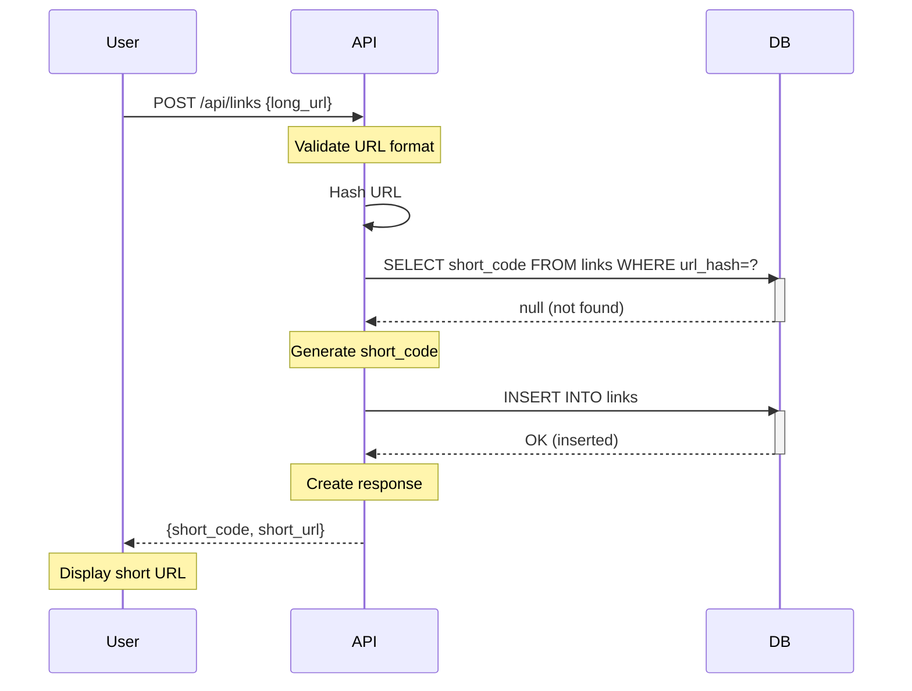

# Article 5: Basic Design Details & Tradeoffs

## Request Flow Diagrams

### Redirect Flow (Read Path)


### Create Link Flow (Write Path)


---

## Component Details (MVP)

### API Server Implementation

```python
# Pseudocode for MVP API server

from fastapi import FastAPI, HTTPException
from sqlalchemy import create_engine, Column, String, DateTime
from datetime import datetime
import hashlib
import secrets

app = FastAPI()
db = create_engine("postgresql://localhost/shortener")

# Create link endpoint
@app.post("/links")
async def create_link(request: CreateLinkRequest, user_id: str):
    """MVP: Synchronous, no caching"""
    
    # Step 1: Validate URL
    if not is_valid_url(request.long_url):
        raise HTTPException(400, "Invalid URL")
    
    # Step 2: Check for duplicate (idempotency)
    url_hash = hashlib.sha256(request.long_url.encode()).hexdigest()
    existing = db.query(Link).filter(
        Link.long_url_hash == url_hash
    ).first()
    
    if existing:
        return {"short_code": existing.short_code}  # Return existing
    
    # Step 3: Generate short code
    if request.custom_code:
        # Check if available
        if db.query(Link).filter(Link.short_code == request.custom_code).exists():
            raise HTTPException(409, "Code already taken")
        short_code = request.custom_code
    else:
        # Generate random code
        short_code = generate_short_code()
        while db.query(Link).filter(Link.short_code == short_code).exists():
            short_code = generate_short_code()  # Retry
    
    # Step 4: Insert into database
    link = Link(
        short_code=short_code,
        long_url=request.long_url,
        user_id=user_id,
        long_url_hash=url_hash,
        is_custom=bool(request.custom_code),
        created_at=datetime.utcnow()
    )
    db.add(link)
    db.commit()
    
    # Step 5: Return response
    return {
        "short_code": short_code,
        "short_url": f"https://short.app/{short_code}",
        "created_at": link.created_at
    }

# Redirect endpoint
@app.get("/{short_code}")
async def redirect(short_code: str):
    """MVP: Synchronous read + write"""
    
    # Step 1: Query database
    link = db.query(Link).filter(
        Link.short_code == short_code,
        Link.is_deleted == False
    ).first()
    
    if not link:
        raise HTTPException(404, "Link not found")
    
    # Step 2: Update analytics (synchronous - BAD!)
    today = datetime.utcnow().date()
    analytics = db.query(DailyAnalytics).filter(
        DailyAnalytics.short_code == short_code,
        DailyAnalytics.date == today
    ).first()
    
    if analytics:
        analytics.clicks += 1
    else:
        analytics = DailyAnalytics(
            short_code=short_code,
            date=today,
            clicks=1
        )
        db.add(analytics)
    
    db.commit()
    
    # Step 3: Return redirect
    return RedirectResponse(
        url=link.long_url,
        status_code=301,
        headers={"Cache-Control": "public, max-age=31536000"}
    )

def generate_short_code(length=6):
    """Generate random base62 code"""
    alphabet = "0123456789abcdefghijklmnopqrstuvwxyzABCDEFGHIJKLMNOPQRSTUVWXYZ"
    return ''.join(secrets.choice(alphabet) for _ in range(length))
```

**Observations**:
- Every operation hits database
- No local caching
- Synchronous (blocking)
- Simple to understand, hard to scale

---

## Database Design Details

### Primary Key Strategy

```sql
-- BAD: Sequential IDs (leaks information)
CREATE TABLE links (
  id BIGINT PRIMARY KEY AUTO_INCREMENT,  -- 1, 2, 3, ...
  short_code VARCHAR(10),                -- "1", "2", "3"
  long_url TEXT
);

Problem:
  User can guess:
  - Next short code is likely "4"
  - Can enumerate all URLs
  - Can estimate company's link volume
```

```sql
-- GOOD: Random short codes
CREATE TABLE links (
  short_code VARCHAR(10) PRIMARY KEY,    -- "abc123", "xyz789"
  long_url TEXT
);

Benefits:
  - Can't guess next code
  - No information leakage
  - Globally unique (can shard later)
```

### Indexing Strategy

```sql
-- Index 1: By user_id (for listing links)
CREATE INDEX idx_user_id ON links(user_id, created_at DESC);
  Query: "Get all links for user_id=123"
  Execution: Index scan returns results sorted by date
  Cost: O(N) where N = user's link count (usually < 1000)

-- Index 2: By created_at (for analytics)
CREATE INDEX idx_created_at ON links(created_at);
  Query: "Get links created today"
  Execution: Range scan on date
  Cost: O(1) lookup + O(M) where M = links created today

-- Index 3: Long URL hash (for deduplication)
CREATE INDEX idx_long_url_hash ON links(MD5(long_url));
  Query: "Does this URL already have a short code?"
  Execution: O(1) hash lookup
  Cost: O(1) + O(1) join

-- Don't index is_deleted
  Why? Most links aren't deleted (sparse index)
  Instead: Add WHERE is_deleted = FALSE in all queries
```

---

## Detailed Data Flows

### Create Link (Detailed Steps)

```
Request: POST /links
Body: {"long_url": "https://blog.example.com/post/123"}

Step 1: Validate URL (0.5ms)
  ├─ Check scheme: must be http or https
  ├─ Check length: must be < 2048 chars
  ├─ Check format: valid hostname, path
  └─ If fails: return 400 Bad Request

Step 2: Check if URL already shortened (5ms - database)
  ├─ Query:
      SELECT short_code FROM links 
      WHERE MD5(long_url) = MD5('https://blog.example.com/post/123')
  ├─ Uses index idx_long_url_hash
  └─ If found: return existing code (IDEMPOTENT!)

Step 3: Generate short code (1ms)
  ├─ If custom_code provided:
  │  ├─ Check availability: SELECT COUNT(*) WHERE short_code = 'my-code'
  │  ├─ If > 0: return 409 Conflict
  │  └─ Else: use custom_code
  ├─ Else (random):
  │  ├─ Generate: random 6-char base62 = "abc123"
  │  ├─ Collision check: SELECT COUNT(*) WHERE short_code = 'abc123'
  │  └─ Retry if collision (probability < 1 in 1M)

Step 4: Insert into database (15ms - network + write)
  ├─ INSERT INTO links (short_code, long_url, user_id, ...)
  │  VALUES ('abc123', 'https://...', 'user@example.com', NOW())
  ├─ Latency breakdown:
  │  ├─ Network: 5ms (round-trip)
  │  ├─ Database: 10ms (write + replication to replica)
  │  └─ Total: 15ms
  ├─ Replication: Master → Slave (synchronous)
  │  └─ Ensures durability

Step 5: Serialize response (1ms)
  ├─ 200 OK
  ├─ Content-Type: application/json
  ├─ Body: {short_url: "short.app/abc123", ...}
  └─ Headers: Cache-Control, etc.

TOTAL LATENCY: ~22ms (p50)
```

### Redirect (Detailed Steps)

```
Request: GET /short.app/abc123

Step 1: Query database (10ms)
  ├─ SELECT long_url FROM links 
     WHERE short_code = 'abc123' AND is_deleted = FALSE
  ├─ Uses primary key (fast)
  ├─ Returns: "https://blog.example.com/post/123"
  └─ Latency: 10ms (network + read)

Step 2: Update analytics (SYNCHRONOUS - BAD!)  (25ms)
  ├─ Query to check if today's record exists:
  │  SELECT * FROM daily_analytics 
  │  WHERE short_code = 'abc123' AND date = TODAY()
  ├─ If exists: UPDATE daily_analytics SET clicks = clicks + 1
  ├─ If not: INSERT new record
  ├─ Latency: 25ms (network + write)
  └─ Problem: User waits for this!

Step 3: Return HTTP 301 redirect (2ms)
  ├─ HTTP/1.1 301 Moved Permanently
  ├─ Location: https://blog.example.com/post/123
  ├─ Cache-Control: public, max-age=31536000
  └─ Serialization: 2ms

TOTAL LATENCY: ~37ms (p50)

PROBLEM: 25ms of 37ms is analytics update!
         User doesn't care about analytics
         Should be async!
```

---

## Where the MVP Breaks (Detailed Analysis)

### Breaking Point 1: Database Overload (100 RPS)

```
PostgreSQL single master with one replica

Capacity: ~1000 concurrent connections, ~1000 RPS (read-heavy)

At 50 RPS:  CPU 10%, Memory 5% → Healthy
At 100 RPS: CPU 50%, Memory 15% → Getting tight
At 200 RPS: CPU 80%, Memory 30% → Queries slow
At 300 RPS: CPU 100%, Memory 50% → Timeouts occur

Causes of slowdown:
  ├─ Lock contention (UPDATE daily_analytics)
  ├─ Query queue buildup
  ├─ Cache misses (working set > buffer pool)
  └─ Replication lag
```

### Breaking Point 2: Analytics Update Latency (100 RPS)

```
Before caching analytics:

Each redirect = 1 read + 1 write to database

At 100 RPS:
  ├─ 100 read operations/sec
  ├─ 100 write operations/sec
  ├─ Lock contention on daily_analytics table
  ├─ UPDATE daily_analytics SET clicks = clicks + 1
  │  └─ Locks row, reads current value, increments, writes
  │  └─ Under contention: 10ms+ per operation
  └─ p99 latency becomes 50-100ms (unacceptable)

Solution: Move analytics to async (next evolution)
```

### Breaking Point 3: Single Region Failure (Any time)

```
Production scenario:

AWS us-east-1 region experiences issues
  ├─ Network latency spikes
  ├─ Replica falls behind (replication lag)
  ├─ Master can't sync to replica
  └─ All writes now synchronous (2x latency!)

Options:
  1. Manual failover to replica (hours)
  2. Accept replication lag (stale reads)
  3. Wait for region to recover (hours)

No automatic failover = unacceptable for 99.9% SLA
```

---

## Critical: Race Condition in Custom Code Creation

**VULNERABILITY IDENTIFIED**: Current implementation has a TOCTOU (Time-of-Check to Time-of-Use) race condition.

The code checks if a custom code exists (line 78), then inserts it much later (line 94). Between check and insert, another concurrent request can insert the same code.

**Vulnerable Code**:
```python
# Line 78-79: CHECK
if db.query(Link).filter(Link.short_code == request.custom_code).exists():
    raise HTTPException(409, "Code already taken")

# ... 10-20ms of processing ...

# Line 94: INSERT (separate operation)
db.add(link)
db.commit()
```

**Race Condition Timeline**:
```
Thread 1 (User A):
  T=0ms:   SELECT COUNT(*) FROM links WHERE short_code='abc123'
           Result: 0 rows (not found) ✓ available
  
  T=10ms:  INSERT INTO links (short_code='abc123', ...)
           Success ✓

Thread 2 (User B):
  T=1ms:   SELECT COUNT(*) FROM links WHERE short_code='abc123'
           Result: 0 rows (still not found!) ✓ available
  
  T=11ms:  INSERT INTO links (short_code='abc123', ...)
           Success ✓ (both succeeded!)

Result: TWO rows with short_code='abc123' in database
        Queries return unpredictable link (data corruption)
```

**Severity**: 🔴 CRITICAL
- Two users can receive the same custom code
- Queries for `/abc123` return random link (undefined behavior)
- Difficult to debug in production

### Solution 1: Add UNIQUE Constraint (Recommended for MVP)

```sql
ALTER TABLE links ADD CONSTRAINT unique_short_code UNIQUE(short_code);
```

Database enforces uniqueness atomically:
```
Thread 1: INSERT short_code='abc123' → Success ✓
Thread 2: INSERT short_code='abc123' → UNIQUE violation! ✗
         ERROR: duplicate key value violates unique constraint
```

Application code handles constraint violation:
```python
try:
    db.add(link)
    db.commit()
    return link
except IntegrityError as e:
    if 'unique_short_code' in str(e):
        db.rollback()
        if custom_code:
            raise HTTPException(409, f"Code '{custom_code}' already taken")
        else:
            # Retry with different random code
            return create_link(long_url, custom_code=None)
    else:
        raise
```

**Why this works**: Database constraint is checked atomically as part of INSERT, eliminating TOCTOU window.

### Solution 2: Deterministic Codes (Recommended for Scale)

Instead of random codes, generate deterministically:
```python
import hashlib

def generate_deterministic_code(long_url, user_id):
    """Same input → same output (no collisions)"""
    data = f"{user_id}:{long_url}"
    hash_int = int(hashlib.md5(data.encode()).hexdigest(), 16)
    code = base62.encode(hash_int)[:6]
    return code
```

**Advantages**:
- ✅ Zero collisions (hash-based)
- ✅ No retries needed
- ✅ Idempotent (creating same link twice returns same code)

**Disadvantages**:
- ❌ User can't choose custom code
- ❌ Code reveals URL hash (slight privacy concern)

### Summary Table

| Approach | Race-Safe | Collisions | Complexity | Use When |
|----------|-----------|-----------|-----------|----------|
| Current (check-then-insert) | ❌ VULNERABLE | N/A | Low | NEVER |
| UNIQUE constraint + retry | ✅ SAFE | Handled | Low | MVP → 100M codes |
| Deterministic hash | ✅ SAFE | 0 by design | Medium | 100M+ codes |
| Distributed locks | ✅ SAFE | None | High | OVERKILL |

**Action**: Add UNIQUE constraint immediately in production. Switch to deterministic codes at 10M+ URLs.

---

### Breaking Point 4: Collision Handling (Rare but Exists)

```
With 6-char base62 codes:
  Total combinations: 62^6 = 56.8 billion
  After 1M codes: collision probability ≈ 0.00001%
  
But retry loop:

generate_and_check():
  for i in range(100):  # max retries
    code = generate_random_code()
    if exists(code):
      continue  # Retry
    return code

Problem at scale:
  ├─ After 10M codes: ~1% of insertions retry
  ├─ After 100M codes: ~10% of insertions retry
  ├─ Retry loop adds latency
  └─ Concurrent inserts amplify contention
```

---

## Summary: MVP Limitations

| Problem | At What Scale | Impact | Solution |
|---------|--------------|--------|----------|
| **DB Bottleneck** | 100+ RPS | Timeouts, errors | Add caching layer |
| **Analytics Latency** | 50+ RPS | p99 > 50ms | Move to async |
| **Sync Writes** | 200+ RPS | Lock contention | Async queue |
| **No HA** | Any time | Downtime = failure | Multi-region |
| **Collision Retries** | 10M+ codes | Latency spikes | Deterministic codes |
| **No Resilience** | Any failure | Cascading fail | Circuit breakers |

---

## Next Article: Proposed Solutions

Three distinct approaches to scale:

1. **Solution 1: Caching-First** (simple, proven)
   - Add Redis in-memory cache
   - Move analytics to queue
   - Keep database simple

2. **Solution 2: Async-Everything** (complex, scalable)
   - Make all writes async via Kafka
   - Event-driven architecture
   - CQRS pattern

3. **Solution 3: Distributed Database** (expensive, complex)
   - Shard PostgreSQL
   - Or switch to NoSQL (DynamoDB, Cassandra)
   - Handle consistency challenges
