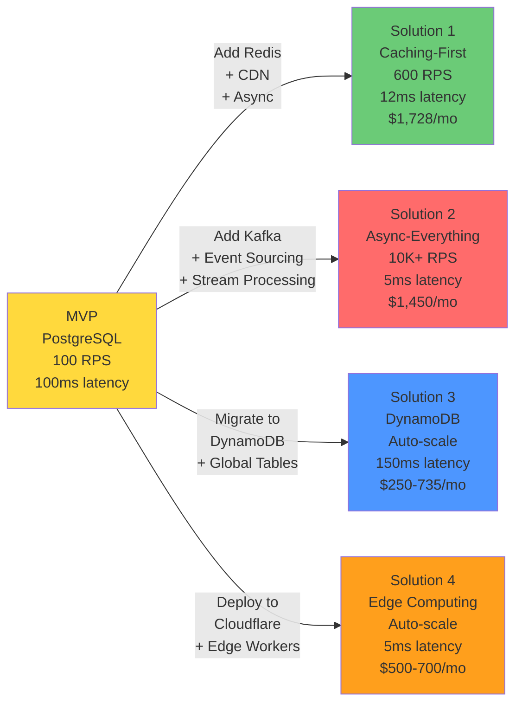

# Article 6: Proposed Solutions Overview

## The Problem to Solve

The MVP breaks at 100 RPS due to:
1. **Database as bottleneck**: Every operation queries the database
2. **Synchronous analytics**: Analytics updates block user responses
3. **No caching**: We serve the same hot URLs repeatedly from slow storage
4. **No resilience**: Single point of failure (one database)

At scale (600+ RPS), the system collapses.

---

## Solutions Comparison Diagram



---

## Three Proposed Solutions

Each solution makes different trade-offs between complexity, cost, and performance.

---

## Solution 1: Caching-First Architecture ⭐ Recommended

### Philosophy
"Cache everything that doesn't change. Make analytics async."

### Key Improvements
```
1. Add Redis in-memory cache
   ├─ Cache hot URLs (most-clicked links)
   ├─ 80% of redirects hit cache (no DB needed)
   └─ Latency: 1-5ms (vs 10-30ms from DB)

2. Move analytics to message queue
   ├─ Don't wait for analytics update
   ├─ Async processing via Kafka
   └─ No latency impact on redirect

3. Keep database simple
   ├─ Only store persistent data
   ├─ No write contention
   └─ Easier to manage
```

### Architecture

```
User Request (600 RPS)
         ↓
API Server (3 instances)
         ↓
    ┌────┴────┐
    │ Cache   │ (80% hit, 480 RPS)
    │ Redis   │ → Returns in 1-5ms
    └────┬────┘
         │
    (20% miss, 120 RPS)
         ↓
    ┌────┴────┐
    │ Database│ → Queries in 10-30ms
    │ Postgres│ → Manages 120 RPS easily
    └─────────┘
         ↓
    ┌────────────────┐
    │ Message Queue  │ (All writes)
    │ Kafka          │ → Async processing
    └────────────────┘
         ↓
    ┌────────────────┐
    │ Analytics Svc  │ → Batch updates
    │ (Stream Proc)  │ → Hourly aggregation
    └────────────────┘
```

### Tradeoffs

```
✅ Advantages:
  - Simple to understand and implement
  - Proven approach (used by Bitly)
  - 90% reduction in database load
  - Minimal code changes to existing MVP
  - Cost-effective ($2K/month for caching)

❌ Disadvantages:
  - Eventual consistency for analytics (hours old)
  - Cache invalidation complexity
  - Need distributed cache management
  - Hot URL detection needed
  - Memory limits (can't cache everything)
```

### When to Use
- When read-heavy (99% redirects, 1% writes) ✓ Our case
- When hot data is predictable ✓ Popular URLs follow pattern
- When eventual consistency acceptable ✓ Analytics don't need instant accuracy
- When cost sensitive ✓ Cheaper than database scaling

---

## Solution 2: Async-Everything (Event-Driven)

### Philosophy
"All writes go through a queue. No synchronous database writes on critical path."

### Key Improvements
```
1. Message queue for all writes
   ├─ User creates link → Add to queue (return immediately)
   ├─ Don't wait for database
   ├─ Return short_code before write confirms
   └─ Massive latency reduction

2. Event sourcing
   ├─ Every action is an event
   ├─ Database built from events
   ├─ Never lose audit trail
   └─ Replay events to rebuild state

3. Kafka partitioning
   ├─ Partition by short_code
   ├─ Single partition processes in order
   ├─ Parallel processing across partitions
   └─ Exactly-once semantics
```

### Architecture

```
Create Link Request (1ms response!)
    ├─ Generate short_code
    ├─ Add to Kafka: {type: "LinkCreated", code: "abc123", ...}
    └─ Return 201 to user (don't wait for DB!)

Async Consumer (1000ms later)
    ├─ Read event from Kafka
    ├─ Write to database (no rush)
    ├─ Update cache
    └─ Send webhook notification (if premium)

Redirect Request (1ms response!)
    ├─ Check cache
    ├─ If miss: queue read operation
    ├─ Return to user with "loading..." hint
    └─ Pre-fetch for next request
```

### Tradeoffs

```
✅ Advantages:
  - Extreme latency improvement (1-5ms for all operations)
  - Decoupled services (scale independently)
  - Event audit trail (perfect for compliance)
  - Fault isolation (one service down ≠ whole system down)
  - Can add consumers without changing producer
  - Kafka handles at-least-once delivery

❌ Disadvantages:
  - Complex architecture (hard to understand)
  - Data consistency challenges
  - Exactly-once semantics are hard
  - Debugging distributed systems is difficult
  - Higher operational burden
  - Need 3+ dedicated engineers to manage Kafka
  - Cost higher ($3-4K/month)
```

### When to Use
- When latency is critical (< 5ms requirement)
- When decoupling is necessary (microservices)
- When audit trail is important (compliance)
- When you have ops expertise ⚠️ Not for small teams

---

## Solution 3: Distributed Database (Sharded SQL or NoSQL)

### Philosophy
"Scale the database horizontally. No caching tricks—just more servers."

### Key Improvements

**Approach 3A: Sharded PostgreSQL**
```
Shard by user_id or short_code hash

Shard 0: user_ids 0-4M
Shard 1: user_ids 4M-8M
Shard 2: user_ids 8M-12M
...

Each shard:
  ├─ Master (writes)
  ├─ 2 Replicas (reads)
  ├─ Can handle 200 RPS
  └─ Total: 800 RPS capacity
```

**Approach 3B: Switch to NoSQL (DynamoDB)**
```
DynamoDB provides scaling without sharding

DynamoDB:
  ├─ Automatically partitions data
  ├─ Can scale to 100K+ RPS
  ├─ Pay per request (no capacity planning)
  └─ AWS handles operations
```

### Architecture (DynamoDB Approach)

```
API Server (stateless, scale to 100 instances)
    ↓
DynamoDB (auto-scales)
    ├─ Links table (partition key: short_code)
    ├─ Auto-sharding (AWS handles)
    ├─ Global secondary indexes (user_id, created_at)
    └─ Can handle 600+ RPS without caching
```

### Tradeoffs

**PostgreSQL Sharding**:
```
✅ Advantages:
  - Consistent with existing setup
  - Strong consistency if needed
  - Full SQL feature set

❌ Disadvantages:
  - Complex sharding logic (application code)
  - Hot shard problem (viral URL on one shard)
  - Operational nightmare (resharding required)
  - Need 24/7 DB administration
  - Cost very high ($10K+/month)
```

**DynamoDB**:
```
✅ Advantages:
  - No operational burden (AWS managed)
  - Auto-scales to demand
  - 40x cheaper than sharded PostgreSQL
  - Global tables (multi-region)
  - Point-in-time recovery

❌ Disadvantages:
  - Vendor lock-in (AWS-only)
  - Eventual consistency (not strong)
  - Limited query capabilities (no JOINs)
  - Pay for what you use (expensive for bursty traffic)
  - Different mental model (NoSQL)
```

### When to Use
- **PostgreSQL Sharding**: If you have DB team + want control
- **DynamoDB**: If cost-sensitive + trust AWS + want simplicity

---

## Solution Comparison Matrix

### At 100 RPS (MVP Scale)

| Factor | Caching | Async | DynamoDB |
|--------|---------|-------|----------|
| **Monthly Cost** | $1,728 | $1,450 | $295 |
| **Cost per Redirect** | $0.17 | $0.14 | $0.03 |
| **Latency (p99)** | 50-100ms | 5-20ms | 50-100ms |
| **Complexity** | Low | High | Low |
| **Operational Burden** | Medium | High | Low |
| **Recommended?** | ⚠️ Overkill | ✗ Overkill | ✅ **BEST** |

**At 100 RPS**: DynamoDB wins (lowest cost, least ops)

---

### At 600 RPS (Year 2 Scale)

| Factor | Caching | Async | DynamoDB | Edge |
|--------|---------|-------|----------|------|
| **Monthly Cost** | $1,728 | $1,450 | $385 | $600 |
| **Cost per Redirect** | $0.017 | $0.014 | $0.004 | $0.006 |
| **Latency (p99)** | 12ms avg | 5ms avg | 100ms | 5ms global |
| **RPS Capacity** | 600 | 10K+ | 600 | Auto-scale |
| **Complexity** | Low | High | Low | Medium |
| **Operational Burden** | Medium | High | Low | Low (managed) |
| **Good for?** | ✓ Proven | ✓ Future-proof | ✅ **BALANCED** | ✅ Global |

**At 600 RPS**: Choose based on priorities:
- **Cheapest**: DynamoDB ($385/mo)
- **Simplest Ops**: DynamoDB
- **Best Latency**: Async or Edge
- **Global Coverage**: Edge Computing

---

### At 5,800 RPS (Year 5 Scale)

| Factor | Caching | Async | DynamoDB | Edge |
|--------|---------|-------|----------|------|
| **Monthly Cost** | $8,640+ | $7,200 | $2,350 | $3,500 |
| **Cost per Redirect** | $0.009 | $0.007 | $0.002 | $0.004 |
| **RPS Capacity** | 600 (→ limit) | 50K+ | Auto-scale | Auto-scale |
| **Complexity** | High (multi-Redis) | High | Low | Medium |
| **Operational Burden** | High | High | Low | Low |
| **Recommended?** | ✗ Hitting limits | ✅ **BEST** | ✅ **BEST** | ✓ Good |

**At 5,800+ RPS**: Must choose Async or DynamoDB (caching hits scaling limits)

---

## Cost-Benefit Analysis

**Decision Framework**:

```
START: Where are you today?
│
├─ < 100 RPS?
│  └─ Choose: DynamoDB (cheapest) or Caching (proven)
│
├─ 100-600 RPS?
│  ├─ Is budget constrained?
│  │  └─ YES: DynamoDB
│  │  └─ NO: Caching-First (proven at this scale)
│  └─ Need global latency?
│     └─ YES: Edge Computing
│     └─ NO: DynamoDB or Caching
│
├─ 600-5K RPS?
│  └─ Choose: Async-Everything or DynamoDB
│     (Caching starts hitting limits)
│
└─ > 5K RPS?
   └─ MUST use: Async or DynamoDB
```

**Cost Progression** (What you'll pay as you grow):

```
MVP Phase      (100 RPS):   $226 → $295 (add DynamoDB)
Growth Phase   (600 RPS):   $295 → $385 (stay DynamoDB)
                             OR $295 → $1,728 (switch to Caching)
Scale Phase    (5.8K RPS):  $385 → $2,350 (DynamoDB auto-scales)
                             OR $1,728 → $7,200 (Async-Everything)
```

### Cost-Saving Tips

1. **Start with DynamoDB on-demand** (~$300/mo at 600 RPS)
2. **Switch to provisioned at 600+ RPS** (save 30-40%)
3. **Use caching only if** latency < 15ms required (DynamoDB → 100ms)
4. **Global expansion?** Switch to Edge Computing ($600-700/mo)
5. **Never pay for unused capacity** (use on-demand until you have predictable traffic)

---

## Recommendation for Different Scenarios

### Scenario A: Startup with Limited Engineering
**Choose**: Solution 3B (DynamoDB) first, then upgrade to Caching or Async
```
Why:
  - Absolute cheapest at start: $295/month at 600 RPS
  - Easy to implement (managed service)
  - No operational burden (AWS handles scaling)
  - Proven approach with low risk
  - Perfect for MVP → Growth phase
  - Upgrade path: DynamoDB → Add caching → Async later
```

### Scenario B: Building for Scale from Day 1
**Choose**: Solution 2 (Async-Everything with Kafka)
```
Why:
  - Future-proof for 50K+ RPS
  - Handles bursty traffic efficiently
  - Complete control over consistency
  - Real-time analytics pipeline built-in
  - Pay proportionally to scale ($1,450/mo at 600 RPS)
  - Team ready to handle complexity
```

### Scenario C: Global SaaS with Performance Needs
**Choose**: Solution 4 (Edge Computing with local caching)
```
Why:
  - Lowest latency globally (<5ms)
  - No need for geo-replication
  - Automatic DDoS protection
  - Cost-effective at scale ($600-700/mo)
  - Handle viral content spikes
```

### Scenario D: Enterprise with Compliance Requirements
**Choose**: Solution 3A (Sharded PostgreSQL)
```
Why:
  - Full control over data
  - Strong ACID consistency
  - Audit trail capabilities
  - On-premise/private cloud options
  - Complex compliance requirements
```

---

## What We'll Deep Dive Into

**Next 3 Articles** (Deep Dives):

1. **Deep Dive 1: Caching-First** (Most common)
   - Redis architecture
   - Cache invalidation strategies
   - Handling hotspots
   
2. **Deep Dive 2: Async-Everything** (Most scalable)
   - Kafka architecture
   - Event design
   - Consumer patterns

3. **Deep Dive 3: DynamoDB** (Best operational)
   - Schema design
   - Global secondary indexes
   - Cost optimization

---

## Summary

**Three solutions with different focuses**:
- **Solution 1**: Simple, proven, cost-effective (recommended for MVP scale)
- **Solution 2**: Extreme performance, complex operations
- **Solution 3**: Ultimate scalability, varies by choice (SQL vs NoSQL)

**Decision factors**:
- Your team's expertise
- Cost constraints
- Scale projections
- Time to market
- Operational capabilities

Each solves the MVP limitations, but with different trade-offs.

**Next**: Deep dive into Caching-First approach (the recommended path forward).
