# Article 7: Deep Dive 1 - Caching-First Architecture

## Overview: Why Caching?

The caching-first approach solves the MVP's biggest problem: **database overload**.

**Key insight**: Most traffic is reads of popular content. Cache takes 80% of load.

---

## Three-Layer Caching Strategy

### Caching Layers Overview
```
Layer 1: CDN (CloudFront)
  ├─ Location: Edge locations worldwide
  ├─ What's cached: Redirects (301 responses)
  ├─ Hit rate: 70% (returning users)
  ├─ Latency: 10-50ms (from user's region)
  └─ Cost: $0.085/GB (~$25/month for us)

Layer 2: In-Memory Cache (Redis)
  ├─ Location: Data center
  ├─ What's cached: Long URLs (hot data)
  ├─ Hit rate: 60% of remaining 30%
  ├─ Latency: 1-5ms (network + memory)
  └─ Cost: ~$1,500/month (3-node cluster)

Layer 3: Database (PostgreSQL)
  ├─ Location: Data center
  ├─ What stored: Source of truth
  ├─ Hit rate: Always (fallback)
  ├─ Latency: 10-30ms per query
  └─ Cost: $100-200/month
```

### Three-Layer Architecture Diagram

```mermaid
graph LR
    User["👤 User<br/>Global"]
    CDN["🌍 CDN<br/>CloudFront<br/>Edge PoPs"]
    API["API Server<br/>t3.medium"]
    Redis["⚡ Redis<br/>In-Memory<br/>Cache"]
    DB["💾 PostgreSQL<br/>Database<br/>Source of Truth"]
    
    User -->|short.app/abc123| CDN
    CDN -->|Cache Hit 70%| User
    CDN -->|Cache Miss| API
    API -->|Check<br/>Key:url:abc123| Redis
    Redis -->|Hit 60%| API
    Redis -->|Miss| DB
    DB -->|Query| Redis
    Redis -->|Store| Redis
    API -->|Cache<br/>TTL:1h| Redis
    API -->|301<br/>Redirect| User
    
    style User fill:#FF6B6B
    style CDN fill:#4ECDC4
    style API fill:#FF9900
    style Redis fill:#FFE66D
    style DB fill:#95E1D3
```


### Load Distribution Example

```
600 RPS incoming traffic

After Layer 1 (CDN): 70% cache hit
  → 420 RPS served by CDN (zero load on server)
  → 180 RPS to server

After Layer 2 (Redis): 60% of remaining hit
  → 108 RPS served by Redis (1-5ms latency)
  → 72 RPS to database (manageable!)

Result:
  ├─ 420 RPS from CDN (no cost to server)
  ├─ 108 RPS from Redis (cheap)
  ├─ 72 RPS from database (can handle 500+ RPS)
  └─ Database runs at 15% capacity (plenty of headroom)
```

---

## Layer 1: CDN Implementation

### CloudFront Configuration

```
Distribution: short.app

Origin:
  └─ short.app API (api.short.app:443)

Behavior 1: GET /{shortCode}
  ├─ Path pattern: /{*}
  ├─ HTTP methods: GET, HEAD only
  ├─ Cache policy:
  │  ├─ TTL: max 1 year (31536000 seconds)
  │  ├─ Cache-Control: public, max-age=31536000
  │  ├─ Compress: Yes (GZIP)
  │  └─ Query string: Ignore
  ├─ Origin request policy:
  │  └─ Include: User-Agent, CloudFront-* headers
  └─ Result:
     └─ 301 redirects cached at edge (immutable)

Behavior 2: POST /api/* and PUT /api/*
  ├─ Path pattern: /api/*
  ├─ HTTP methods: All
  ├─ Cache policy: None (Don't cache)
  ├─ Require signed headers: Authorization
  └─ Result: Dynamic requests bypass cache
```

### Why 1-Year TTL?

```
Standard HTTP headers:
  Cache-Control: public, max-age=31536000
  Expires: Sun, 15 Jan 2025 10:30:00 GMT

Behavior:
  Browser caches: Don't re-request for 1 year
  CDN caches: Don't ask origin for 1 year
  Proxies cache: Can serve for 1 year
  
Why safe?
  ├─ Short codes are immutable (never change)
  ├─ Long URL doesn't change (link is permanent)
  ├─ If user deletes link: we handle explicitly
  └─ Trade-off: Acceptable occasional stale cache
```

### Cache Invalidation (When User Deletes)

```python
def delete_link(short_code):
    # 1. Mark as deleted in database
    db.update(short_code, is_deleted=True)
    
    # 2. Immediately return 404 for this code
    #    (Even if CDN still has old 301 cached)
    
    # 3. Purge CloudFront cache
    cloudfront.create_invalidation(
        DistributionId='ABC123',
        Paths=[f'/{short_code}', f'/{short_code}/*']
    )
    
    # Cost: $0.005 per invalidation
    # For 100 deletions/day: $0.50/day = $15/month
    # Worth it for consistency
```

### Cost Analysis

```
Traffic: 600 RPS × 86,400 sec/day = 51.8M requests/day

With 70% CDN hit rate:
  - 36.3M requests served by CDN/day
  - Average response size: 300 bytes (301 redirect)
  - Data transferred: 36.3M × 0.3KB = 10.9GB/day

CloudFront cost: 10.9GB × $0.085/GB = $0.93/day = $28/month

Benefits:
  ├─ Reduces origin bandwidth by 70%
  ├─ Without CDN: 10.9GB × 1 origin = $110/month egress
  ├─ Net saving: $110 - $28 = $82/month
  └─ PLUS: Latency improvement (10-50ms vs 50-100ms)
```

---

## Layer 2: Redis Cache Implementation

### Redis Architecture

```
3-node cluster (recommended for MVP+)

Cluster Mode Disabled:
  - Node 1 (Master, 16GB)
  - Node 2 (Replica of Node 1)
  - Node 3 (Replica of Node 1)
  
Cluster Mode Enabled:
  - Node 1 (Shard 0, keys 0-20B)
  - Node 2 (Shard 1, keys 20B-40B)
  - Node 3 (Shard 2, keys 40B-62B)
  - Each has replica (HA)
```

### Cache Data Structure

```python
# Key: short_code
# Value: JSON string of long_url + metadata
# TTL: 1 hour (or LRU evicted)

redis.setex(
    key=f"url:{short_code}",
    time=3600,  # 1 hour TTL
    value=json.dumps({
        "long_url": "https://...",
        "user_id": "user123",
        "created_at": "2024-01-15T10:30:00Z"
    })
)

# Lookup:
result = redis.get(f"url:{short_code}")
if result:
    data = json.loads(result)
    return data["long_url"]  # Cache hit!
else:
    return None  # Cache miss, query DB
```

### Cache Hit Rate Prediction

```
Mathematical model:

Zipfian distribution (realistic):
  P(URL k is accessed) ∝ 1/k

Result:
  Top 1% of URLs (10K out of 1M):
    └─ Account for 50% of all traffic
  
  Top 10% of URLs (100K out of 1M):
    └─ Account for 90% of all traffic

In Redis:
  With 10M URLs (3GB memory):
    ├─ Cache top 1M URLs
    ├─ Hit rate: ~60% (matches model)
    └─ Serves 360 RPS (out of 540 misses from CDN)
```

### Handling Hotspot URLs (Viral Content)

```
Problem:
  - URL becomes viral (10K RPS sudden spike)
  - Single URL exceeds single Redis node capacity
  - Locks, network, CPU saturation

Detection:
  if redis.client.info('stats')['keyspace_hits'] / requests < 0.5:
    # Cache miss rate > 50%, something wrong
    alert("Possible hotspot, investigate")

Solution 1: Dedicated Cache Node
  ├─ Detect: requests to URL > 1000/sec
  ├─ Action: Allocate separate Redis instance
  ├─ Route: Direct traffic to hotspot cache
  └─ Clean up: When traffic drops, remove

Solution 2: In-Process Cache (Fastest)
  ├─ Code:
     hotspot_cache = LRU(max_size=10000)
     
     def get_url(code):
       if code in hotspot_cache:
         return hotspot_cache[code]  # <1ms!
       url = redis.get(code)
       if hits[code] > 100/sec:
         hotspot_cache[code] = url
       return url
       
  ├─ Cost: ~10MB per server (10K entries)
  └─ Benefit: <1ms latency for hotspots

Solution 3: CDN Amplification (Automatic)
  ├─ CloudFront detects traffic surge
  ├─ Automatically adds more edge nodes
  ├─ Handled by CDN (we don't manage)
  └─ Cost: Built into CDN pricing
```

### Eviction & TTL Policy

```
Redis memory: 16GB on each node
Eviction policy: allkeys-lru
  ├─ When full: Remove least recently used key
  ├─ Automatic process
  ├─ No manual intervention
  └─ Keep hot data, discard cold

TTL assignment strategy:
  Hot URL (100+ req/min): TTL = 1 hour
  Warm URL (10-100 req/min): TTL = 30 minutes
  Cold URL (< 10 req/min): TTL = 5 minutes
  
  Strategy:
  ├─ Count requests in background
  ├─ Adjust TTL based on popularity
  ├─ Popular URLs stay longer
  └─ Cold URLs auto-evicted quickly
```

### Cache Warming (Startup Optimization)

```python
def warm_cache_on_startup():
    """Pre-populate cache with top URLs"""
    
    # Get top 1M URLs by click count
    top_urls = db.query("""
        SELECT short_code, long_url
        FROM links
        JOIN daily_analytics ON ...
        ORDER BY total_clicks DESC
        LIMIT 1000000
    """)
    
    pipe = redis.pipeline()  # Batch writes
    for short_code, long_url in top_urls:
        pipe.setex(
            f"url:{short_code}",
            3600,
            json.dumps({"long_url": long_url})
        )
    
    pipe.execute()  # All written in one round-trip
    
    print(f"Warmed {len(top_urls)} URLs")
    # Takes ~2-3 minutes for 1M URLs

warm_cache_on_startup()  # Call on server startup
```

**Result**: 60% cache hit rate immediately (vs 0% cold start)

---

## Layer 3: Database Still Needed

Even with caching, database handles:
- Cache misses (70 RPS in our example)
- Write operations (create, delete, update)
- Analytics aggregation
- User data

### Database Optimization

```sql
-- Keep database simple, just store data
CREATE TABLE links (
  short_code VARCHAR(10) PRIMARY KEY,
  long_url TEXT NOT NULL,
  user_id UUID NOT NULL,
  created_at TIMESTAMP,
  is_deleted BOOLEAN DEFAULT FALSE,
  
  -- Index for analytics queries
  CONSTRAINT links_pkey PRIMARY KEY (short_code)
);

CREATE INDEX idx_user_id ON links(user_id);
CREATE INDEX idx_created_at ON links(created_at);

-- No analytics in main table!
-- Analytics in separate, aggregated table

CREATE TABLE daily_analytics_summary (
  short_code VARCHAR(10) NOT NULL,
  date DATE NOT NULL,
  clicks INTEGER,
  PRIMARY KEY (short_code, date)
);

-- This is written asynchronously
```

---

## Async Analytics (Critical Improvement)

### Problem with Synchronous Analytics

```
Current flow (MVP):
  GET /abc123
    ├─ Query database: 20ms
    ├─ Update daily_analytics: 50ms ← BLOCKS USER!
    └─ Return redirect: 5ms
    Total: 75ms (2 database hits)
```

### Solution: Async via Message Queue

```
New flow (Caching-First):
  GET /abc123
    ├─ Check Redis: 1-5ms (hit 60% of time)
    ├─ If miss, query DB: 10-20ms
    ├─ Queue analytics event: 1ms (fire-and-forget)
    │  └─ Send to Kafka: {type: "redirect", code, timestamp}
    └─ Return redirect: 5ms
    
    Total: 1-25ms (user doesn't wait for analytics!)
    
Async Consumer (Kafka → Analytics):
  ├─ Batches events (every 1 minute)
  ├─ Aggregates: count clicks by short_code
  ├─ Update daily_analytics table
  └─ No impact on user request
```

### Kafka Configuration (Optional for MVP)

```python
from kafka import KafkaProducer

producer = KafkaProducer(
    bootstrap_servers=['localhost:9092'],
    compression_type='gzip'
)

def redirect(short_code):
    url = get_url(short_code)
    
    # Fire and forget (async)
    producer.send_async(
        'analytics-events',
        value={
            'type': 'redirect',
            'short_code': short_code,
            'timestamp': time.time(),
            'user_agent': request.user_agent,
            'ip': request.ip
        }
    )
    
    # Return immediately (don't wait!)
    return redirect(url)

# Kafka is optional for MVP
# Simple version: Just log to syslog, batch process hourly
```

---

## Monitoring Cache Health

```python
def check_cache_health():
    """Monitor Redis to ensure it's working"""
    
    info = redis.info('stats')
    
    hits = info['keyspace_hits']
    misses = info['keyspace_misses']
    hit_rate = hits / (hits + misses)
    
    # Expect 60%+ hit rate
    if hit_rate < 0.5:
        alert(f"Cache hit rate low: {hit_rate:.1%}")
    
    memory_used = info['used_memory']
    memory_pct = memory_used / (16 * 1024 * 1024 * 1024)
    
    # Expect < 70% (leaves room for LRU eviction)
    if memory_pct > 0.7:
        alert(f"Cache memory high: {memory_pct:.1%}")
    
    evicted = redis.info('stats')['evicted_keys']
    if evicted > 1000:
        # Too many evictions = cache too small
        alert(f"High eviction rate: {evicted} keys")
```

---

## Consistency Model

This caching-first approach uses **eventual consistency**. Understanding the timing is critical:

### Consistency Windows by Layer

**Layer 1: CDN (CloudFront)**
- **Consistency Window**: Up to 1 year (default TTL)
- **Typical Window**: 1 hour for content updates
- **How it works**:
  - User requests `/abc123`
  - CloudFront checks cache (TTL not expired?)
  - If yes: serve cached 301 immediately (30ms)
  - If no: fetch from origin API, cache for 1 year
- **Guarantee**: Immutable for 1 year (safe because short codes never change)
- **Tradeoff**: If user updates destination URL, CDN still serves old URL for up to 1 hour

**Layer 2: Redis Cache**
- **Consistency Window**: 1 hour (TTL) 
- **Typical Window**: Few milliseconds (most traffic hits cache)
- **How it works**:
  - API checks Redis for short code
  - If found: return cached long URL (5ms)
  - If not found: query PostgreSQL, update Redis, return
  - After 1 hour: Redis key expires, next request queries DB (refreshes)
- **Guarantee**: Within 1 hour of last access, data is consistent
- **Tradeoff**: Between 1-hour refreshes, URL metadata might change (rare)

**Layer 3: PostgreSQL (Source of Truth)**
- **Consistency Window**: Immediate (strong consistency)
- **How it works**:
  - All writes go directly to PostgreSQL (via transaction)
  - Immediate durable writes
  - Reads go through Redis/CDN first (async invalidation)
- **Guarantee**: Database is always correct; caches are eventually consistent

### Scenarios: How Consistency Works in Practice

**Scenario 1: User deletes a short link**

```
Timeline:
  T=0:    User clicks "Delete" for link /abc123
  T=1ms:  Database UPDATE: is_deleted = true
  T=2ms:  API returns 404 for /abc123 requests
  T=3ms:  CloudFront cache invalidation initiated
  T=100ms: CloudFront edge cache purged
  T=1min: All CDN PoPs cleared (eventual)

Result: Within 100ms to 1 minute, all users see 404 (worst case)
```

**Scenario 2: User updates destination URL**

```
Cannot happen! Short codes are immutable after creation.
If user wants to change destination: must delete + recreate link.
```

**Scenario 3: Database is down**

```
Timeline:
  T=0:    PostgreSQL becomes unavailable
  T=0-30s: Redis serves cached data (100% cache hit rate)
  T=30s:  CDN serves cached data (70% hit rate)
  T=30-3600s: CDN continues serving, data is 1h old

Result: If DB down for < 1 hour, users see no impact (cached)
        If DB down for > 1 hour, users see stale data
```

### Real-World Impact

| Operation | Consistency Guarantee | User Impact |
|-----------|----------------------|-------------|
| Create link | Immediate (DB written) | New link available after 1-2 seconds (CDN/Redis miss) |
| Redirect (exists) | 1 hour eventual (cached) | See correct URL from cache (< 30ms) |
| Update created link | N/A (immutable) | Not possible - must delete & recreate |
| Delete link | 100-3600s eventual | Stop working after cache expires (worst case 1h) |
| Database outage | Served from cache | Users see cached data for up to 1 hour |

### Acceptable Risk Assessment

✅ **Acceptable** (rare in practice):
- User deletes link, but CDN serves 301 for up to 1 hour
- Database is down, users see cached data from up to 1 hour ago

❌ **Not Acceptable** (implement differently):
- User expects real-time consistency (< 100ms) across all data
- Need GDPR right-to-be-forgotten (immediate deletion everywhere)

**Mitigation for strict requirements**:
- Add cache invalidation API: immediately purge CDN + Redis
- Cost: $0.005 per invalidation (5 deletions = $0.025)
- For high-volume deletions (100+/day): use bulk invalidation ($20/month)

---

## Cost Breakdown (Caching-First)

```
Component                Cost/Month    RPS Capacity
CloudFront (CDN)         $28           Unlimited (edge)
Redis (3 nodes)          $1,500        6,000 RPS
PostgreSQL              $150          500 RPS
Load Balancer           $50           Unlimited

TOTAL                   $1,728        600+ RPS ✓

Comparison:
  MVP (no cache): Database limited to 100-200 RPS
  With caching: 600+ RPS at same cost!
```

---

## Summary: Caching-First Approach

**Three layers**:
1. **CDN**: 70% hit, 10-50ms, $28/month
2. **Redis**: 60% of remainder, 1-5ms, $1,500/month
3. **Database**: Fallback + source of truth, 10-30ms, $150/month

**Key improvements**:
- Database load reduced 90% (2,900 RPS → 290 RPS)
- Latency improved (100ms → 15-20ms median)
- Cost-effective ($1,728/month for 600 RPS)
- Async analytics (no impact on redirect latency)

**Operational**:
- Monitor cache hit rate (60%+ expected)
- Detect and handle hotspots
- Warm cache on server restart
- Simple, proven approach

**Next**: Deep Dive 2 - Async-Everything (extreme performance).
