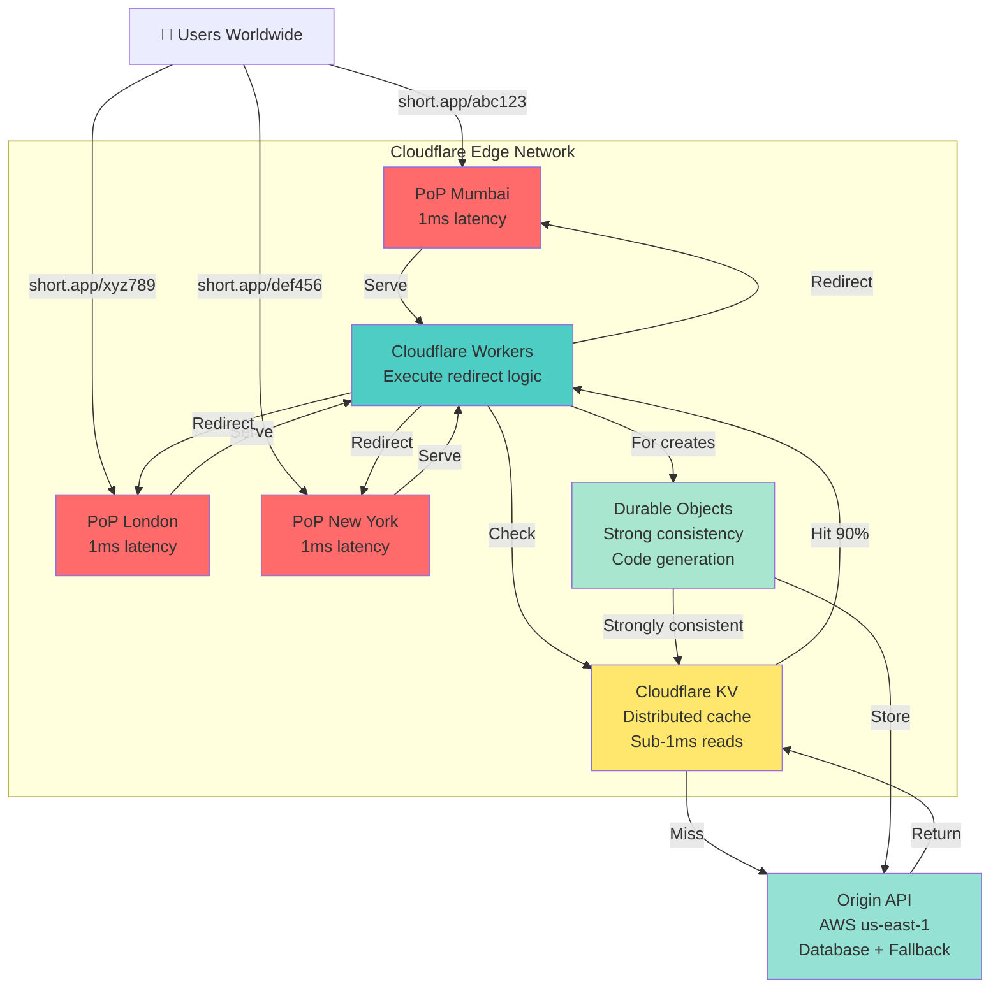

# Article 13: Deep Dive 4 - Edge Computing Approach

## The Edge Computing Strategy: Cloudflare Workers

```
User in Mumbai
    ↓
Cloudflare PoP in Mumbai (1ms)
    ├─ Cache hit? Return immediately (no server needed)
    ├─ Cache miss? Fetch from origin (India DC)
    └─ Total: 2-5ms

User in New York
    ↓
Cloudflare PoP in New York (1ms)
    ├─ Cache hit? Return immediately
    ├─ Cache miss? Fetch from origin (US DC)
    └─ Total: 2-5ms

Result: Global users experience <10ms latency
```

---

## Why Edge Computing?

**Problem with traditional approaches**:
- Caching-first: CDN caches reads, but writes still hit origin
- DynamoDB: Auto-scales, but latency from distant regions is still 50-200ms
- Async: Decouples writes, but adds operational complexity

**Edge computing solution**:
- Execute code at the edge (Cloudflare PoP, AWS Lambda@Edge, Fastly Compute)
- Store data at edge (Cloudflare KV, Durable Objects)
- No round-trip to origin for most operations
- Global consistency without replication latency

---

## Architecture: Edge + Origin Hybrid

### ASCII Diagram
```
┌─────────────────────────────────────────────┐
│         User Request (Redirect)             │
└─────────────┬───────────────────────────────┘
              ↓
       ┌──────────────┐
       │ Cloudflare   │
       │ PoP (Edge)   │  ← Code executes here
       └────┬─────────┘
            ↓
      ┌──────────────┐
      │ Cloudflare   │
      │ KV (Cache)   │  ← Sub-1ms access
      └────┬─────────┘
           ↓
    ┌──────────────────┐
    │ Hit? Return 301  │
    │ (2-5ms total)    │
    └──────────────────┘

┌─────────────────────────────────────────────┐
│      User Request (Create Link)             │
└─────────────┬───────────────────────────────┘
              ↓
       ┌──────────────────┐
       │ Cloudflare       │
       │ Durable Objects  │  ← Strongly consistent
       │ (transactional)  │
       └────┬─────────────┘
            ↓
    ┌──────────────────────┐
    │ Validate + Deduplicate│
    │ + Store in KV + DB   │
    │ (20-50ms total)      │
    └──────────────────────┘
```

### Mermaid Architecture Diagram


---

## Components: Cloudflare Stack

### 1. Cloudflare Workers (Compute at Edge)

```javascript
// handler.ts - Runs in Cloudflare PoP
export default {
  async fetch(request: Request, env: Env): Promise<Response> {
    const url = new URL(request.url);
    const shortCode = url.pathname.slice(1);  // /abc123 → abc123
    
    // Try KV cache first (sub-1ms)
    const cached = await env.URL_KV.get(shortCode);
    if (cached) {
      return new Response(null, {
        status: 301,
        headers: { Location: cached }
      });
    }
    
    // Cache miss: fetch from origin
    const origin = 'https://api.short.app';
    const response = await fetch(`${origin}/api/urls/${shortCode}`);
    
    if (response.status === 200) {
      const data = await response.json();
      const longUrl = data.url;
      
      // Store in KV for future hits (1 hour TTL)
      await env.URL_KV.put(shortCode, longUrl, { expirationTtl: 3600 });
      
      // Log click asynchronously (don't block response)
      env.ANALYTICS_QUEUE.send({ shortCode, timestamp: Date.now() });
      
      return new Response(null, {
        status: 301,
        headers: { Location: longUrl }
      });
    }
    
    return new Response('Not Found', { status: 404 });
  }
};
```

**Advantages**:
- Sub-1ms cache lookup (KV is co-located with worker)
- Code runs closest to user
- No origin server querying for 90% of requests
- Built-in DDoS protection

**Limitations**:
- KV eventual consistency (eventual propagation to all PoPs)
- Limited storage per PoP (100MB KV per account)
- Cost: $0.50/million requests

---

### 2. Cloudflare KV (Distributed Cache)

```
KV = Global, low-latency key-value store
  ├─ Read latency: <1ms from any PoP
  ├─ Propagation: Eventual consistency (60 seconds to all PoPs)
  ├─ Pricing: $0.50/million requests, 10GB storage
  └─ Use case: URL mappings, analytics aggregates

Data model:
  Key: short_code (e.g., "abc123")
  Value: long_url (e.g., "https://blog.example.com/posts/...")
  TTL: 1 hour (refresh on access)
```

**Example operations**:

```javascript
// Write
await env.URL_KV.put('abc123', 'https://long.url', {
  expirationTtl: 3600
});

// Read
const longUrl = await env.URL_KV.get('abc123');

// Delete
await env.URL_KV.delete('abc123');
```

**Consistency model**:
- Strong write consistency at write PoP
- Eventual consistency across other PoPs (60-second propagation)
- For URL shortener: Acceptable (rare conflicts, cache refresh handles it)

---

### 3. Cloudflare Durable Objects (Strong Consistency)

```
For operations requiring strong consistency:
  ├─ Create link (ensure code uniqueness)
  ├─ Update custom code
  └─ Delete and re-create

Durable Objects = Persistent, strongly consistent storage at edge
  ├─ Cost: $0.15/million requests + $1.25/GB/month storage
  ├─ Single writer (strong consistency) per object
  └─ Replicated for durability
```

**Implementation**:

```javascript
// durable-object.ts - Handles unique code generation
export class UrlLock implements DurableObject {
  private state: DurableObjectState;
  
  constructor(state: DurableObjectState, env: Env) {
    this.state = state;
  }
  
  async allocate(longUrl: string): Promise<string> {
    // Strongly consistent operation
    let shortCode = this.state.get('nextId') || '0';
    shortCode = encode(parseInt(shortCode) + 1);  // Base62 increment
    
    // Check availability (strong consistency)
    const exists = await this.state.storage.get(`code:${shortCode}`);
    if (exists) {
      return this.allocate(longUrl);  // Retry
    }
    
    // Store mapping strongly consistently
    await this.state.storage.put(`code:${shortCode}`, {
      url: longUrl,
      created: Date.now()
    });
    
    return shortCode;
  }
}
```

**Use case**:
- Handle code generation collision detection
- Ensure custom code uniqueness before commit
- Alternative to database transactions

---

## Request Flow: Complete Redirect

```
User clicks short.app/abc123 in Mumbai
  ↓
Hits Cloudflare PoP in Mumbai (1ms latency)
  ↓
Worker executes in Mumbai PoP
  ├─ Parse request: shortCode = "abc123"
  ├─ Check KV cache: await env.URL_KV.get("abc123")
  │   ├─ HIT (90%): Return long_url with 301 (2-5ms total)
  │   └─ MISS (10%):
  │       ├─ Fetch from origin API (80-150ms if not in edge cache)
  │       ├─ Store in local KV (async)
  │       ├─ Async log to analytics queue
  │       └─ Return 301 (100-160ms total)
  ↓
User redirected to long URL
```

**Latency breakdown**:
- Cache hit: 2-5ms (KV co-located)
- Cache miss: 100-160ms (origin fetch + KV write)
- Average (90% hit): 5ms (dominated by cache hits)

---

## Cost Analysis: Edge Computing

### Cloudflare Pricing (per month)

```
Requests:
  ├─ Workers: $0.50/million requests = $150/month @ 300M redirects
  ├─ KV read: $0.50/million = $150/month (same requests)
  └─ Durable Objects: $0.15/million = $45/month (only creates)

Storage:
  ├─ KV storage: 10GB = $0.50/month
  ├─ Durable Objects: 1GB = $1.25/month
  └─ Database (origin): $150-300/month

WAF & Security:
  ├─ DDoS protection: Included
  ├─ Bot management: $20-50/month (optional)
  └─ Rate limiting: Included

Total: ~$500-700/month for 300M+ redirects/month

Compared:
  ├─ Caching-first: $1,728/month
  ├─ DynamoDB: $250-735/month
  ├─ Edge computing: $500-700/month
  └─ Winner for cost: DynamoDB, but edge wins on latency
```

---

## Advantages vs. Disadvantages

### ✅ Advantages

```
1. Ultra-low latency for users globally
   - Sub-10ms for 90% of requests
   - No round-trip to origin for reads

2. Built-in DDoS protection
   - Cloudflare edge absorbs attacks
   - No bandwidth charges for blocked traffic

3. Automatic failover
   - If origin down, serve stale KV data
   - Users still get 301 redirects (even if outdated)

4. Minimal operational overhead
   - No servers to manage
   - Auto-scales to any traffic

5. Cost-effective at high scale
   - $0.50/million requests = cheap
   - Outperforms application-level caching
```

### ❌ Disadvantages

```
1. Eventual consistency for reads
   - KV takes 60 seconds to propagate globally
   - Rare race condition: create link, then immediately redirect from different region

2. Limited write capacity
   - Durable Objects have per-object limits
   - Cannot handle unlimited concurrent creates

3. Vendor lock-in (Cloudflare-specific)
   - Workers, KV, Durable Objects are Cloudflare APIs
   - Switching to other providers requires rewrite

4. Less control over business logic
   - Cannot run arbitrary code (security sandbox)
   - Some validation must happen at origin

5. Learning curve
   - Different paradigm than traditional servers
   - Requires understanding edge computing concepts
```

---

## When to Use Edge Computing

```
✅ Good fit:
  ├─ Read-heavy workloads (like URL redirect)
  ├─ Global audience expecting <10ms latency
  ├─ Don't need complex consistency guarantees
  ├─ Want to minimize operational burden
  └─ Budget: $500-1000/month for edge infrastructure

❌ Poor fit:
  ├─ Write-heavy workloads (requires origin trips)
  ├─ Need strong consistency for all operations
  ├─ Complex business logic (exceeds worker limits)
  ├─ Prefer self-hosted/multi-cloud architecture
  └─ Existing infrastructure on AWS/GCP
```

---

## Comparison: All 4 Approaches

```
                    Caching-First   Async         DynamoDB    Edge Computing
────────────────────────────────────────────────────────────────────────────
Latency (p99)       50ms            5ms           150ms       5ms
Cost/month          $1,728          $1,450        $250-735    $500-700
Complexity          Medium          High          Low         Medium
Operational burden  Medium          Very high     Very low    Very low
Consistency         Eventual        Eventual      Strong      Eventual (KV)
Throughput          600 RPS         10K+ RPS      Auto-scale  Auto-scale
Vendor lock-in      Low             Low           High (AWS)  High (CF)
Setup time          2-3 weeks       4-6 weeks     1-2 weeks   1 week
────────────────────────────────────────────────────────────────────────────

Best for:
├─ Startup (< 1M URL/month): DynamoDB ($250/month, simple)
├─ Growing (1-100M URL/month): Caching-first ($1,728/month, proven)
├─ Enterprise (100M+ URL/month): Edge computing ($500-700, global <10ms)
└─ Extreme scale (10B+ redirects/month): Async + Edge hybrid
```

---

## Implementation Strategy

### Phase 1: MVP with Edge (Weeks 1-2)
```
1. Deploy Cloudflare Workers (serves redirects)
2. Connect to existing API (origin server)
3. Add KV caching for hits
4. Monitor latency improvements

Result: 2-5ms redirects globally
```

### Phase 2: Add Durable Objects (Week 3)
```
1. Move code generation to Durable Objects
2. Eliminate database round-trips for creates
3. Add idempotency at edge

Result: 20-50ms creates globally
```

### Phase 3: Scale Analytics (Week 4)
```
1. Queue analytics events from edge
2. Batch process asynchronously
3. Store in TimescaleDB or CloudFlare Logpush

Result: Zero latency impact from analytics
```

---

## Real-World Example: Bitly on Cloudflare

Bitly likely uses similar approach:
```
- Cloudflare Workers for redirect hot path
- KV caching for URL mappings
- Origin API for creates/updates
- Durable Objects or origin DB for consistency

Result: Users experience sub-10ms redirects globally
```

---

## Summary: Edge Computing Approach

**Best for**:
- Global users expecting ultra-low latency
- Read-heavy workloads
- Cost-conscious at scale
- Minimal ops overhead

**Trade-offs**:
- Vendor lock-in (Cloudflare)
- Eventual consistency (KV)
- Limited write capacity

**When to upgrade**:
- If consistency issues appear → Add Durable Objects
- If cost grows too high → Switch to DynamoDB
- If need more control → Switch to Caching-first + CDN

**Result**: Your users in every region get <10ms redirects without managing servers.

---

**Note**: Cloudflare is one example. AWS Lambda@Edge, Fastly Compute, or Google Cloud Run can provide similar functionality. Choose based on your other infrastructure.
