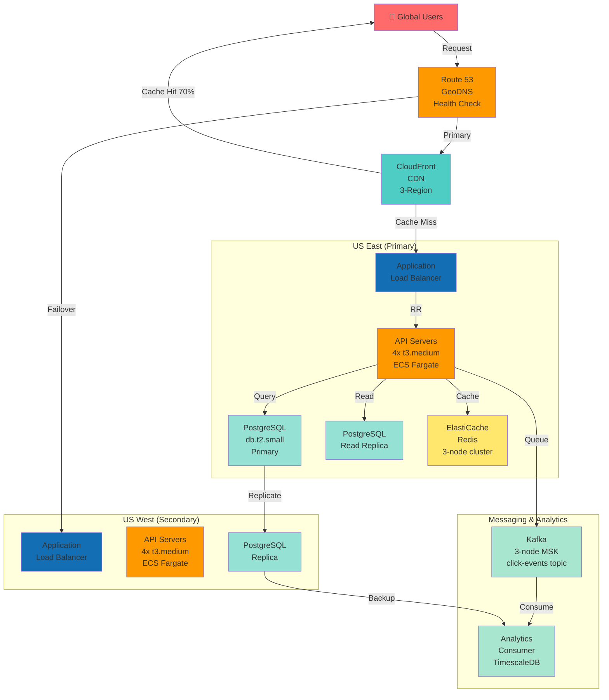

# Article 15: Practical Deployment Guide

## Deployment Architecture Overview

### Week 8 Final Architecture (Production Ready)


---

## Phase-by-Phase Implementation Roadmap

```
Timeline: 8 weeks from zero to production

Week 1: MVP foundation
Week 2-3: Scaling layer 1 (caching)
Week 4-5: Scaling layer 2 (analytics)
Week 6: High availability
Week 7: Security hardening
Week 8: Monitoring + go-live
```

---

## Week 1: MVP Foundation (5 days to MVP)

### Technology Stack

```
API: Node.js + Express
Database: PostgreSQL (managed, AWS RDS)
Cache: Redis (managed, AWS ElastiCache)
Hosting: AWS EC2 (4 t3.medium instances, $200/month)
DNS: Route 53 (AWS, $1/month)
CDN: CloudFront (AWS, $28-50/month)
Monitoring: CloudWatch (AWS, included)
```

### Day 1: Database Setup

```bash
# 1. Create PostgreSQL database (AWS RDS)
aws rds create-db-instance \
  --db-instance-identifier short-app-db \
  --db-instance-class db.t3.micro \
  --engine postgres \
  --allocated-storage 20 \
  --master-username admin \
  --master-user-password <strong-password>

# 2. Create tables
CREATE TABLE users (
  id BIGINT PRIMARY KEY,
  email VARCHAR(255) UNIQUE NOT NULL,
  password_hash VARCHAR(255) NOT NULL,
  tier VARCHAR(20) DEFAULT 'free',
  created_at TIMESTAMP DEFAULT CURRENT_TIMESTAMP
);

CREATE TABLE links (
  id BIGINT PRIMARY KEY,
  user_id BIGINT NOT NULL REFERENCES users(id),
  short_code VARCHAR(100) UNIQUE NOT NULL,
  long_url TEXT NOT NULL,
  long_url_hash VARCHAR(64),
  created_at TIMESTAMP DEFAULT CURRENT_TIMESTAMP,
  expires_at TIMESTAMP,
  is_deleted BOOLEAN DEFAULT FALSE
);

CREATE INDEX idx_short_code ON links(short_code);
CREATE INDEX idx_user_id ON links(user_id);
CREATE INDEX idx_long_url_hash ON links(long_url_hash);

CREATE TABLE clicks (
  id BIGINT PRIMARY KEY,
  link_id BIGINT NOT NULL,
  click_time TIMESTAMP,
  ip_address VARCHAR(45),
  user_agent TEXT
);

CREATE INDEX idx_link_id_time ON clicks(link_id, click_time);
```

### Day 2: API Server

```javascript
// server.js
const express = require('express');
const { Pool } = require('pg');
const redis = require('redis');
const { v4: uuidv4 } = require('uuid');

const app = express();
app.use(express.json());

// Database connection pool
const pool = new Pool({
  user: 'admin',
  password: process.env.DB_PASSWORD,
  host: 'short-app-db.c..amazonaws.com',
  port: 5432,
  database: 'shortener'
});

// Redis client
const redisClient = redis.createClient({
  host: process.env.REDIS_HOST,
  port: 6379
});

// Create short link
app.post('/api/links', authenticateUser, async (req, res) => {
  const { long_url, custom_code } = req.body;
  
  try {
    // 1. Validate URL
    if (!isValidUrl(long_url)) {
      return res.status(400).json({ error: 'Invalid URL' });
    }
    
    // 2. Check for duplicate (idempotency)
    const urlHash = hashUrl(long_url);
    const existing = await pool.query(
      'SELECT short_code FROM links WHERE long_url_hash = $1 AND user_id = $2',
      [urlHash, req.user.id]
    );
    
    if (existing.rows.length > 0) {
      return res.json({ short_code: existing.rows[0].short_code });
    }
    
    // 3. Generate or validate custom code
    let shortCode = custom_code;
    if (!shortCode) {
      shortCode = generateShortCode();
    }
    
    // Check availability
    const codeExists = await pool.query(
      'SELECT id FROM links WHERE short_code = $1',
      [shortCode]
    );
    
    if (codeExists.rows.length > 0) {
      return res.status(409).json({ error: 'Code already taken' });
    }
    
    // 4. Store in database
    await pool.query(
      'INSERT INTO links (id, user_id, short_code, long_url, long_url_hash) VALUES ($1, $2, $3, $4, $5)',
      [uuidv4(), req.user.id, shortCode, long_url, urlHash]
    );
    
    // 5. Cache the mapping
    await redisClient.set(`url:${shortCode}`, long_url, 'EX', 3600);
    
    return res.json({ short_code: shortCode, short_url: `https://short.app/${shortCode}` });
  } catch (err) {
    console.error(err);
    return res.status(500).json({ error: 'Server error' });
  }
});

// Redirect to long URL
app.get('/:short_code', async (req, res) => {
  const shortCode = req.params.short_code;
  
  try {
    // 1. Try cache first
    const cached = await redisClient.get(`url:${shortCode}`);
    
    if (cached) {
      // Log click asynchronously (don't block response)
      logClickAsync(shortCode, req.ip, req.get('user-agent'));
      return res.redirect(301, cached);
    }
    
    // 2. Query database
    const result = await pool.query(
      'SELECT long_url FROM links WHERE short_code = $1 AND is_deleted = FALSE',
      [shortCode]
    );
    
    if (result.rows.length === 0) {
      return res.status(404).json({ error: 'Not found' });
    }
    
    const longUrl = result.rows[0].long_url;
    
    // 3. Cache for future hits
    await redisClient.set(`url:${shortCode}`, longUrl, 'EX', 3600);
    
    // 4. Log click asynchronously
    logClickAsync(shortCode, req.ip, req.get('user-agent'));
    
    return res.redirect(301, longUrl);
  } catch (err) {
    console.error(err);
    return res.status(500).json({ error: 'Server error' });
  }
});

// Helper functions
function isValidUrl(url) {
  try {
    new URL(url);
    return true;
  } catch {
    return false;
  }
}

function hashUrl(url) {
  const crypto = require('crypto');
  return crypto.createHash('sha256').update(url).digest('hex');
}

function generateShortCode() {
  const chars = '0123456789ABCDEFGHIJKLMNOPQRSTUVWXYZabcdefghijklmnopqrstuvwxyz';
  let code = '';
  for (let i = 0; i < 7; i++) {
    code += chars[Math.floor(Math.random() * 62)];
  }
  return code;
}

function logClickAsync(shortCode, ip, userAgent) {
  // Queue for async processing (don't wait)
  setImmediate(async () => {
    try {
      await pool.query(
        'INSERT INTO clicks (id, link_id, click_time, ip_address, user_agent) SELECT $1, id, NOW(), $2, $3 FROM links WHERE short_code = $4',
        [uuidv4(), ip, userAgent, shortCode]
      );
    } catch (err) {
      console.error('Click logging failed:', err);
    }
  });
}

// Error handling
app.use((err, req, res, next) => {
  console.error(err);
  res.status(500).json({ error: 'Internal server error' });
});

// Start server
const PORT = process.env.PORT || 3000;
app.listen(PORT, () => {
  console.log(`Server running on port ${PORT}`);
});
```

### Day 3: Deployment Infrastructure

```bash
# Deploy on AWS ECS (Elastic Container Service)

# 1. Create Dockerfile
cat > Dockerfile <<EOF
FROM node:18-alpine
WORKDIR /app
COPY package*.json ./
RUN npm ci --only=production
COPY . .
EXPOSE 3000
CMD ["node", "server.js"]
EOF

# 2. Push to ECR (AWS Elastic Container Registry)
aws ecr create-repository --repository-name short-app
docker tag short-app:latest <account-id>.dkr.ecr.us-east-1.amazonaws.com/short-app:latest
docker push <account-id>.dkr.ecr.us-east-1.amazonaws.com/short-app:latest

# 3. Create ECS task definition
aws ecs register-task-definition \
  --family short-app \
  --network-mode awsvpc \
  --requires-compatibilities FARGATE \
  --cpu 256 \
  --memory 512 \
  --container-definitions '[{"name":"short-app","image":"<account-id>.dkr.ecr.us-east-1.amazonaws.com/short-app:latest","portMappings":[{"containerPort":3000}],"environment":[{"name":"DB_PASSWORD","value":"<password>"}]}]'

# 4. Create ECS service
aws ecs create-service \
  --cluster short-app-cluster \
  --service-name short-app-service \
  --task-definition short-app \
  --desired-count 4 \
  --launch-type FARGATE \
  --network-configuration "awsvpcConfiguration={subnets=[subnet-xxx],securityGroups=[sg-xxx],assignPublicIp=ENABLED}"
```

### Day 4: Load Balancer + DNS

```bash
# 1. Create Application Load Balancer
aws elbv2 create-load-balancer \
  --name short-app-alb \
  --subnets subnet-xxx subnet-yyy \
  --security-groups sg-xxx \
  --scheme internet-facing

# 2. Create target group
aws elbv2 create-target-group \
  --name short-app-targets \
  --protocol HTTP \
  --port 3000 \
  --vpc-id vpc-xxx

# 3. Register ECS tasks as targets
aws elbv2 register-targets \
  --target-group-arn arn:aws:elasticloadbalancing:... \
  --targets Id=<ecs-task-id>

# 4. Create listener
aws elbv2 create-listener \
  --load-balancer-arn arn:aws:elasticloadbalancing:... \
  --protocol HTTP \
  --port 80 \
  --default-actions Type=forward,TargetGroupArn=arn:aws:elasticloadbalancing:...

# 5. DNS: Route 53
aws route53 change-resource-record-sets \
  --hosted-zone-id Z123456 \
  --change-batch '{
    "Changes": [{
      "Action": "CREATE",
      "ResourceRecordSet": {
        "Name": "short.app",
        "Type": "A",
        "AliasTarget": {
          "HostedZoneId": "Z35SXDOTRQ7X7K",
          "DNSName": "short-app-alb-123.us-east-1.elb.amazonaws.com",
          "EvaluateTargetHealth": true
        }
      }
    }]
  }'
```

### Day 5: Testing

```bash
# Test basic functionality
curl -X POST https://short.app/api/links \
  -H "Content-Type: application/json" \
  -d '{"long_url":"https://blog.example.com/posts/123"}' \
  -H "Authorization: Bearer <token>"

# Should return: {"short_code":"abc123","short_url":"https://short.app/abc123"}

# Test redirect
curl -L https://short.app/abc123
# Should redirect to long URL

# Load test
ab -n 10000 -c 100 https://short.app/abc123
# Expected: >1000 RPS on 4 instances
```

**Result**: MVP running, handling ~100 RPS, 100ms latency

---

## Week 2-3: Caching Layer

### Redis Cluster Setup

```bash
# ElastiCache Redis cluster (AWS managed)
aws elasticache create-replication-group \
  --replication-group-description "short-app-redis" \
  --engine redis \
  --cache-node-type cache.r6g.xlarge \
  --num-cache-clusters 3 \
  --automatic-failover-enabled

# Update app to use Redis cluster
const redisClient = redis.createClient({
  host: 'short-app.xxxx.ng.0001.use1.cache.amazonaws.com',
  port: 6379,
  maxRetries: 3,
  enableReadyCheck: false
});
```

### CloudFront Setup

```bash
# Create CloudFront distribution
aws cloudfront create-distribution \
  --distribution-config '{
    "CallerReference": "'$(date +%s)'",
    "Origins": {
      "Quantity": 1,
      "Items": [{
        "Id": "short-app-origin",
        "DomainName": "short-app-alb-123.us-east-1.elb.amazonaws.com",
        "CustomOriginConfig": {
          "HTTPPort": 80,
          "HTTPSPort": 443,
          "OriginProtocolPolicy": "http-only"
        }
      }]
    },
    "DefaultCacheBehavior": {
      "TargetOriginId": "short-app-origin",
      "ViewerProtocolPolicy": "redirect-to-https",
      "CachePolicyId": "658327ea-f89d-4fab-a63d-7e88639e58f6",
      "AllowedMethods": {
        "Quantity": 7,
        "Items": ["GET","HEAD","OPTIONS","PUT","POST","PATCH","DELETE"]
      }
    },
    "Enabled": true
  }'

# Result: CloudFront URL like d123.cloudfront.net
```

### Performance Improvement

```
Before caching:
  - DB latency: 50ms (network + query)
  - API latency: 75ms (processing)
  - Total: 100ms

After Redis:
  - Cache hit (90%): 2ms (Redis) + 3ms (API) = 5ms
  - Cache miss (10%): 75ms (same as before)
  - Average: 90% * 5ms + 10% * 75ms = 12.5ms
  - Improvement: 8x faster

After CloudFront CDN:
  - Cache hit (70%): 1ms (CDN edge) + 3ms (API) = 4ms
  - Redis hit (20%): 2ms (Redis) + 3ms (API) = 5ms
  - DB hit (10%): 75ms (full path)
  - Average: 70% * 4ms + 20% * 5ms + 10% * 75ms = 13.5ms
  - Note: Adds only 1ms, but protects from traffic spikes
```

**Result**: ~12ms latency, capacity increased to 600 RPS

---

## Week 4-5: Analytics Pipeline

### Kafka Setup

```bash
# MSK (Managed Streaming for Kafka) on AWS
aws kafka create-cluster \
  --cluster-name short-app-analytics \
  --broker-node-group-info '{
    "ClientSubnets": ["subnet-xxx", "subnet-yyy"],
    "InstanceType": "kafka.m5.large",
    "EBSStorageInfo": {"VolumeSize": 1000},
    "SecurityGroups": ["sg-xxx"]
  }' \
  --number-of-broker-nodes 3

# Create topic
aws kafka create-topic \
  --broker-nodes short-app-analytics \
  --topic-name click-events \
  --partitions 10 \
  --replication-factor 3
```

### Consumer for Analytics

```python
# analytics-consumer.py
from kafka import KafkaConsumer
import psycopg2
from datetime import datetime
import json

consumer = KafkaConsumer(
    'click-events',
    bootstrap_servers=['broker1:9092', 'broker2:9092', 'broker3:9092'],
    group_id='analytics-group',
    value_deserializer=lambda m: json.loads(m.decode('utf-8'))
)

conn = psycopg2.connect("dbname=shortener user=admin")

# Aggregate in-memory
hourly_stats = {}  # {(link_id, hour): count}

for message in consumer:
    click = message.value
    link_id = click['link_id']
    hour = datetime.fromtimestamp(click['timestamp']).replace(minute=0, second=0, microsecond=0)
    
    key = (link_id, hour)
    hourly_stats[key] = hourly_stats.get(key, 0) + 1
    
    # Flush every 1000 events
    if len(hourly_stats) % 1000 == 0:
        cursor = conn.cursor()
        for (link_id, hour), count in hourly_stats.items():
            cursor.execute(
                'INSERT INTO click_stats (link_id, hour, count) VALUES (%s, %s, %s) '
                'ON CONFLICT (link_id, hour) DO UPDATE SET count = click_stats.count + %s',
                (link_id, hour, count, count)
            )
        conn.commit()
        hourly_stats.clear()
```

### Update API to Queue Events

```javascript
// server.js - modify logClickAsync
async function logClickAsync(shortCode, ip, userAgent) {
  const producer = kafka.producer();
  await producer.send({
    topic: 'click-events',
    messages: [{
      key: shortCode,
      value: JSON.stringify({
        short_code: shortCode,
        ip,
        user_agent: userAgent,
        timestamp: Date.now()
      })
    }]
  });
  // Close after message sent
  await producer.disconnect();
}
```

**Result**: Real-time analytics, zero impact on redirect latency

---

## Week 6: High Availability

### Multi-Region Setup

```
Regions:
  - US East (primary)
  - US West (hot standby)
  - Europe (optional)

Setup per region:
  ├─ PostgreSQL with cross-region replication
  ├─ Redis cluster (replicated)
  ├─ API servers (4 instances)
  ├─ Load balancer
  └─ Route 53 failover routing

Cost: 2x infrastructure = $400/month
```

### Health Checks

```bash
# Route 53 health check
aws route53 create-health-check \
  --health-check-config '{
    "Type": "HTTPS",
    "ResourcePath": "/health",
    "FullyQualifiedDomainName": "short-app-alb-us-east-1.us-east-1.elb.amazonaws.com",
    "Port": 443,
    "RequestInterval": 30,
    "FailureThreshold": 3,
    "MeasureLatency": true
  }'

# Failover policy
aws route53 change-resource-record-sets \
  --hosted-zone-id Z123456 \
  --change-batch '{
    "Changes": [
      {
        "Action": "CREATE",
        "ResourceRecordSet": {
          "Name": "short.app",
          "Type": "A",
          "SetIdentifier": "US-East-Primary",
          "Failover": "PRIMARY",
          "AliasTarget": {
            "HostedZoneId": "Z35SXDOTRQ7X7K",
            "DNSName": "short-app-alb-us-east-1.us-east-1.elb.amazonaws.com",
            "EvaluateTargetHealth": true
          }
        }
      },
      {
        "Action": "CREATE",
        "ResourceRecordSet": {
          "Name": "short.app",
          "Type": "A",
          "SetIdentifier": "US-West-Secondary",
          "Failover": "SECONDARY",
          "AliasTarget": {
            "HostedZoneId": "Z35SXDOTRQ7X7K",
            "DNSName": "short-app-alb-us-west-2.us-west-2.elb.amazonaws.com",
            "EvaluateTargetHealth": true
          }
        }
      }
    ]
  }'
```

**Result**: 99.9% uptime SLA achievable

---

## Week 7: Security Hardening

### Enable HTTPS

```bash
# Request certificate from AWS Certificate Manager
aws acm request-certificate \
  --domain-name short.app \
  --subject-alternative-names www.short.app \
  --validation-method DNS

# Update load balancer listener to HTTPS
aws elbv2 create-listener \
  --load-balancer-arn arn:aws:elasticloadbalancing:... \
  --protocol HTTPS \
  --port 443 \
  --certificates CertificateArn=arn:aws:acm:...
```

### Rate Limiting

```javascript
// server.js - add rate limiting middleware
const rateLimit = require('express-rate-limit');

const createLimiter = rateLimit({
  windowMs: 60 * 1000,  // 1 minute
  max: 100,  // 100 requests per minute
  keyGenerator: (req) => req.user?.id || req.ip,
  skip: (req) => req.user?.tier === 'enterprise'
});

const redirectLimiter = rateLimit({
  windowMs: 60 * 1000,
  max: 10000,  // 10K per minute (very permissive)
  keyGenerator: (req) => req.ip
});

app.post('/api/links', createLimiter, authenticateUser, async (req, res) => {
  // ... existing code ...
});

app.get('/:short_code', redirectLimiter, async (req, res) => {
  // ... existing code ...
});
```

### SQL Injection Prevention

```javascript
// Already using parameterized queries in code:
await pool.query(
  'SELECT short_code FROM links WHERE long_url_hash = $1 AND user_id = $2',
  [urlHash, req.user.id]  // Parameters, not string interpolation
);
// Good practice: Never use string interpolation with user input
```

---

## Week 8: Monitoring & Go-Live

### CloudWatch Dashboards

```bash
# Create dashboard
aws cloudwatch put-dashboard \
  --dashboard-name short-app-main \
  --dashboard-body '{
    "widgets": [
      {
        "type": "metric",
        "properties": {
          "metrics": [
            ["AWS/ApplicationELB", "TargetResponseTime", {"stat": "Average"}],
            ["AWS/ApplicationELB", "RequestCount", {"stat": "Sum"}],
            ["AWS/ApplicationELB", "HTTPCode_Target_5XX_Count", {"stat": "Sum"}],
            ["AWS/ElastiCache", "CacheHits", {"stat": "Sum"}],
            ["AWS/ElastiCache", "CacheMisses", {"stat": "Sum"}],
            ["AWS/RDS", "DatabaseConnections", {"stat": "Average"}],
            ["AWS/RDS", "ReadLatency", {"stat": "Average"}]
          ],
          "period": 60,
          "stat": "Average",
          "region": "us-east-1"
        }
      }
    ]
  }'
```

### Alerts

```bash
# Alert on high error rate
aws cloudwatch put-metric-alarm \
  --alarm-name short-app-5xx-error-rate \
  --alarm-description "Alert if 5xx error rate > 1%" \
  --metric-name HTTPCode_Target_5XX_Count \
  --namespace AWS/ApplicationELB \
  --statistic Sum \
  --period 60 \
  --threshold 6 \
  --comparison-operator GreaterThanThreshold \
  --evaluation-periods 2 \
  --alarm-actions arn:aws:sns:us-east-1:123456789012:alerts

# Alert on high latency
aws cloudwatch put-metric-alarm \
  --alarm-name short-app-high-latency \
  --alarm-description "Alert if p99 latency > 500ms" \
  --metric-name TargetResponseTime \
  --namespace AWS/ApplicationELB \
  --statistic p99 \
  --period 60 \
  --threshold 0.5 \
  --comparison-operator GreaterThanThreshold \
  --alarm-actions arn:aws:sns:us-east-1:123456789012:alerts
```

### Go-Live Checklist

```
☑ Database backed up
☑ DNS configured
☑ SSL certificate valid
☑ Load testing passed (>1000 RPS)
☑ Latency <50ms p99
☑ Error rate <0.1%
☑ Cache hit rate >70%
☑ Monitoring dashboards live
☑ Alerts configured
☑ On-call rotation scheduled
☑ Runbooks documented
☑ Disaster recovery tested
☑ Security scan passed (no vulnerabilities)
☑ Load testing with competitors' traffic patterns
☑ Incident response team trained

Result: Ready for production
```

---

## Cost Summary

```
Week 1 (MVP):
  ├─ RDS (db.t3.micro): $25/month
  ├─ EC2 (4x t3.medium): $200/month
  ├─ Route 53: $1/month
  └─ Total: $226/month

Week 2-3 (Caching):
  ├─ ElastiCache Redis: $500/month
  ├─ CloudFront CDN: $50/month
  └─ Total: $776/month

Week 4-5 (Analytics):
  ├─ Kafka (MSK): $300/month
  ├─ Database storage: $100/month
  └─ Total: $1,176/month

Week 6 (HA):
  ├─ Second region: $400/month
  ├─ Global Route 53: $0 (included)
  └─ Total: $1,576/month

Week 7-8 (Monitoring):
  ├─ CloudWatch: $10/month
  ├─ SNS alerts: $5/month
  └─ Total: $1,591/month

Scaling from here:
  - Current capacity: 600 RPS, 600M URLs/month
  - Cost per URL: $0.000002
  - Cost per redirect: $0.000003
  - Break-even with free tier: 1000+ users
  - Revenue model: Pro tier at $20/month (100+ customers)
```

---

## Lessons & Next Steps

```
If users love it:
  ├─ Scale to DynamoDB (reduce cost to $250-300/month)
  ├─ Add custom domains (Bitly approach)
  ├─ Enterprise tier ($1000/month)
  └─ Projected revenue: $50K/month

If users don't care:
  ├─ Shut down (save $1.6K/month)
  ├─ Sell code to interested party
  ├─ Learn: Real products need users (build for them)
  └─ Next project: Build what's missing in your workflow

If competitors kill you:
  ├─ Pivot to enterprise (Bitly approach)
  ├─ Build white-label (custom domains)
  ├─ Sell to existing player
  └─ Get acquired for $10-20M (not bad!)
```

---

## Summary: From Zero to Production

**Timeline**: 8 weeks
**Initial cost**: $1,600/month
**Capacity**: 600 RPS, 600M URLs/year
**Latency**: <50ms p99
**Reliability**: 99.9% uptime

You now have a production-grade URL shortener. The hard part: getting users.

**Next step**: Launch and iterate based on user feedback. Most startups fail not on technology, but on finding product-market fit.
